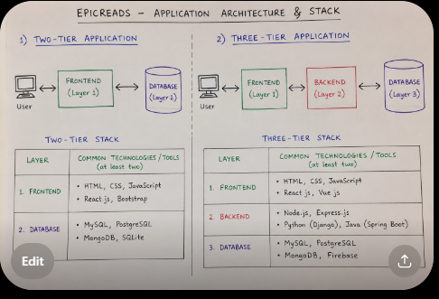

# Week 00 - Internet and Networking

Part of the DevOps Micro Internship (DMI) Cohort 3 with Agentic AI

---

# 🧑‍💻 Task 1: Using ChatGPT as Your Learning Assistant

## Scenario

You're new to DevOps and will frequently encounter technical questions. ChatGPT can be your learning companion.

## Your Task

Write a clear ChatGPT prompt to help you understand:

> "What is a protocol in networking? Explain with a simple real-life example."

Take a screenshot of your interaction showing:

* Your detailed prompt (with clear expectations)
* ChatGPT's simplified response with an example

## Screenshot

Save your screenshot in the `screenshots` folder and update the file name below.


Replace `task-1-chatgpt.png` with your actual screenshot file name.

---

## What I Learned (2–3 lines)


A protocol is a set of rules that tells computers how to send and receive information.A protocol is a set of rules that helps computers talk to each other nicely, just like children follow rules when playing a game.
---

# 🌐 Task 2: Internet and Networking

## Scenario

Your friend is launching an online bookstore named **EpicReads**.

He asked you to explain how users globally can access his website hosted in Finland.

## Your Task

Write a short explanation (**100–150 words**) that includes:

* Packet Switching
* IP Address
* TCP/IP
* HTTP/HTTPS

💡 **Tip:** You may use ChatGPT (as demonstrated in Task 1) to refine your explanation.

## Answer


When someone anywhere in the world visits **EpicReads**, their request is broken into small pieces called **packets** through **packet switching**. Each packet travels across the internet and is directed to the correct server in Finland using its unique **IP address**, just like a house address helps deliver mail. The **TCP/IP** protocol suite ensures that all packets are sent, received, and reassembled correctly, even if they take different routes. Once the packets reach the server, **HTTP** (Hypertext Transfer Protocol) or **HTTPS** (Hypertext Transfer Protocol Secure) is used to request and deliver the website. **HTTPS** encrypts the data exchanged between the user's browser and the server, protecting sensitive information such as login details and payment information. Together, these technologies make EpicReads accessible securely and reliably from anywhere in the world.

---

# 🏗️ Task 3: Application Architecture & Stack

## Scenario

EpicReads bookstore has two application versions:

### Two-Tier Application

* Frontend
* Database

### Three-Tier Application

* Frontend
* Backend
* Database

## Your Task

* Draw simple diagrams (hand-drawn or tool-based such as draw.io)
* Label each layer clearly
* List at least two common technologies or tools used for each layer
* Submit a screenshot or photo clearly showing your own drawing

## Diagram Screenshot / Photo

Save your diagram image in the `screenshots` folder and update the file name below.




Replace `task-3-diagram.png` with your actual diagram file name.

---

## Technologies Used

### Frontend

* HTML
* CSS

### Backend

* Node JS
* EXPRESS JS

### Database

* MYSQL
* POSTGRESQL

---

# 🌍 Task 4: Domain Name & DNS (Basic Concepts)

## Scenario

Your friend's bookstore **EpicReads** is currently accessible through:

```text
52.172.142.222:3000
```

He purchased the domain:

```text
epicreads.com
```

## Your Task

In **50–100 words**, explain in your own words:

1. What is DNS (Domain Name System)?
2. Which DNS record type should be used to connect the domain to the given IP, and why?

## Answer


DNS (Domain Name System) is like the internet's phonebook. It translates easy-to-remember domain names such as **epicreads.com** into IP addresses like **52.172.142.222**, allowing users to access websites without memorizing numbers.

To connect **epicreads.com** to the IP address **52.172.142.222**, an **A Record (Address Record)** should be used. An A Record maps a domain name directly to an IPv4 address, ensuring that when users type **epicreads.com** into their browser, they are directed to the server hosting the EpicReads website.

---

# 💻 Task 5: Visual Studio Code Setup (Hands-on)

## Your Task

Install Visual Studio Code (if not already installed).

Take a screenshot of your VS Code environment showing:

* Terminal open inside VS Code
* Running a basic command:

### Windows

```powershell
dir
```

### Linux / macOS

```bash
pwd
ls
```

* Your selected VS Code theme clearly visible

⚠️ **Important:** The screenshot must show your username or another identifiable detail to confirm it is your environment.

## Screenshot

Save your screenshot in the `screenshots` folder and update the file name below.


Replace `task-5-vscode.png` with your actual screenshot file name.

---

# 🔗 Task 6: Publish Your Assignment as a LinkedIn Post

## Objective

Publishing on LinkedIn helps you:

* Build your professional online presence
* Reinforce your learning
* Document your DevOps journey publicly

## Your Task

Summarize your answers from Tasks 1–5 into a LinkedIn post.

Clearly structure your post into the following sections:

* ChatGPT
* Internet & Networking
* App Architecture
* DNS
* VS Code Setup

Add the following credit note at the end of your post:

> **P.S. This post is part of the DevOps Micro Internship (DMI) with Agentic AI — Cohort 3 — by Pravin Mishra. My graded progress is public: https://dmi.pravinmishra.com/s/YOUR-GITHUB-USERNAME.html · Start your DevOps journey: https://dmi.pravinmishra.com/?utm_source=student&utm_medium=ps-linkedin&utm_campaign=cohort3**

---

## LinkedIn Post URL

Paste your LinkedIn post URL here:

```text
https://www.linkedin.com/posts/angus-egbekobar_dmi-devops-micro-internship-with-agentic-share-7486376994222309377-aDws/?utm_source=share&utm_medium=member_desktop&rcm=ACoAACpBxXUBgkRH28KX9wNr0QE4jJlRTmgHtCg
```

---

## LinkedIn Post Backup Copy

Paste the full text of your LinkedIn post here:


Week 0: Building My Networking Foundations for DevOps 
Every DevOps engineer starts with the fundamentals, and this week in the DevOps Micro Internship (DMI) with Agentic AI, Cohort 3, I strengthened my understanding of the technologies that make the internet work.
Here's what I learned:
🤖 ChatGPT as a Learning Assistant
One of my first tasks was learning how to ask better technical questions. Using a well-structured prompt, I explored what a network protocol is and understood it through a simple real-life example.
This reminded me that AI isn't just about getting answers. It's about learning how to ask better questions.
🌍 Internet & Networking
I learned how users anywhere in the world can access a website like EpicReads, even when it's hosted on a server in another country.
Some key networking concepts I explored include:
✅ Packet Switching
✅ IP Addresses
✅ TCP/IP
✅ HTTP & HTTPS
Understanding how data travels across networks gave me a much clearer picture of what happens every time we open a website.
🏗️ Application Architecture
I compared Two-Tier and Three-Tier application architectures and created diagrams to understand how applications are structured.
I also identified common technologies used in each layer:
• Frontend: HTML, CSS
• Backend: Node.js, Express.js
• Database: MySQL, PostgreSQL
This helped me understand how each layer works together to deliver modern web applications.
🌐 DNS
I explored how the Domain Name System (DNS) translates human-friendly domain names into IP addresses.
I also learned why an A Record is used to connect a domain name to an IPv4 address, allowing users to reach a website without memorizing numerical IP addresses.
💻 Visual Studio Code Setup
Finally, I verified my development environment by working inside Visual Studio Code, using the integrated terminal and confirming everything was ready for the hands-on DevOps assignments ahead.
This week reminded me that before deploying applications or working with cloud infrastructure, it's essential to understand the networking and development fundamentals that everything else is built upon.
Every new concept is another building block in my journey toward becoming a DevOps Engineer.
P.S. This post is part of the DevOps Micro Internship (DMI) with Agentic AI, Cohort 3, by Pravin Mishra. My graded progress is public: https://lnkd.in/eBe9ABzY · Start your DevOps journey: https://lnkd.in/e6YTEQuX
hashtag#DMIByPravinMishra
hashtag#DevOps hashtag#Networking hashtag#Internet hashtag#TCPIP hashtag#HTTP hashtag#HTTPS hashtag#DNS hashtag#VSCode hashtag#Git hashtag#Linux hashtag#CloudComputing hashtag#AWS hashtag#SoftwareEngineering hashtag#ContinuousLearning Mentors:
@Pravin Mishra
@Tanisha Borana
@Joy Ukpabi
---

# Reflection – Week 0

### What did you find easy?


tagging the co-mentors
---

### What was difficult?


Understanding  what a protocol is
---

### What will you improve next week?


starting on time
---

## 📌 About DMI & CloudAdvisory

DevOps Micro Internship (DMI) is a project-based DevOps program run by Pravin Mishra (The CloudAdvisory) focused on real-world execution, systems thinking, and career readiness.

It helps learners build strong DevOps foundations with hands-on experience.


## 📌 Resources

- 🌐 **DMI Official Website:** https://pravinmishra.com/dmi  
- 🎓 **DevOps for Beginners (Udemy):** https://www.udemy.com/course/devops-for-beginners-docker-k8s-cloud-cicd-4-projects/  
- 🎓 **Ultimate Agentic AI DevOps with Clude Code** https://www.udemy.com/course/ultimate-agentic-ai-devops-with-claude-code/?referralCode=448389767BC96284087B
- 🎓 **DevOps with Claude Code: Terraform, EKS, ArgoCD & Helm** https://www.udemy.com/course/devops-with-claude-code-terraform-eks-argocd-helm/?referralCode=1C5B734505D65A010FA3
- ▶️ **YouTube Playlist (DMI Cohort 3):** https://www.youtube.com/playlist?list=PLFeSNDtI4Cho  
- 🔗 **Pravin Mishra (LinkedIn):** https://www.linkedin.com/in/pravin-mishra-aws-trainer/  
- 🏢 **CloudAdvisory (LinkedIn):** https://www.linkedin.com/company/thecloudadvisory/

---

*This submission is part of DevOps Micro Internship (DMI) Cohort 3 — Agentic AI Track*