# Assignment 3 — Production Maintenance Drill (OPS Checklist)

Part of the DevOps Micro Internship (DMI) Cohort 3 with Agentic AI

---

## Purpose

In this assignment, you will treat your already deployed React application (on Ubuntu VM with Nginx) as a live production system. You will perform structured operational checks covering network validation, service health, log analysis, resource monitoring, configuration verification, and incident simulation with recovery — mirroring real on-call DevOps responsibilities.

---

# Task 1 — Server Access & Networking Validation

## Goal

Verify that the deployed React application is reachable from the browser and confirm basic network connectivity of the Ubuntu VM.

### Evidence

#### Screenshot 1 — Browser showing the React app with your Full Name visible on the UI

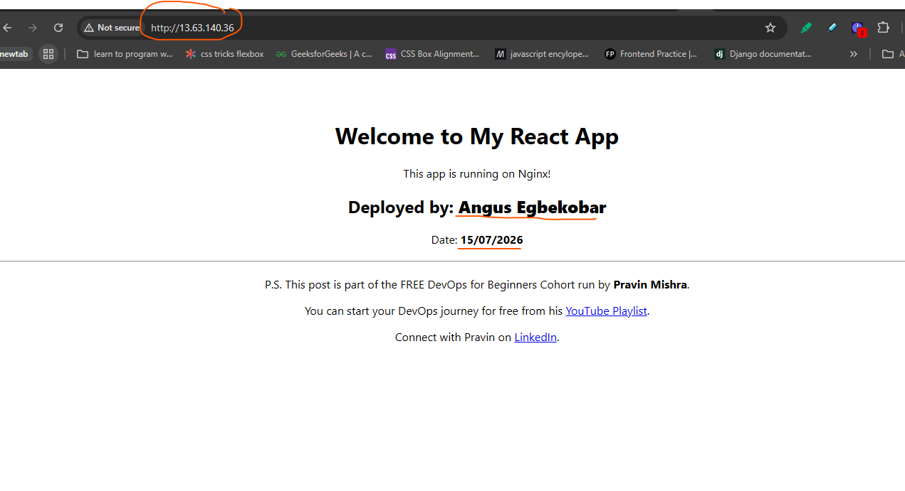
---

#### Screenshot 2 — Output of `ip a`

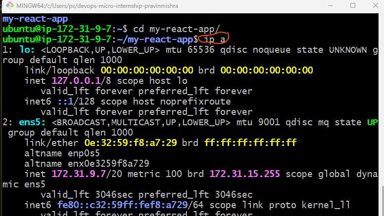
---

#### Screenshot 3 — Output of `sudo ss -tulpen`

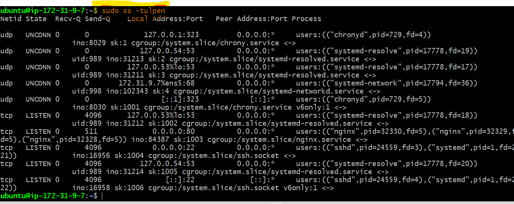
---

#### Screenshot 4 — Output of `sudo ufw status`

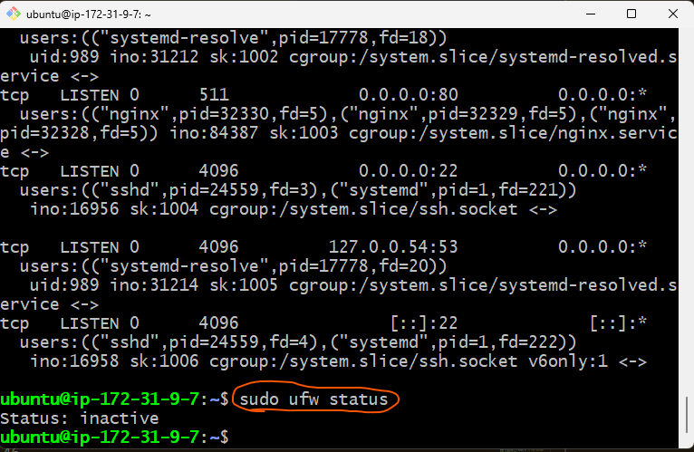
---

### Notes

Answer the following in your own words:

**1. What proves Nginx is listening on 0.0.0.0:80?**

The output  of the  command --> sudo ss -tulpen proves that Nginx is listening on 0.0.0.0:80
---

**2. What proves SSH is active on port 22?**

The output  of the  command --> sudo ss -tulpen proves that Nginx is listening on port 22
---

**3. Did you find any unexpected open ports? Explain briefly.**

no, there are no unexpected open ports. The listening ports are consistent with what you is expected  on an Ubuntu EC2 instance running a React application behind Nginx.
---

# Task 2 — Service Health & Systemd Validation (Nginx)

## Goal

Verify that Nginx is properly installed, running, enabled at boot, and safely configured.

### Evidence

#### Screenshot 1 — Output of `systemctl status nginx --no-pager`

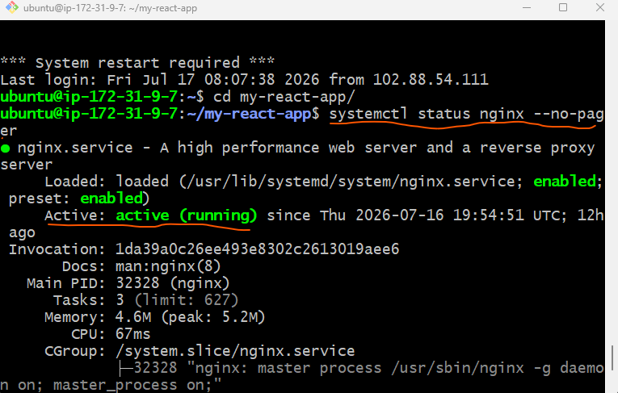
---

#### Screenshot 2 — Output of `sudo nginx -t`

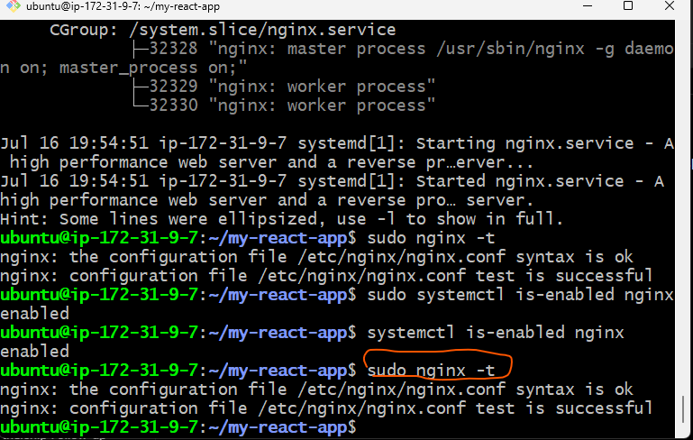
---

#### Screenshot 3 — Output of `sudo ss -lptn '( sport = :80 )'`

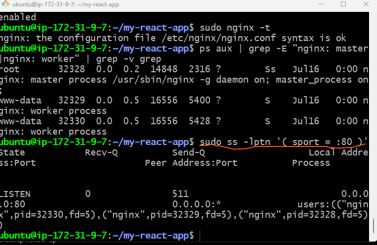
---

### Notes

Answer the following in your own words:

**1. What happens if Nginx fails to restart in production?**

If Nginx fails to restart in production, the web server will not come back online after the restart attempt. Since Nginx is responsible for serving our React application's static files, users will no longer be able to access the application.
---

**2. What's your basic rollback plan?**

My basic rollback plan would be the following:
1. identify the issue using the command --> sudo systemctl status nginx --no-pager to check whether Nginx failed because of a configuration error or another issue.

2. i inspect the logs with the command --> journalctl -u nginx --no-pager

3. Restore the last working configuration
  If there is any  recently modified  Nginx configuration, i replace it with the previous working version (or restore it from my  backup or version control) using the command -->
sudo cp /etc/nginx/sites-available/default.bak /etc/nginx/sites-available/default

4. i validate the configuration using the command --> sudo nginx -t . Before restarting Nginx, i have to verify that the restored configuration is valid.
5.  I restart (or reload) Nginx using the command --> sudo systemctl restart nginx
6. or, if only the configuration changed, i use the command --> sudo systemctl reload nginx to reload it 

---

# Task 3 — Logs & Request Trace

## Goal

Verify real traffic flow and analyze logs to understand system behavior and errors.

### Evidence

#### Screenshot 1 — Output of `sudo tail -n 30 /var/log/nginx/access.log`

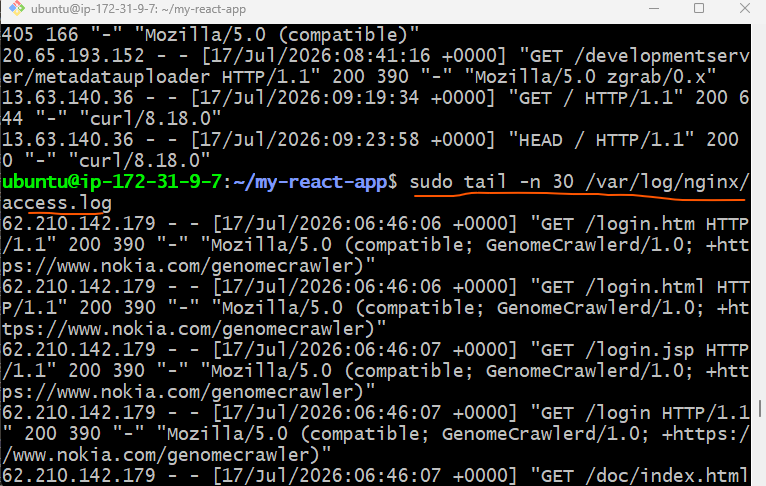
---

#### Screenshot 2 — Output of `sudo tail -n 30 /var/log/nginx/error.log`

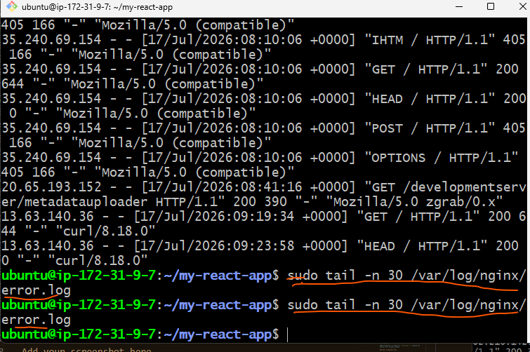
---

#### Screenshot 3 — Output of `sudo journalctl -u nginx --no-pager -n 50`

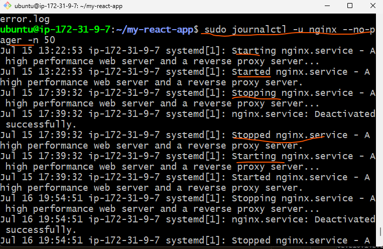
---

### Notes

Answer the following in your own words:

**1. Were there any errors in the logs?**

- If yes, mention 1–2 example error lines from the logs and explain what each one means in simple terms.
- If no, explain what it means if the error log is empty or shows no recent errors during your check.

no, there were no errors in the logs, it simply means everything is fine
---

**2. If there were no errors, what does that indicate about the system?**

It indicates that Nginx has not recorded any recent errors.
---

**3. Based on the access logs, were your curl requests visible in the log entries? What does that prove about traffic flow?**

yes, the curl requests were visible in the log entries and It proves that traffic is flowing correctly between the client and the web server.
---

# Task 4 — System Resource Health Check (Capacity Red Flags)

## Goal

Assess server capacity and detect potential performance or failure risks.

### Evidence

#### Screenshot 1 — Output of `uptime`

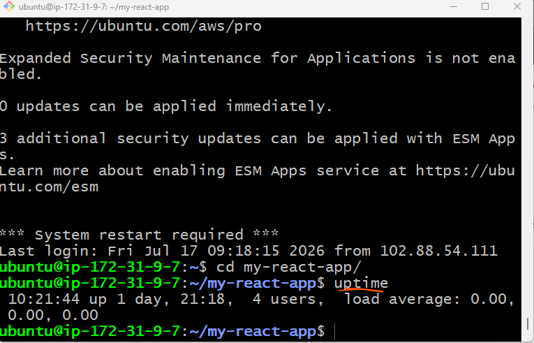
---

#### Screenshot 2 — Output of `free -h`

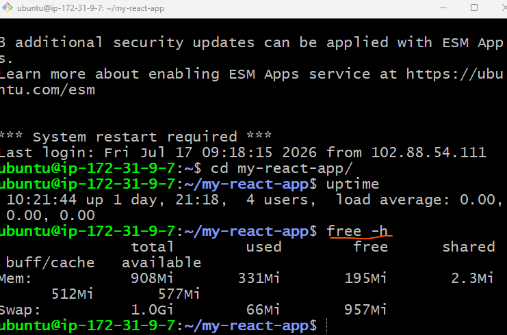
---

#### Screenshot 3 — Output of `df -h`

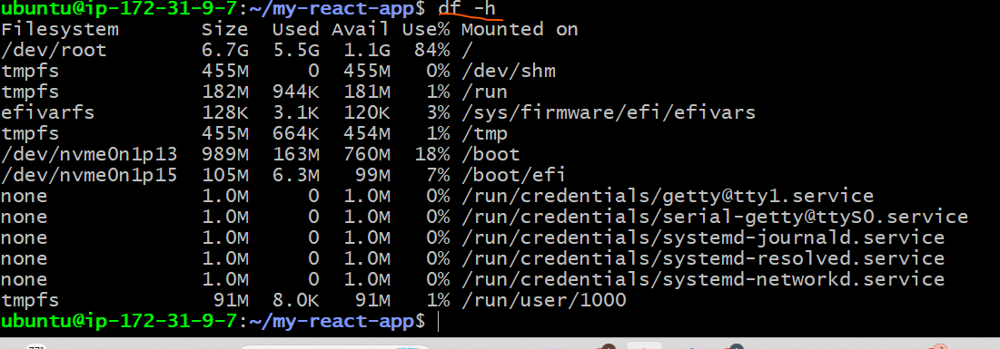
---

#### Screenshot 4 — Output of `sudo du -sh /var/* | sort -h`

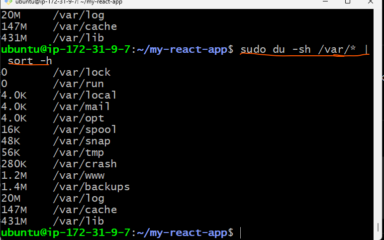
---

### Notes

Answer the following in your own words:

**1. Which resource looks most critical right now? (CPU/load, memory, or disk) Explain why.**

The most critical resource is disk space. The root filesystem (/dev/root) is 84% utilized, leaving only 1.1 GB of free space. While the server is still operational, this usage level is approaching the threshold where disk capacity can become a problem if logs, application data, or package files continue to grow. In contrast, the CPU load is 0.00, indicating no processing bottleneck, and memory is healthy with 577 MiB available and only minimal swap usage. Therefore, disk utilization is the primary capacity concern and should be monitored or addressed before it reaches critical levels.
---

**2. What happens if disk becomes 100% full in a production server?**

if the disk reaches 100% full, it can have a severe impact on a production server. Even if the CPU and memory are healthy, the server may stop functioning correctly because many services need free disk space to operate.
---

# Task 5 — Configuration & Deployment Verification

## Goal

Ensure the correct React build is deployed and Nginx is serving it properly.

### Evidence

#### Screenshot 1 — Output of `ls -lah /var/www/html | head -n 20`

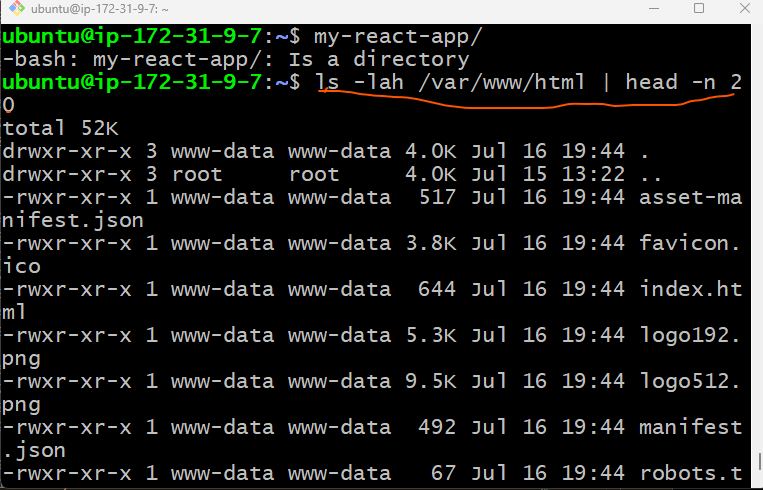
---

#### Screenshot 2 — Output of `grep -R "Deployed by" -n /var/www/html 2>/dev/null | head`

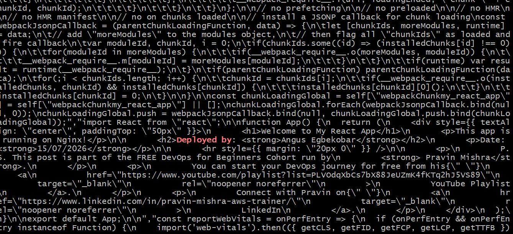
---

#### Screenshot 3 — Output of `grep -n "try_files" /etc/nginx/sites-available/default`

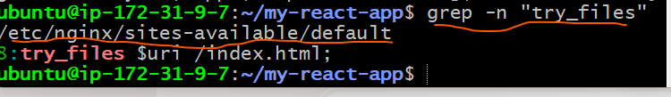
---

### Notes

Answer the following in your own words:

**1. How do you confirm that the correct version of the application is deployed?**

I confirm that the correct version of the application is deployed by checking the deployed React build in /var/www/html and searching for the custom deployment marker using grep -R "Deployed by" -n /var/www/html.  the expected text appears, it confirms that the React source code was updated, a new production build was created, and the latest build was successfully deployed and is being served by Nginx. 
---

# Task 6 — Nginx Configuration Failure Simulation

## Goal

Simulate a real-world Nginx misconfiguration and recover the service safely.

### Evidence

#### Screenshot 1 — Output of `sudo nginx -t` showing the syntax error (broken config)

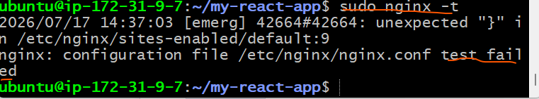
---

#### Screenshot 2 — Output of `sudo nginx -t` showing syntax ok (fixed config)

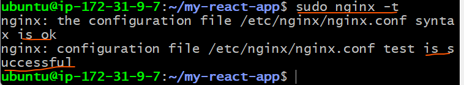
---

#### Screenshot 3 — Output of `curl -I http://<public-ip>` confirming recovery (200 OK)

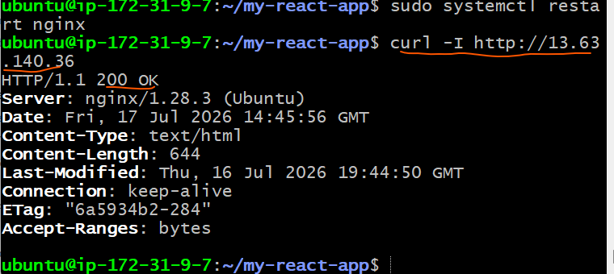
---

### Notes

Answer the following in your own words:

**1. What caused the configuration failure?**

Removing the semi colon (;) at the end of try_files $uri /index.html; caused the configuration failure
---

**2. How did you fix the issue?**

I put the semi colon back at the end of try_files $uri /index.html;
---

**3. How can you avoid this kind of issue in real production systems?**

Always test your configuration with the command --> sudo nginx -t
---

# Task 7 — Web Application Failure Simulation

## Goal

Simulate missing deployment content and recover the application safely.

### Evidence

#### Screenshot 1 — Output of `curl -I http://<public-ip>` showing failure (non-200 response)

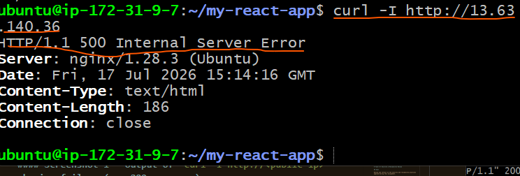
---

#### Screenshot 2 — Output of `curl -I http://<public-ip>` confirming recovery (200 OK)

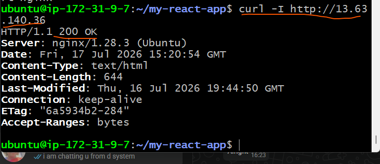
---

### Notes

Answer the following in your own words:

**1. What caused the application to break in this scenario?**

The application broke because the web content directory (/var/www/html) was removed and replaced with an empty directory. Although the Nginx service was still running, it could not find the React application's build files, such as index.html, JavaScript, and CSS files, to serve to users. As a result, HTTP requests returned a non-200 response, indicating that the application content was unavailable.
---

**2. How did you fix the issue and restore the application?**

I restored the application by:

* Removing the empty /var/www/html directory.
* Moving the backup directory (/var/www/html_backup) back to /var/www/html.
* Restarting the Nginx service using:=>sudo systemctl restart nginx
---

**3. What steps would you take to prevent this kind of issue in real production systems?**

To prevent this issue in a production environment, I would take backups before every deployment so there is a known-good version to roll back to if needed.
Deploy to a staging environment first and test the application before releasing it to production.
Perform post-deployment health checks, such as curl requests or monitoring, to confirm the application is serving traffic correctly.
---

# Task 8 — Security & Reliability Review

## Goal

Review and reflect on the security and reliability practices applied during this assignment.

### Security & Reliability Notes

Answer the following in your own words:

**1. Why is SSH key-based authentication more secure than sharing passwords?**

   SSH key-based authentication is more secure because it uses a pair of cryptographic keys (a private key and a public key) instead of a password. The private key remains on the user's computer and is never sent over the network, making it much more difficult for attackers to steal or guess. It also protects against brute-force and password-guessing attacks, providing stronger authentication than traditional passwords.
---

**2. Why should only required ports be open on a production server?**

Only the ports required by the application should be open to minimize the server's attack surface. Every open port is a potential entry point for attackers to exploit vulnerabilities or gain unauthorized access. Closing unnecessary ports improves security, reduces exposure to network attacks, and helps ensure that only legitimate services are accessible.
---

**3. Why is it important for Nginx to be enabled on boot?**

Enabling Nginx on boot ensures that the web server starts automatically whenever the server is restarted, whether due to maintenance, updates, or unexpected outages. This helps keep the application available without requiring manual intervention, improving reliability and reducing downtime.
---

**4. What are the risks of sharing secrets, keys, or credentials publicly?**

Sharing secrets, SSH keys, API keys, passwords, or cloud credentials publicly can allow unauthorized users to access servers, applications, or cloud resources. This can lead to data breaches, unauthorized changes, service disruption, financial losses, or misuse of cloud resources. Sensitive credentials should always be stored securely and never committed to public repositories or shared openly.
---

**5. Why should cloud resources be stopped or terminated when they are no longer needed?**

Cloud resources should be stopped or terminated when they are no longer needed to avoid unnecessary costs and reduce security risks. Unused resources may continue generating charges and, if left exposed, can become targets for attackers. Removing unused resources helps optimize costs, improves security, and keeps the cloud environment clean and easier to manage.
---

# LinkedIn Post (Required)

## Evidence

#### LinkedIn Post URL

https://www.linkedin.com/posts/angus-egbekobar_devops-linux-nginx-ugcPost-7484633339916902400-IRmu/?utm_source=share&utm_medium=member_desktop&rcm=ACoAACpBxXUBgkRH28KX9wNr0QE4jJlRTmgHtCg

---

#### Screenshot — Published LinkedIn post

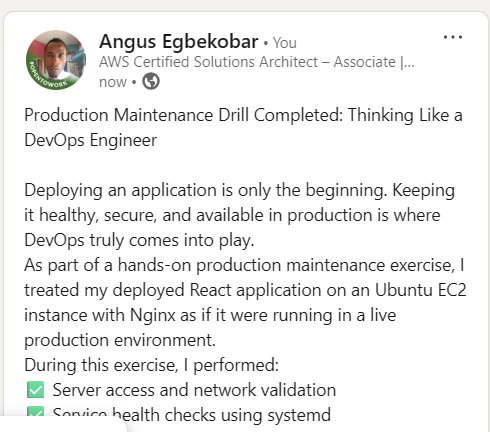
---

# Submission Instructions

- Add all required screenshots in your submission
- Full name must be visible in required screenshots
- Do not expose sensitive information (keys, passwords, account IDs)

---

# Completion Checklist

- [✓ ] Task 1: Screenshots (browser, ip a, ss -tulpen, ufw status) + Notes answered
- [ ✓] Task 2: Screenshots (nginx status, nginx -t, ss port 80) + Notes answered
- [✓ ] Task 3: Screenshots (access log, error log, journalctl) + Notes answered
- [ ✓] Task 4: Screenshots (uptime, free -h, df -h, du -sh) + Notes answered
- [ ✓] Task 5: Screenshots (ls html, grep deployed by, grep try_files) + Notes answered
- [ ✓] Task 6: Screenshots (nginx -t fail, nginx -t pass, curl recovery) + Notes answered
- [✓ ] Task 7: Screenshots (curl failure, curl recovery) + Notes answered
- [✓ ] Task 8: Security & Reliability Notes answered
- [✓ ] LinkedIn post published and URL submitted
- [ ✓] Full Name visible in all required screenshots
- [✓ ] No sensitive data exposed

---

## 📌 About DMI & CloudAdvisory

DevOps Micro Internship (DMI) is a project-based DevOps program run by Pravin Mishra (The CloudAdvisory) focused on real-world execution, systems thinking, and career readiness.

It helps learners build strong DevOps foundations with hands-on experience.

---

## 📌 Resources

- 🌐 DMI Official Website: https://pravinmishra.com/dmi  
- 🎓 DevOps for Beginners (Udemy): https://www.udemy.com/course/devops-for-beginners-docker-k8s-cloud-cicd-4-projects/  
- 🎓 Agentic AI DevOps with Claude Code: https://www.udemy.com/course/ultimate-agentic-ai-devops-with-claude-code/  
- 🎓 DevOps with Claude Code: Terraform, EKS, ArgoCD & Helm: https://www.udemy.com/course/devops-with-claude-code-terraform-eks-argocd-helm/  
- ▶️ YouTube Playlist: https://www.youtube.com/playlist?list=PLFeSNDtI4Cho  
- 🔗 Pravin Mishra (LinkedIn): https://www.linkedin.com/in/pravin-mishra-aws-trainer/  
- 🏢 CloudAdvisory (LinkedIn): https://www.linkedin.com/company/thecloudadvisory/

---

*This submission is part of DevOps Micro Internship (DMI) Cohort 3 — Agentic AI Track.*