# Assignment 5 — Bash Script Automation Drill (OPS Checklist)

Part of the DevOps Micro Internship (DMI) Cohort 3 with Agentic AI

---

## Purpose

In this assignment, you will practice Bash scripting by building a series of small automation scripts covering environment setup, variables, arrays, loops, file conditionals, if-else logic, and functions. These scripts form the foundation of real-world Linux automation used in DevOps, cloud, and production support environments.

---

# Task 1 — Bash Environment & Workspace Setup

## Goal

Verify that Bash is available on your system and create a clean workspace for this assignment.

### Evidence

#### Screenshot 1 — Output of `echo $SHELL` and `bash --version`

Add your screenshot here.
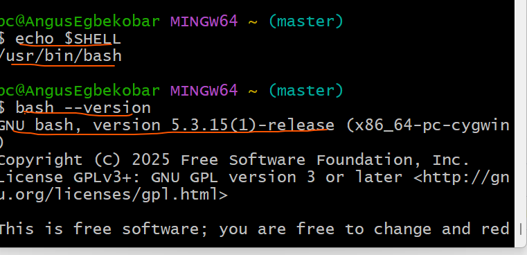
---

#### Screenshot 2 — Output of `pwd` and `ls -lah` showing the scripts directory

Add your screenshot here.
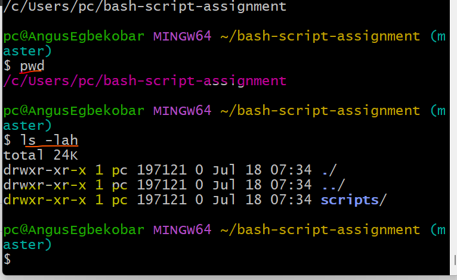
---

### Notes

Answer the following in your own words:

**1. What is Bash?**

Bash (Bourne Again SHell) is a command-line interpreter and scripting language commonly used on Linux and Unix systems. It allows users to execute commands, automate repetitive tasks, manage files and processes, and write scripts to perform complex system administration and DevOps operations.
---

**2. What is the difference between shell and Bash?**

A shell is a general term for any program that provides a command-line interface between the user and the operating system. There are several types of shells, such as Bash, sh, Zsh, Ksh, and Fish.

Bash is one specific type of shell. It is the default shell on many Linux distributions and extends the original Bourne Shell (sh) by adding features such as command history, command-line editing, arrays, functions, and improved scripting capabilities.

In short:
Shell: A general interface for interacting with the operating system.
Bash: A specific shell with enhanced features for interactive use and scripting.
---

**3. Why is it important to confirm the Bash version before writing scripts?**

It is important to confirm the Bash version because different versions support different features. Some scripting features, such as associative arrays, advanced parameter expansion, and newer syntax, are only available in later versions of Bash. Verifying the version helps ensure that your script is compatible with the target system and avoids unexpected errors when the script is executed on another machine.
---

# Task 2 — Your First Bash Script

## Goal

Create your first Bash script, make it executable, and run it from the terminal.

### Evidence

#### Screenshot 1 — Content of `first-script.sh`

Add your screenshot here.
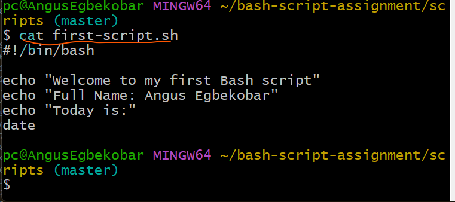
---

#### Screenshot 2 — Output of `./first-script.sh`

Add your screenshot here.
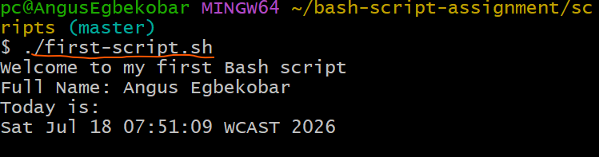
---

#### Screenshot 3 — Output of `ls -l first-script.sh` showing executable permission

Add your screenshot here.
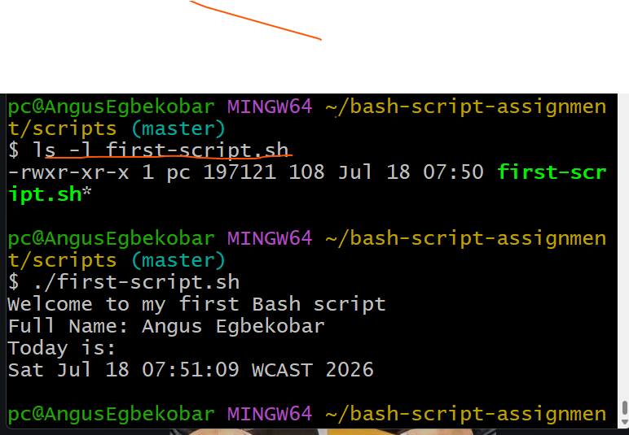
---

### Notes

Answer the following in your own words:

**1. What is the purpose of `#!/bin/bash`?**

The line #!/bin/bash, known as the shebang, tells the operating system which interpreter should be used to execute the script. In this case, it instructs the system to run the script using the Bash shell located at /bin/bash. This ensures the script is executed with the correct shell and behaves consistently across systems where Bash is available.
---

**2. Why do we use `chmod +x` before running a script?**

The chmod +x command adds execute permission to the script, allowing it to be run as an executable program. Without execute permission, the operating system will prevent the script from being executed directly using ./script.sh and will return a "Permission denied" error.
---

**3. What is the difference between running a script using `./script.sh` and `bash script.sh`?**

./script.sh runs the script as an executable file. It requires the script to have execute permission (chmod +x) and uses the interpreter specified in the shebang line (for example, #!/bin/bash).
bash script.sh explicitly tells the Bash interpreter to execute the script. This method does not require the script to have execute permission because Bash reads and runs the script directly.
---

# Task 3 — Variables: User Information Script

## Goal

Use variables to store and display user-related information.

### Evidence

#### Screenshot 1 — Content of `user-info.sh`

Add your screenshot here.
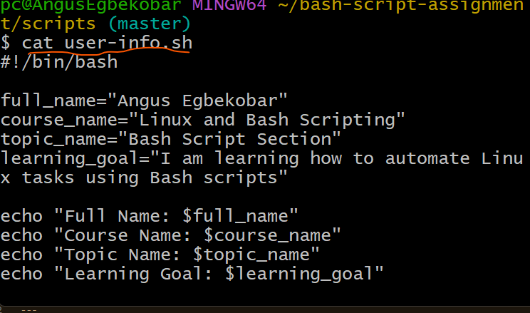
---

#### Screenshot 2 — Output of `./user-info.sh`

Add your screenshot here.
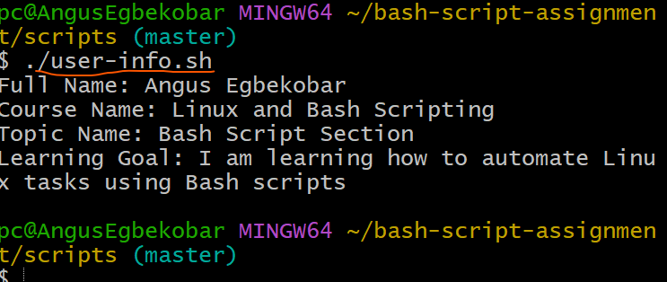
---

### Notes

Answer the following in your own words:

**1. What is a variable in Bash?**

A variable in Bash is a named storage location used to hold data, such as text, numbers, or command output. Variables make scripts more flexible and reusable by allowing values to be stored once and referenced multiple times throughout the script.
---

**2. Why should we avoid spaces around the `=` sign when creating variables?**

In Bash, there must be no spaces around the = sign when assigning a value to a variable. If spaces are added, Bash interprets the variable name and value as separate commands or arguments, resulting in a syntax error or a "command not found" error.
---

**3. How do you access the value stored inside a Bash variable?**

You access the value of a Bash variable by prefixing its name with the $ symbol.
---

# Task 4 — Arrays & Loops: Tools Checklist Script

## Goal

Use arrays and loops to print a checklist of tools used in Bash scripting.

### Evidence

#### Screenshot 1 — Content of `tools-checklist.sh`

Add your screenshot here.

---

#### Screenshot 2 — Output of `./tools-checklist.sh`

Add your screenshot here.
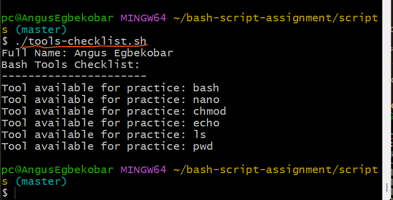
---

### Notes

Answer the following in your own words:

**1. What is an array in Bash?**

An array in Bash is a variable that can store multiple values under a single name. Each value is stored at a different index, allowing you to organize and manage related pieces of data more efficiently.
---

**2. Why are arrays useful in scripts?**

Arrays are useful because they allow you to store and process multiple related values without creating separate variables for each one. They work well with loops, making it easy to iterate through a list of items, automate repetitive tasks, and write cleaner, more maintainable scripts.
---

**3. What does `"${tools[@]}"` mean?**

"${tools[@]}" represents all the elements in the tools array. When used in a loop, it expands to each array element one at a time, allowing the script to process every item individually.
---

**4. What is the purpose of the `for` loop in this script?**

The purpose of the for loop is to iterate through each element in the tools array and execute the same command for every item. In this script, it prints each tool in the checklist one by one without having to write a separate echo statement for each tool. This makes the script shorter, more efficient, and easier to maintain.
---

# Task 5 — Loops: Number Counter Script

## Goal

Use loops to repeat a task multiple times.

### Evidence

#### Screenshot 1 — Content of `counter.sh`

Add your screenshot here.
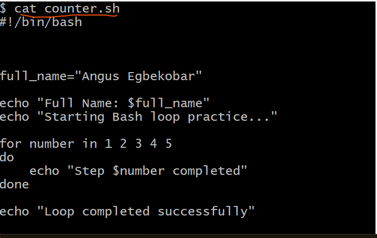
---

#### Screenshot 2 — Output of `./counter.sh`

Add your screenshot here.
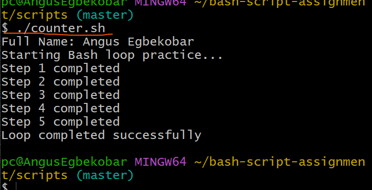
---

### Notes

Answer the following in your own words:

**1. What is a loop?**

A loop is a programming construct that repeatedly executes a block of code until a specified condition is met or all items in a list have been processed.
---

**2. Why do we use loops in Bash scripting?**

Loops are used to automate repetitive tasks, reducing the need to write the same code multiple times. They make scripts shorter, more efficient, easier to maintain, and less prone to errors.
---

**3. How many times did the loop run in your script?**

The loop ran 5 times.
---

**4. What would you change if you wanted the loop to run 10 times?**

I would modify the list of numbers in the for loop to include numbers 1 through 10
---

# Task 6 — Files & Conditionals: File Validation Script

## Goal

Use file checks and conditionals to verify whether files and directories exist.

### Evidence

#### Screenshot 1 — Output of `ls -lah ../test-folder`

Add your screenshot here.
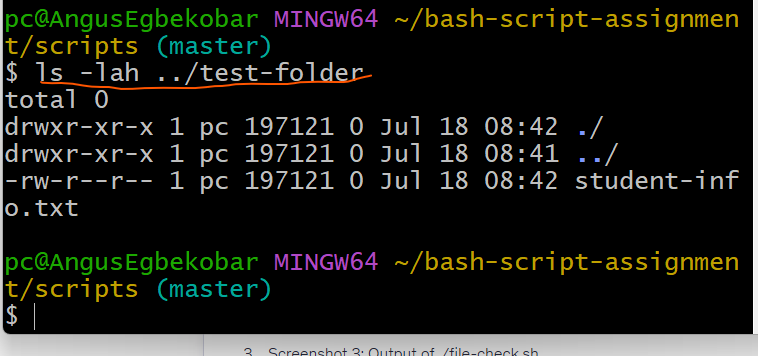
---

#### Screenshot 2 — Content of `file-check.sh`

Add your screenshot here.
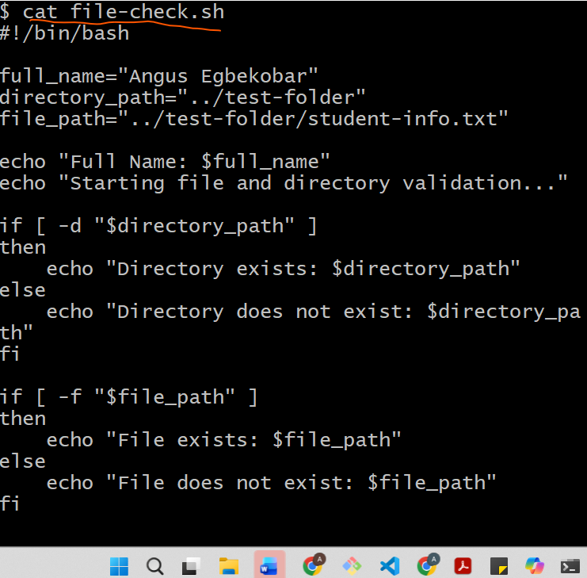
---

#### Screenshot 3 — Output of `./file-check.sh`

Add your screenshot here.
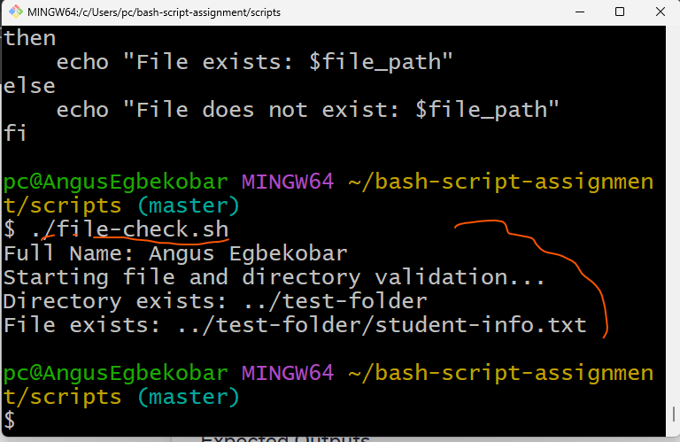
---

### Notes

Answer the following in your own words:

**1. What does `-d` check in Bash?**

The -d test checks whether a specified path exists and is a directory. It returns true if the directory exists; otherwise, it returns false.
---

**2. What does `-f` check in Bash?**

The -f test checks whether a specified path exists and is a regular file. It returns true if the file exists and is a normal file; otherwise, it returns false.
---

**3. Why should file and directory paths be stored in variables?**

File and directory paths should be stored in variables because it makes the script easier to read, maintain, and update.
---

**4. What happens if the file does not exist?**

If the file does not exist, the -f test evaluates to false, and the else block is executed
---

# Task 7 — Conditionals: Pass or Retry Script

## Goal

Use if-else conditionals to make decisions based on a variable value.

### Evidence

#### Screenshot 1 — Content of `score-check.sh` with `score=85`

Add your screenshot here.
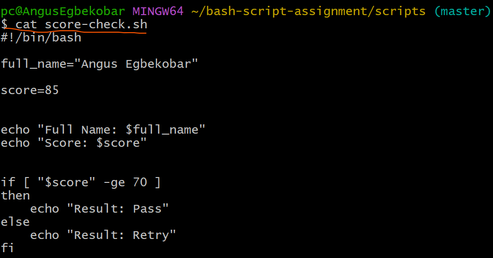
---

#### Screenshot 2 — Output showing `Result: Pass`

Add your screenshot here.
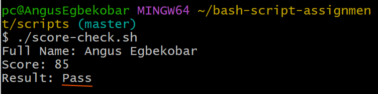
---

#### Screenshot 3 — Content of `score-check.sh` with `score=55`

Add your screenshot here.
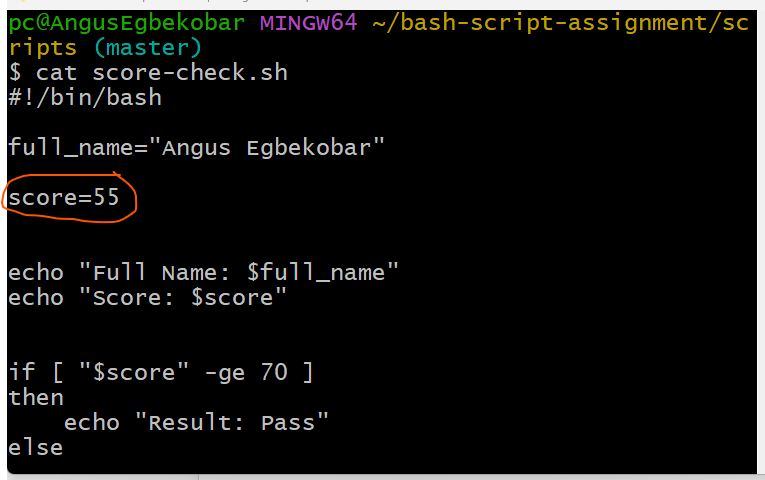
---

#### Screenshot 4 — Output showing `Result: Retry`

Add your screenshot here.
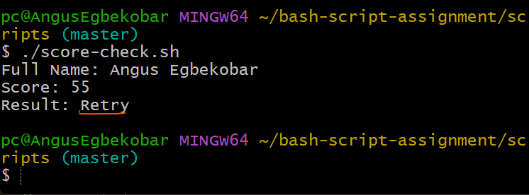
---

### Notes

Answer the following in your own words:

**1. What is the purpose of if-else in Bash?**

The if-else statement is used to make decisions in a Bash script. It evaluates a condition and executes one block of code if the condition is true, and a different block if the condition is false. This allows the script to respond differently based on different situations.
---

**2. What does `-ge` mean?**

-ge stands for greater than or equal to.
---

**3. Why should conditions be tested with different values?**

Conditions should be tested with different values to verify that all possible outcomes work correctly. This helps ensure that both the if and else branches execute as expected, allowing you to identify and fix any logic errors before using the script in a real environment.
---

**4. How can conditionals help in automation scripts?**

Conditionals help automation scripts make decisions based on specific conditions or system states. For example, they can check whether a file exists, verify if a service is running, or determine whether a command completed successfully. This enables scripts to perform the appropriate actions automatically, making them more reliable and adaptable.
---

# Task 8 — Functions: Final Bash Automation Script

## Goal

Create a final Bash script using functions to organize reusable code.

### Evidence

#### Screenshot 1 — Content of `final-automation.sh`

Add your screenshot here.
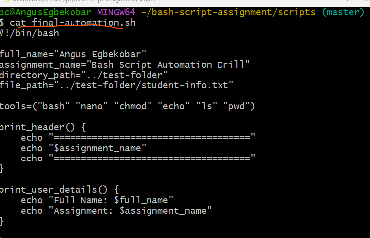
---

#### Screenshot 2 — Output of `./final-automation.sh`

Add your screenshot here.
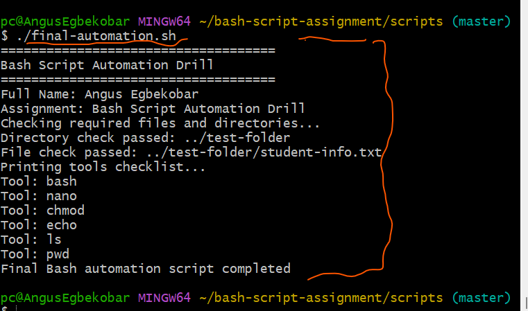
---

#### Screenshot 3 — Output of `ls -lah` showing all created scripts

Add your screenshot here.
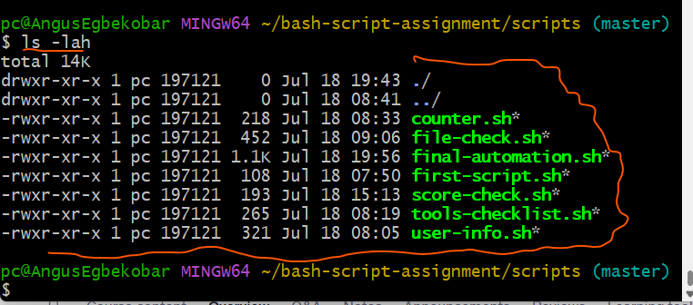
---

### Notes

Answer the following in your own words:

**1. What is a function in Bash?**

A function in Bash is a named block of code that performs a specific task. It can be called whenever needed within a script, allowing the same code to be reused without rewriting it. Functions help organize scripts into smaller, manageable sections.
---

**2. Why are functions useful in scripts?**

Functions make scripts more organized, reusable, and easier to maintain. They reduce code duplication by allowing the same block of code to be called multiple times. Functions also improve readability and simplify debugging by separating different tasks into logical units.
---

**3. Which functions did you create in this script?**

print_header() – Displays the assignment title and header.
print_user_details() – Prints the user's full name and assignment name.
check_files() – Checks whether the required directory and file exist using conditional statements.
print_tools() – Loops through the tools array and prints each tool in the checklist.
---

**4. How does this final script combine variables, arrays, loops, conditionals, files, and functions?**

Variables store information such as the user's name, assignment name, and file paths.
Arrays store a list of Bash tools used in the script.
Loops iterate through the array to print each tool.
Conditionals (if-else) check whether the required directory and file exist.
File checks use the -d and -f operators to validate the presence of directories and files.
Functions organize the script into reusable sections, making it easier to read, maintain, and extend.
---

# LinkedIn Post (Required)

## Evidence

#### LinkedIn Post URL

Paste your LinkedIn post URL here:

`_https://www.linkedin.com/posts/angus-egbekobar_devops-linux-bash-ugcPost-7484330302337761281-IUfp/?utm_source=share&utm_medium=member_desktop&rcm=ACoAACpBxXUBgkRH28KX9wNr0QE4jJlRTmgHtCg_________________________`

---

#### Screenshot — Published LinkedIn post

Add your screenshot here.

---

# Submission Instructions

- Add all required screenshots in your submission
- Full name must be visible in required screenshots
- All script files must be created and run successfully
- Required notes must be answered clearly for every task
- Do not expose sensitive information (keys, passwords, credentials)

---

# Completion Checklist

- [ ✓] Task 1: Environment setup verified, workspace created (Screenshots 1–2, Notes answered)
- [ ✓] Task 2: First script created, executed, permissions verified (Screenshots 1–3, Notes answered)
- [ ✓] Task 3: Variables script created and run (Screenshots 1–2, Notes answered)
- [ ✓] Task 4: Arrays and loops script created and run (Screenshots 1–2, Notes answered)
- [ ✓] Task 5: Counter loop script created and run (Screenshots 1–2, Notes answered)
- [ ✓] Task 6: File validation script created and run (Screenshots 1–3, Notes answered)
- [ ✓] Task 7: Pass/Retry conditional script tested with both values (Screenshots 1–4, Notes answered)
- [✓ ] Task 8: Final automation script created and run (Screenshots 1–3, Notes answered)
- [ ✓] All scripts run without errors
- [ ✓] Full Name visible in all required screenshots
- [✓ ] LinkedIn post published and URL submitted
- [✓ ] No sensitive data exposed

---

## 📌 About DMI & CloudAdvisory

DevOps Micro Internship (DMI) is a project-based DevOps program run by Pravin Mishra (The CloudAdvisory) focused on real-world execution, systems thinking, and career readiness.

It helps learners build strong DevOps foundations with hands-on experience.

---

## 📌 Resources

- 🌐 DMI Official Website: https://pravinmishra.com/dmi  
- 🎓 DevOps for Beginners (Udemy): https://www.udemy.com/course/devops-for-beginners-docker-k8s-cloud-cicd-4-projects/  
- 🎓 Agentic AI DevOps with Claude Code: https://www.udemy.com/course/ultimate-agentic-ai-devops-with-claude-code/  
- 🎓 DevOps with Claude Code: Terraform, EKS, ArgoCD & Helm: https://www.udemy.com/course/devops-with-claude-code-terraform-eks-argocd-helm/  
- ▶️ YouTube Playlist: https://www.youtube.com/playlist?list=PLFeSNDtI4Cho  
- 🔗 Pravin Mishra (LinkedIn): https://www.linkedin.com/in/pravin-mishra-aws-trainer/  
- 🏢 CloudAdvisory (LinkedIn): https://www.linkedin.com/company/thecloudadvisory/

---

*This submission is part of DevOps Micro Internship (DMI) Cohort 3 — Agentic AI Track.*