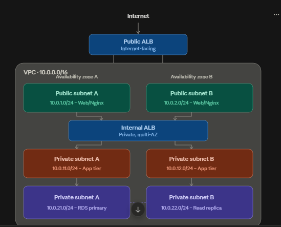
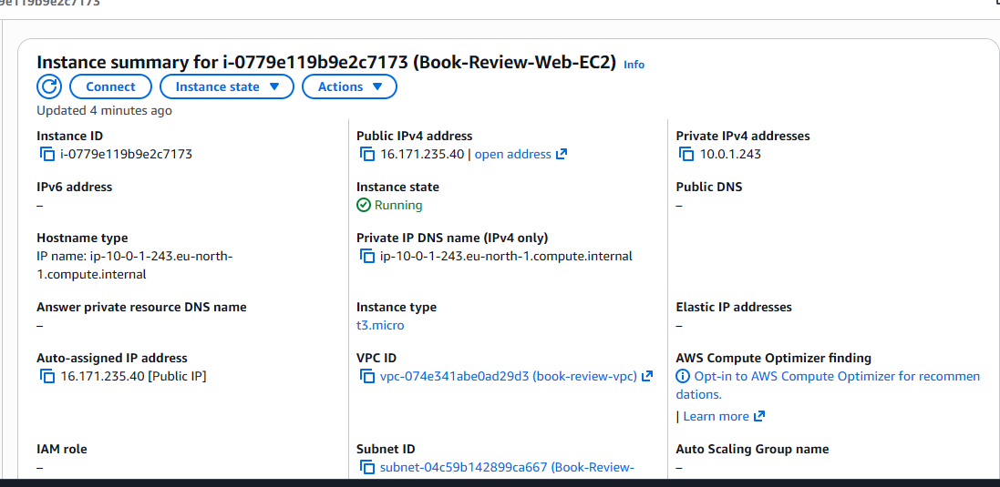
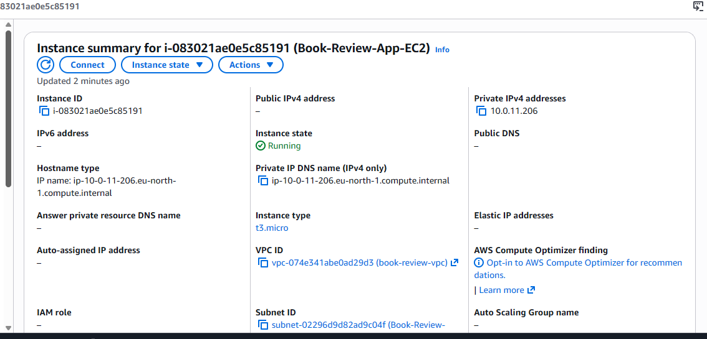
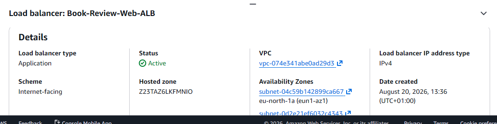
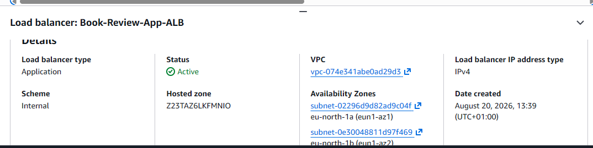
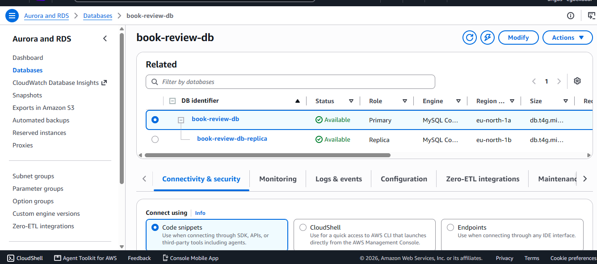
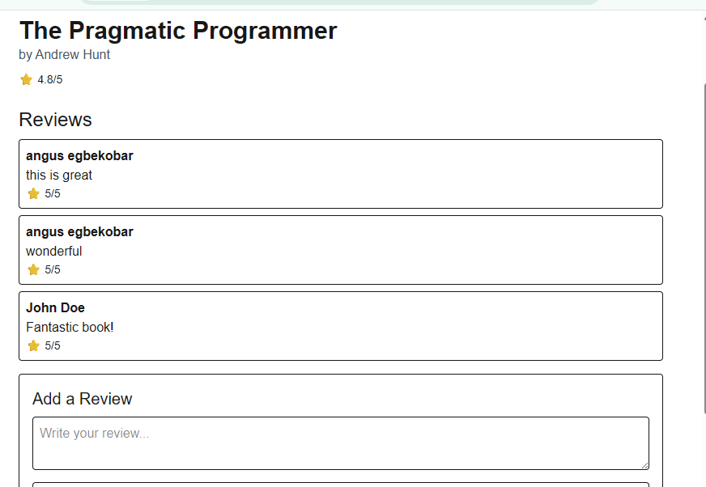
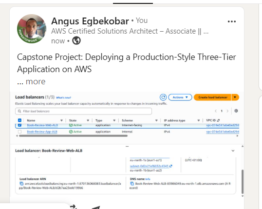

# Assignment 6 — Capstone Assignment — Deploy Book Review App (Three-Tier Architecture) on AWS

Part of the DevOps Micro Internship (DMI) Cohort 3 with Agentic AI

---

## Purpose

This is the most important assignment of the course. You will deploy the Book Review App in a fully production-style three-tier architecture on AWS: a Next.js Web Tier behind Nginx and a public ALB, a private Node.js/Express App Tier behind an internal ALB, and a private Multi-AZ MySQL RDS database with a read replica. You are expected to design, deploy, isolate, debug, and document the result independently.

---

# Task 1 — Architecture Diagram

## Goal

Create an architecture diagram showing the custom VPC (10.0.0.0/16), the six subnets across two Availability Zones (two public Web Tier, two private App Tier, two private Database Tier), the public ALB, Web Tier EC2/Nginx, internal ALB, private App Tier EC2, private Multi-AZ RDS with its read replica, and the permitted traffic flow.

### Evidence

#### Diagram image or link

Add your diagram image or link here.

---

# Task 2 — AWS Region & Services Used

## Goal

Record the AWS Region used and list every AWS service used across networking, compute, load balancing, security, and the database.

### Notes

**Region:**

Europe(Stockholm)
---

**Services:**

Write your answer here.

 Networking

VPC,
six subnets, Internet Gateway
,Elastic IP,NAT Gateway
,public route table
,private route table
,private database route table

 Security

Security Groups

 Load Balancers

Public ALB

Internal ALB

Target Groups

 Database Layer

DB Subnet Group,
RDS MySQL,
Multi-AZ,
Read Replica,

Compute

Web EC2,
App EC2

---

# Task 3 — Public Entry Point

## Goal

Confirm the Book Review App loads through the public ALB DNS name.

### Evidence

#### Public ALB DNS

Paste your public ALB DNS name here:

Book-Review-Web-ALB-83986049.eu-north-1.elb.amazonaws.com
---

# Task 4 — Evidence Screenshots

## Goal

Capture visual proof of every tier and load balancer.

### Evidence

#### Web EC2

---

#### App EC2

---

#### Public ALB

---

#### Internal ALB

---

#### RDS + Replica

---

#### App UI proof

---

# Task 5 — Summary

## Goal

Summarize what worked in the final deployment, the issues encountered and how each was fixed, and the tools or sources used to research and debug.

### Notes

**What worked:**

Write your answer here.

The final deployment is a fully isolated three-tier architecture inside a custom VPC (10.0.0.0/16) across two Availability Zones, with six subnets (two public, four private):

A public Application Load Balancer routes internet traffic into the Web Tier (Nginx + Next.js on EC2), which is the only publicly reachable component.

Nginx proxies /api/* requests internally to an Internal Application Load Balancer, which load-balances to the App Tier (Node.js/Express on EC2) in a private subnet with no public IP.

The App Tier connects to a private Multi-AZ RDS MySQL database with a read replica, also with no public exposure.

Access to the private App Tier is only possible via a bastion-host pattern: SSH into the Web Tier first, then hop to the App Tier's private IP from there.

Each tier's security group only trusts the specific security group of the tier immediately in front of it (Web SG → App SG → DB SG), rather than broad IP ranges, enforcing real network isolation between tiers.

End-to-end functionality is confirmed working: the homepage loads and lists books pulled live from RDS, and both user registration and login succeed through the full Web → ALB → App → DB round trip

---

**Issues + fixes:**

Write your answer here.

Issue: SSH key permission error in WSL. The .pem key lived under /mnt/c/... (the Windows-mounted drive), where chmod cannot enforce Linux file permissions, so SSH refused to use it. 

Fix: copied the key into WSL's own filesystem (~/.ssh/) and set chmod 400 there.

Issue: Bastion-hop SSH blocked by security group. The App Tier's SSH rule was scoped to my personal IP, which is meaningless for traffic originating from the Web Tier's private IP during the second hop.

 Fix: changed the App SG's SSH source to reference the Web Tier's security group directly, instead of an IP or opening it to 0.0.0.0/0.

Issue: Database reachable from the wrong tier. The DB security group's MySQL/Aurora (3306) rule was sourced from the Web SG, allowing the Web Tier to bypass the App Tier entirely. 

Fix: changed the source to the App Tier's security group, enforcing the intended Web → App → DB flow.

Issue: Backend process stuck in an errored restart loop (EADDRINUSE). An orphaned node process (started outside PM2 at some point) was already bound to port 3001, so every new PM2-managed instance failed to bind and crash-looped. 

Fix: used lsof -i :3001 to find the orphan PID, killed it directly, then started a clean PM2 process.

Issue: Internal ALB target group unhealthy despite the app running correctly. The App Tier's security group only allowed inbound traffic from itself, but since there was no dedicated ALB security group, the internal ALB was also using the App SG — meaning its health-check traffic needed a self-referencing rule to reach the instance. 

Fix: added an inbound rule on the App SG sourced from itself (self-reference) on port 3001, in addition to the Web SG rule already used for real API traffic.

Issue: Public ALB target group unhealthy. Same root cause as above, mirrored on the Web Tier: the public ALB also used the Web SG for itself, so it needed a self-referencing HTTP(80) rule to pass its own health check.

Issue: Site became completely unreachable after the previous fix. While adding the self-reference rule to the Web SG, the existing 0.0.0.0/0 rule on port 80 was inadvertently replaced rather than added alongside it, blocking all public traffic. 

Fix: re-added a second port-80 rule sourced from 0.0.0.0/0, so both the public internet and the ALB's own health checks are allowed.

Issue: Frontend showed "No books available" despite a working API. Browser dev tools revealed the frontend was requesting /api/api/books — a doubled path caused by NEXT_PUBLIC_API_URL being set to /api while the code separately appended /api/books to it. 

Fix: corrected the environment variable, then rebuilt the Next.js app (npm run build) and restarted PM2, since NEXT_PUBLIC_* values are baked into the client bundle at build time, not read at runtime.

Issue: Registration/login requests going to localhost:3001. A fallback in the API client used process.env.NEXT_PUBLIC_API_URL || "http://localhost:3001". Because an empty string is falsy in JavaScript, the intentionally blank production value was silently overridden by the local-dev fallback.

 Fix: changed || to the nullish-coalescing operator ??, which only falls back on null/undefined, not on an empty string.

Issue: Registration failing with a 500 error after the URL was fixed. Backend logs showed CORS policy: Not allowed by server. The site's real address (http://16.171.235.40) was never included in ALLOWED_ORIGINS, so the browser's Origin header on the POST request was correctly rejected by the app's own CORS logic. 

Fix: added the site's actual origin to ALLOWED_ORIGINS and restarted PM2 with --update-env, which is required for PM2 to actually reload environment variable changes rather than reusing the values from when the process first started.

---

**Tools/sources used:**

Write your answer here.

AWS Management Console — EC2 instances, Security Groups, Target Groups, Load Balancers, and RDS, for configuration and health-check verification.

SSH / SCP via a bastion-host pattern to reach the private App Tier and transfer files.

PM2 (pm2 status, pm2 logs, pm2 restart --update-env) for process management and reading real-time error output.

MySQL CLI client to connect directly to RDS and verify table structure and data.

curl at every tier (App EC2 locally, through the internal ALB, through Nginx) to isolate exactly which hop in the request path was failing.

Browser Developer Tools (Network and Console tabs) to see the actual request URLs, status codes, and CORS/JS errors the server-side logs alone couldn't show.

Linux command-line utilities — grep, sed, lsof, find, md5sum — to search code, inspect exact file contents/line numbers, find processes holding a port, and confirm which file a running process was actually executing.

Claude (AI assistant) for step-by-step debugging guidance, root-cause analysis of security group and CORS misconfigurations, and validating fixes at each stage of the deployment.

---

# LinkedIn Post (Required)

## Goal

Publish a LinkedIn post sharing the capstone deployment, including the public ALB DNS (or a redacted screenshot), three to five lines on what you built and why it is production-style, and one proof screenshot.

## Evidence

#### LinkedIn Post URL

Paste your LinkedIn post URL here:

https://lnkd.in/p/etNfPE5B
---

#### Screenshot of LinkedIn post

---

# Submission Instructions

- Add all required screenshots and links in your submission
- Do not expose passwords, RDS credentials, connection strings, private keys, or account IDs

---

# Completion Checklist

- [ ✓] Task 1: Architecture diagram completed
- [ ✓] Task 2: AWS Region and services documented
- [ ✓] Task 3: Public ALB DNS confirmed working
- [✓ ] Task 4: All six evidence screenshots captured (Web Tier, App Tier, both ALBs, RDS + replica, app UI)
- [ ✓] Task 5: Deployment summary completed (what worked, issues/fixes, tools/sources)
- [ ✓] LinkedIn post published and URL submitted
- [✓ ] App Tier and Database Tier confirmed not publicly accessible
- [ ✓] No sensitive data exposed

---

## 📌 About DMI & CloudAdvisory

DevOps Micro Internship (DMI) is a project-based DevOps program run by Pravin Mishra (The CloudAdvisory) focused on real-world execution, systems thinking, and career readiness.

It helps learners build strong DevOps foundations with hands-on experience.

---

## 📌 Resources

- 🌐 DMI Official Website: https://dmi.pravinmishra.com?utm_source=github&utm_medium=readme  
- 🎓 University: https://university.pravinmishra.com?utm_source=github&utm_medium=readme  
- 💬 Discord Community: https://discord.pravinmishra.com?utm_source=github&utm_medium=readme  
- 📝 Blog: https://dmi.pravinmishra.com/blog?utm_source=github&utm_medium=readme  
- ▶️ YouTube Playlist: https://www.youtube.com/playlist?list=PLFeSNDtI4Cho  
- 🔗 Pravin Mishra (LinkedIn): https://www.linkedin.com/in/pravin-mishra-aws-trainer/  
- 🏢 CloudAdvisory (LinkedIn): https://www.linkedin.com/company/thecloudadvisory/

---

*This submission is part of DevOps Micro Internship (DMI) Cohort 3 — Agentic AI Track.*