# Assignment 6 — Capstone: Deploy Book Review App (Three-Tier Architecture) on Azure

Part of the DevOps Micro Internship (DMI) Cohort 3 with Agentic AI

---

## Purpose

This is the most important assignment of the course. You will deploy the Book Review App in a production-ready, best-practice-compliant three-tier architecture on Azure: separated presentation, application, and database tiers, least-privilege network access, a controlled public entry point, protected secrets, and availability/monitoring evidence.

---

# Task 1 — Design the Azure Three-Tier Architecture

## Goal

Create an architecture diagram and implementation plan identifying the presentation, application, and database components, the chosen Azure services, the public entry point, and the internal traffic paths.

### Evidence

#### Screenshot 1 — Architecture diagram showing the public entry point, three tiers, network boundaries, and traffic flow

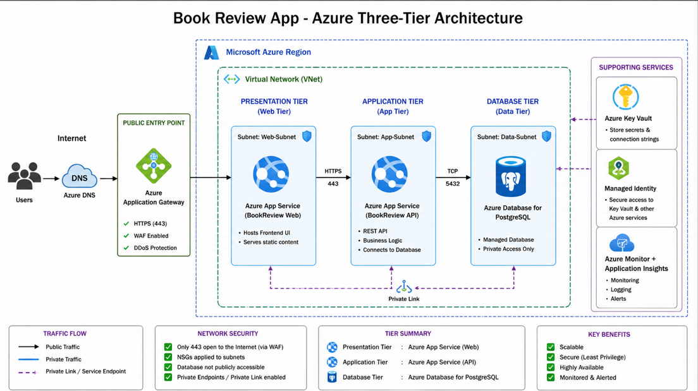
---

#### Screenshot 2 — Written architecture assumptions and selected Azure services

# Architecture Assumptions

## The Book Review App will be deployed using a three-tier architecture consisting of a presentation tier, application tier, and database tier. The architecture is designed to separate responsibilities, reduce unnecessary network exposure, and follow the principle of least privilege.

## The following assumptions were made:

### 1. Users access the Book Review App through the Internet using HTTPS. Only the approved public entry point is exposed to the Internet.

### 2. The presentation tier is responsible for serving the Book Review App's frontend and user interface.

### 3. The application tier contains the backend/API responsible for processing requests, implementing business logic, and communicating with the database.

### 4. The database tier stores book information, reviews, user information, and other application data. The database should not be directly accessible from the public Internet.

### 5. Communication between tiers should use private or controlled network paths wherever possible.

### 6. HTTPS over port 443 is used for public and application-level communication to protect data in transit.

### 7. Access between the application and database tiers is restricted to only the required database port and application resources.

### 8.Secrets such as database credentials and connection strings should not be stored directly in application source code. They will be stored in Azure Key Vault.

### 9. Managed Identity will be used where possible to allow Azure resources to access Key Vault without storing credentials in the application.

### 10. Azure Monitor and Application Insights will be used to provide monitoring, logging, and application performance information.

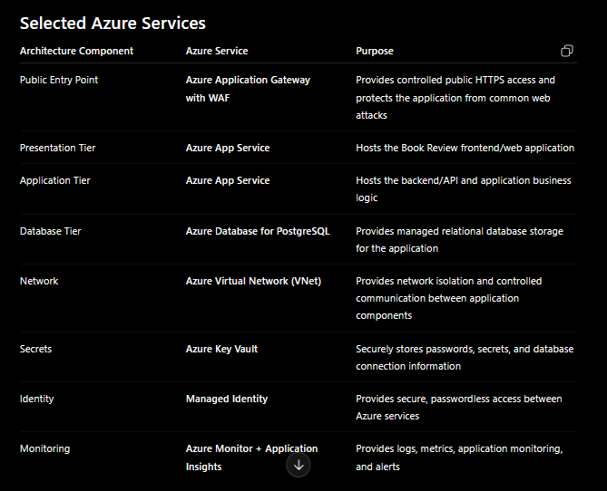
---

# Task 2 — Create the Azure Network Foundation

## Goal

Create a dedicated Resource Group and VNet with separate subnets for the web, application, and database tiers, keeping the application and database tiers without direct public access.

### Evidence

#### Screenshot 3 — Resource Group overview showing the assignment resources

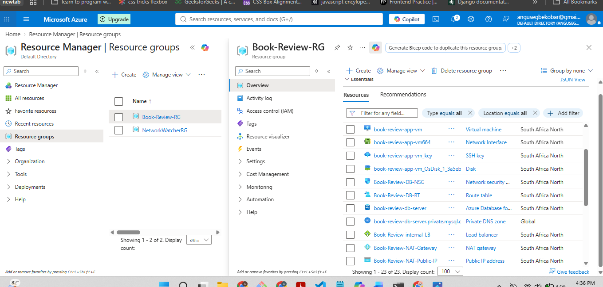
---

#### Screenshot 4 — VNet overview showing the address space and all required subnets

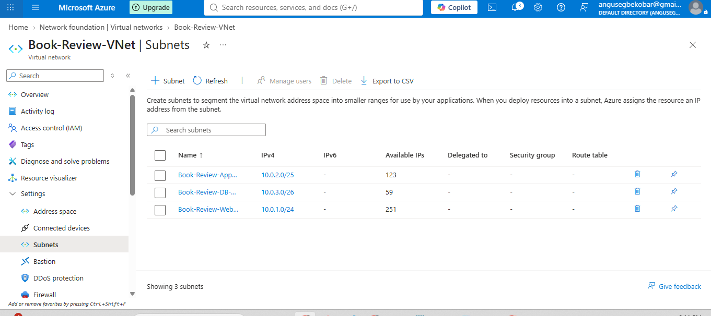
---

#### Screenshot 5 — Route-table or Private DNS evidence where applicable

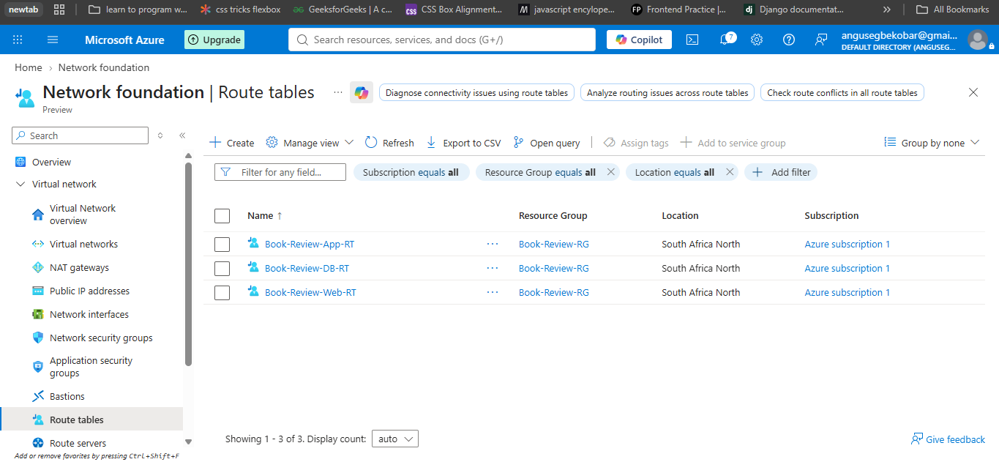
---

# Task 3 — Configure Security and Secret Management

## Goal

Apply least-privilege NSG rules so traffic flows Internet → public entry point → web tier → application tier → database tier, and store credentials in Azure Key Vault or another approved secure mechanism.

### Evidence

#### Screenshot 6 — NSG rules proving least-privilege access between the tiers

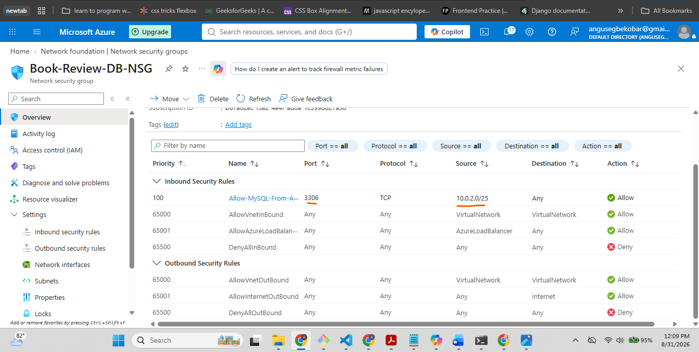
---

#### Screenshot 7 — Key Vault or approved secret-management configuration (without displaying secret values)

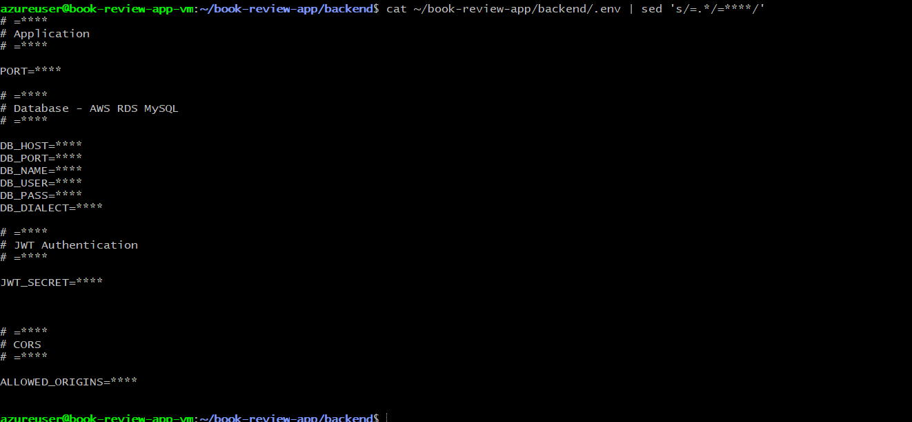
---

# Task 4 — Deploy the Presentation (Web) Tier

## Goal

Deploy the Book Review App presentation layer on the approved web-tier compute service, configured to route requests to the internal application-tier endpoint, and not directly exposed except through the public entry service.

### Evidence

#### Screenshot 8 — Web-tier compute overview showing subnet and availability configuration

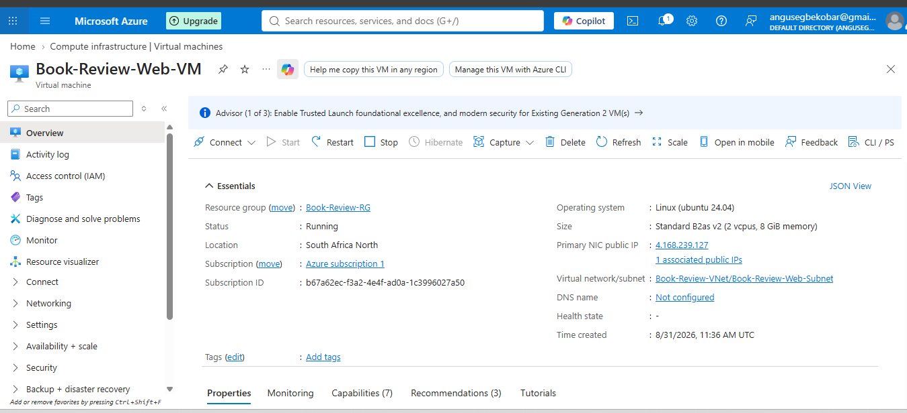
---

#### Screenshot 9 — Terminal or service output proving the presentation layer is running

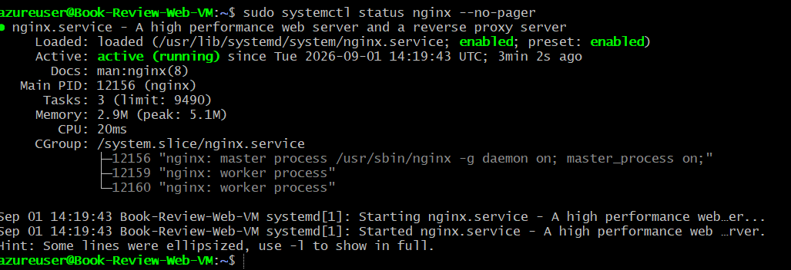
---

# Task 5 — Deploy the Business (Application) Tier

## Goal

Deploy the Book Review App backend privately in the application subnet, configured to use the private database endpoint and secured environment values, reachable only through its internal endpoint.

### Evidence

#### Screenshot 10 — Application-tier compute overview showing private subnet placement

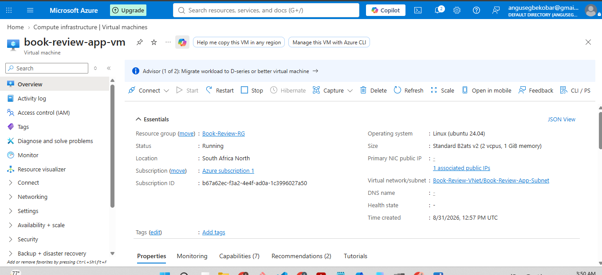
---

#### Screenshot 11 — Backend process, service, or listening-port evidence

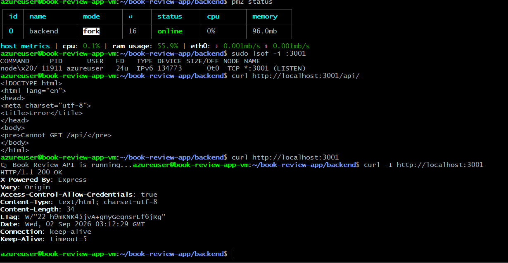
---

#### Screenshot 12 — Internal health-check or API response (without exposing secrets)

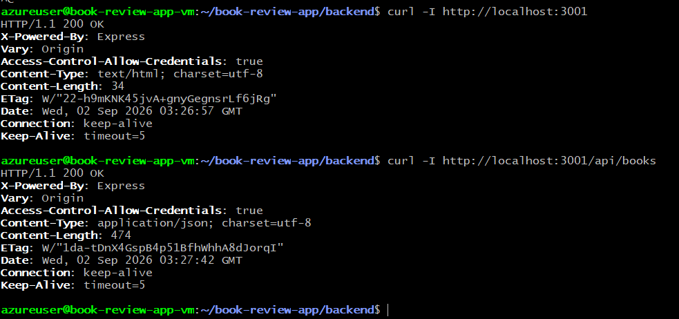
---

# Task 6 — Deploy the Managed Database Tier

## Goal

Create a private Azure managed database (public access disabled), with availability/backup/retention settings, the Book Review App schema imported, and access restricted to the application tier only.

### Evidence

#### Screenshot 13 — Database overview showing private connectivity and public access disabled

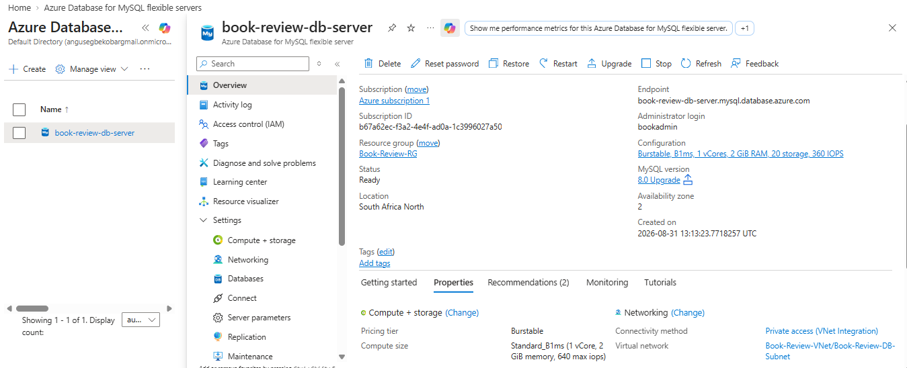
---

#### Screenshot 14 — Availability, backup, and retention configuration

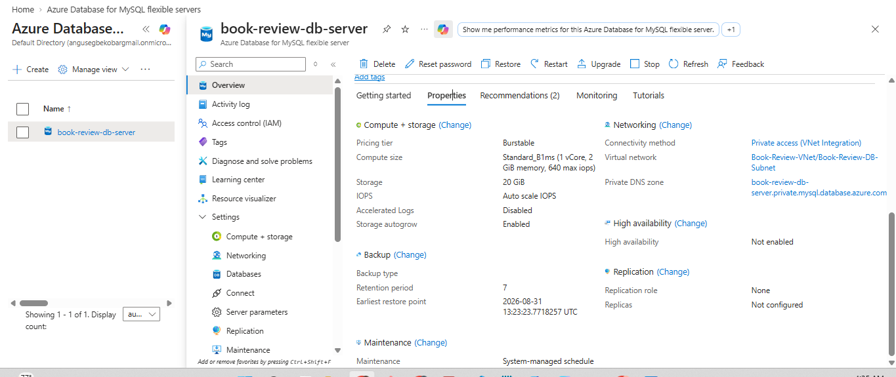
---

#### Screenshot 15 — Successful schema or connectivity verification (without exposing credentials)

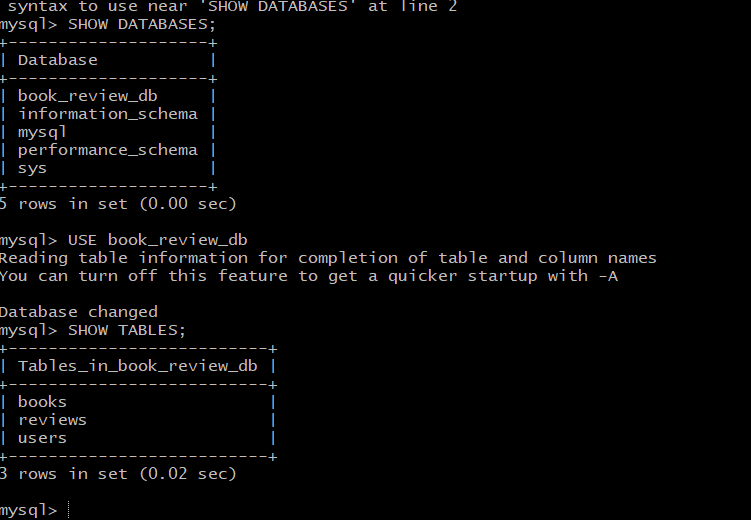
---

# Task 7 — Configure Traffic Management, Availability, and Monitoring

## Goal

Configure the approved public entry service with health probes and backend pools, internal routing for the application tier where required, and enable Azure Monitor/diagnostics/logs/alerts for the key resources.

### Evidence

#### Screenshot 16 — Public entry service showing listener, frontend endpoint, and healthy web targets

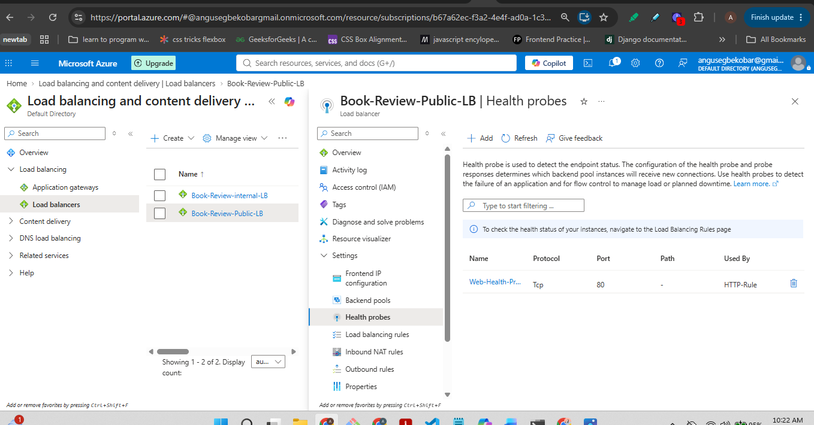
---

#### Screenshot 17 — Internal application-tier load-balancing or routing configuration where applicable

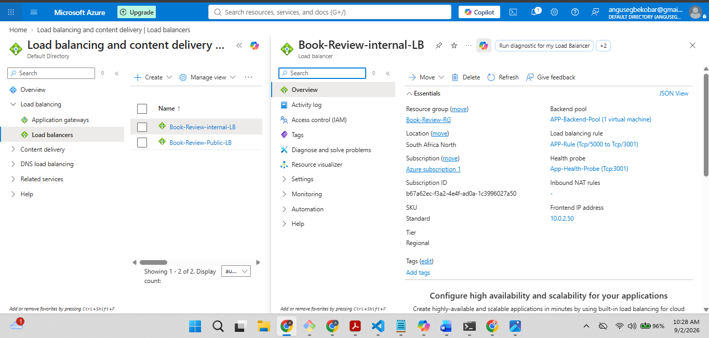
---

#### Screenshot 18 — Azure Monitor, diagnostic settings, logs, metrics, or alert evidence

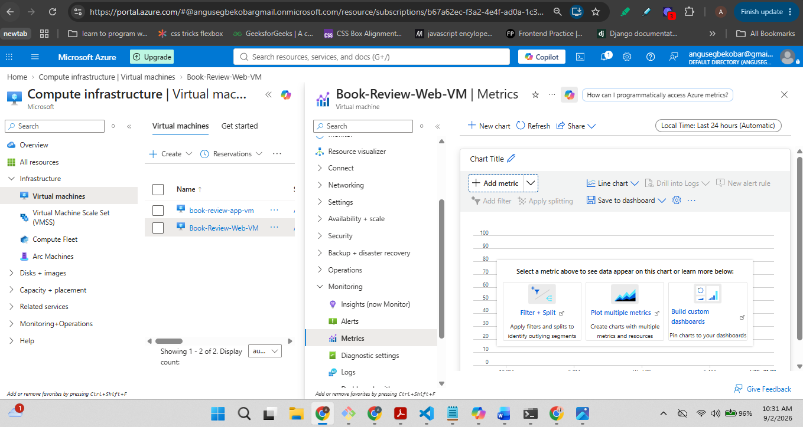
---

# Task 8 — Validate the Production-Style Deployment

## Goal

Confirm the Book Review App works end to end through the public endpoint, with at least one database read and one write, confirm private tiers are not internet-reachable, and complete a safe availability test.

### Evidence

#### Screenshot 19 — Browser showing the Book Review App through the public endpoint

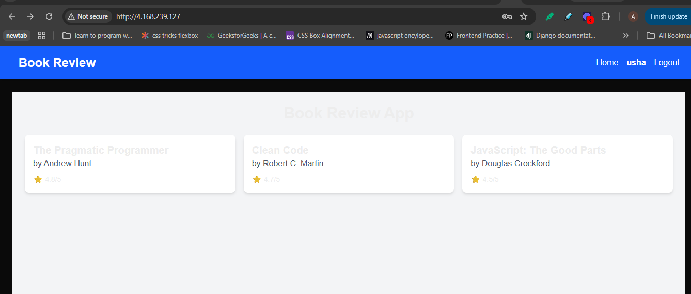
---

#### Screenshot 20 — Proof of successful database-backed read and write operations

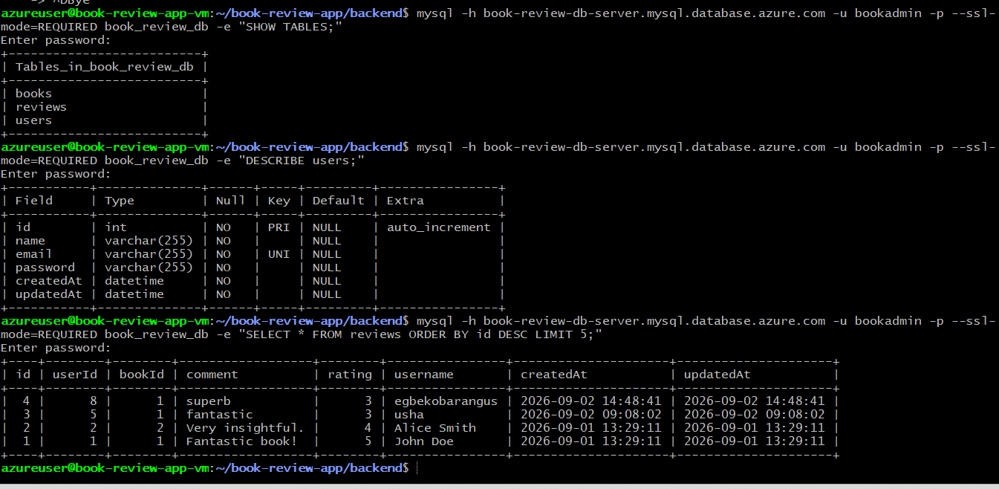
---

#### Screenshot 21 — Evidence that private tiers are not publicly accessible

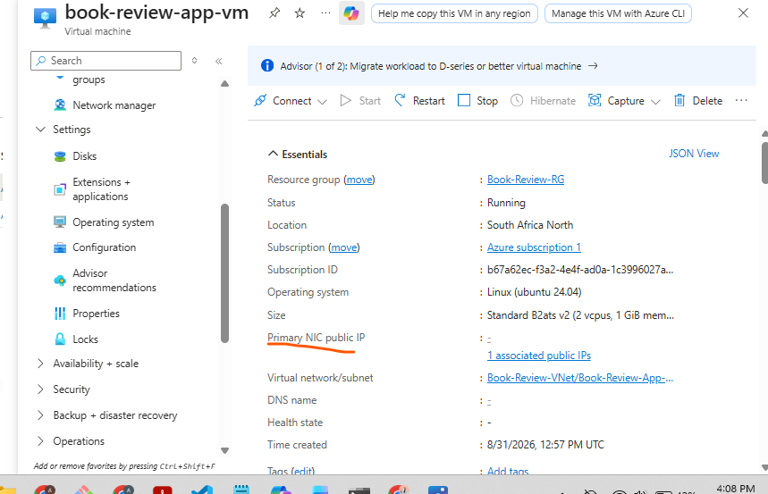
---

#### Screenshot 22 — Availability-test and healthy-target evidence

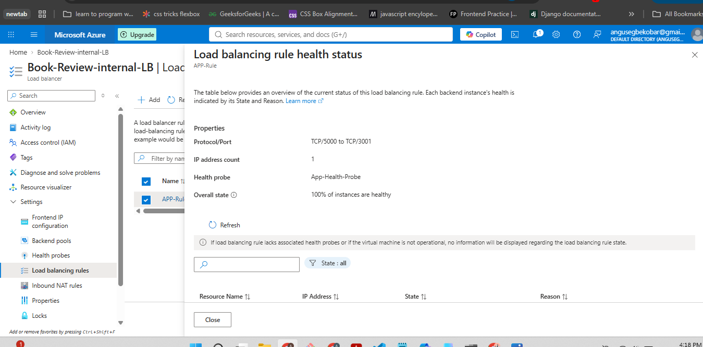
---

#### Public Endpoint

Paste your public endpoint URL here:

http://4.168.239.127/book/1
---

### Notes

Summarize what worked, issues encountered and how they were fixed, and the availability/security/secrets/monitoring/backup choices made.

Write your answer here.
# What worked
The overall three-tier architecture came together successfully: a public-facing Web VM running Nginx (reverse proxy + Next.js frontend) → an internal Load Balancer → a private App VM (Node/Express backend, PM2-managed) → Azure Database for MySQL Flexible Server (Private access/VNet integration). End-to-end read (books listing) and write (user registration) operations were verified working through the full chain, and the app auto-restarts on VM reboot via PM2's systemd integration (pm2 startup + pm2 save).

# Issues encountered and how they were fixed

 Regional restriction on MySQL Flexible Server: the subscription was blocked from provisioning in the VM/VNet's original region (North Central US). Resolved by deploying the MySQL server and a dedicated VNet in an allowed region (South Africa North), then connecting the two VNets via Global VNet Peering and linking the server's Private DNS Zone to the Web/App VNet so hostname resolution worked across regions.

CIDR overlap blocking peering: the new MySQL VNet's address space initially overlapped with the existing VNet's /16 range, which Azure rejects for peering. Fixed by using a non-overlapping address space for the MySQL VNet.

EADDRINUSE crash loops (both frontend and backend): leftover manual node processes (started before PM2 took over) were still holding the app ports, causing PM2's managed instances to crash-restart repeatedly. Fixed by killing the orphaned processes (lsof/ss to identify, then kill) before restarting under PM2.

NAT Gateway / Public IP SKU mismatch: the lab's public IP was created as Standard SKU, incompatible with the StandardV2 NAT Gateway. Resolved by creating a matching StandardV2 public IP.

Load Balancer port mismatch: the internal LB's rule and health probe were both configured for port 5000, but the backend app actually listens on 3001, causing health checks to fail silently and requests to hang/timeout (504s). Fixed by changing the LB rule's backend port and the health probe's port to 3001, and confirming the NSG allowed inbound 3001 from the web subnet.

Duplicate /api path in frontend code: a hardcoded fetch call appended /api/books to an environment variable that already included /api, producing /api/api/books (404). Fixed by correcting the frontend call and rebuilding via npm run build + pm2 restart.

CORS rejection on registration (500 error): the backend's ALLOWED_ORIGINS environment variable didn't include the Web VM's actual public-facing origin. Fixed by adding it to the app VM's .env and restarting with --update-env.

# Availability, security, secrets, and monitoring choices

Security: the App VM has no public IP attached (verified via the VM's Networking blade — Primary NIC public IP: -); it's reachable only via its private IP from within the VNet. SSH access follows a jump-host pattern — the App VM's private key is copied to the Web VM (~/.ssh/, permissions locked to 600), and the Web VM is used to hop into the App VM. NSG rules on the App tier restrict inbound traffic to specific ports/sources rather than allowing broad access.

Availability: the internal Load Balancer's health probe reports "100% of instances are healthy" for the App backend pool, confirming automated availability monitoring is active and passing.

Secrets: database credentials and CORS origin configuration are managed via environment variables (.env on the App VM), not hardcoded in source.

Database access: MySQL Flexible Server uses Private access (VNet integration) with SSL required (--ssl-mode=REQUIRED), rather than public access — reducing exposure of the data tier.

Process management/monitoring: both frontend and backend run under PM2 with systemd integration for auto-restart on reboot; pm2 status/pm2 logs were the primary tools used to diagnose and confirm process health throughout.

---

# Submission Instructions

- Add all required screenshots and links in your submission
- Do not expose passwords, keys, connection strings, or subscription IDs

---

# Completion Checklist

- [ ✓] Task 1: Architecture diagram and assumptions documented (Screenshots 1–2)
- [ ✓] Task 2: Network foundation created with isolated tiers (Screenshots 3–5)
- [✓ ] Task 3: Least-privilege security and secret management configured (Screenshots 6–7)
- [ ✓] Task 4: Presentation tier deployed (Screenshots 8–9)
- [✓ ] Task 5: Application tier deployed privately (Screenshots 10–12)
- [✓ ] Task 6: Managed database tier deployed privately (Screenshots 13–15)
- [✓ ] Task 7: Public entry, internal routing, and monitoring configured (Screenshots 16–18)
- [✓ ] Task 8: End-to-end validation and availability test completed (Screenshots 19–22, Public Endpoint, Notes)
- [ ✓] No sensitive data exposed

---

## 📌 About DMI & CloudAdvisory

DevOps Micro Internship (DMI) is a project-based DevOps program run by Pravin Mishra (The CloudAdvisory) focused on real-world execution, systems thinking, and career readiness.

It helps learners build strong DevOps foundations with hands-on experience.

---

## 📌 Resources

- 🌐 DMI Official Website: https://dmi.pravinmishra.com?utm_source=github&utm_medium=readme  
- 🎓 University: https://university.pravinmishra.com?utm_source=github&utm_medium=readme  
- 💬 Discord Community: https://discord.pravinmishra.com?utm_source=github&utm_medium=readme  
- 📝 Blog: https://dmi.pravinmishra.com/blog?utm_source=github&utm_medium=readme  
- ▶️ YouTube Playlist: https://www.youtube.com/playlist?list=PLFeSNDtI4Cho  
- 🔗 Pravin Mishra (LinkedIn): https://www.linkedin.com/in/pravin-mishra-aws-trainer/  
- 🏢 CloudAdvisory (LinkedIn): https://www.linkedin.com/company/thecloudadvisory/

---

*This submission is part of DevOps Micro Internship (DMI) Cohort 3 — Agentic AI Track.*
