# Assignment 02 — Provision Linux VMs with Terraform and Run Ansible Ad-Hoc Commands

Part of the DevOps Micro Internship (DMI) with Agentic AI

---

## Purpose

In this assignment, you will use Terraform to provision three or four Ubuntu Linux Virtual Machines on either Microsoft Azure or Amazon Web Services.

You will configure SSH key-based authentication, organize the servers using a custom Ansible inventory, and run Ansible ad-hoc commands across individual hosts and inventory groups.

---

# Task 1 — Create the Multi-Host Lab Structure

## Goal

Create a separate project directory for the multi-host lab and prepare the Terraform, Ansible, and documentation files.

This project will use the Git repository and Ansible controller prepared in Assignment 01.

### Evidence

#### Screenshot 1 — Terminal showing the complete `ansible-adhoc-lab` project structure

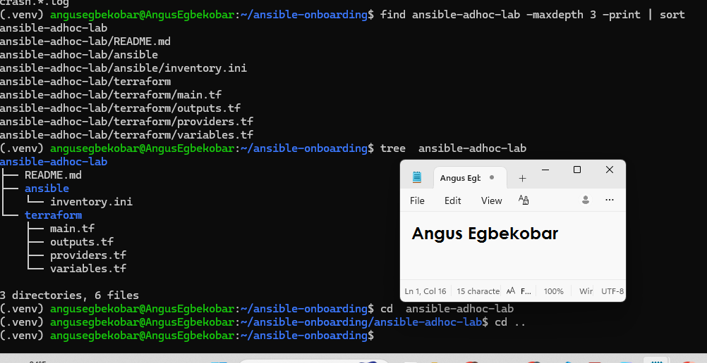
---

#### Screenshot 2 — Terminal showing `git status --short` with the new project files and updated `.gitignore`

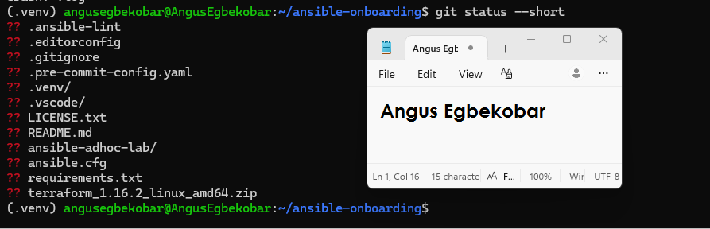
---

### Notes

Created the ansible-adhoc-lab project structure and organized the Terraform, Ansible, and documentation files. I also updated the .gitignore to prevent Terraform state files and other sensitive or generated files from being committed to the repository.

---

# Task 2 — Create the Terraform Configuration

## Goal

Create the Terraform configuration required to provision three or four Ubuntu Linux VMs on your selected cloud platform.

Complete only one option:

- Option A — Microsoft Azure
- Option B — Amazon Web Services

Do not configure both providers for this assignment.

### Evidence

#### Screenshot 3 — Terraform configuration showing the three or four server roles and the `for_each` or `count` implementation

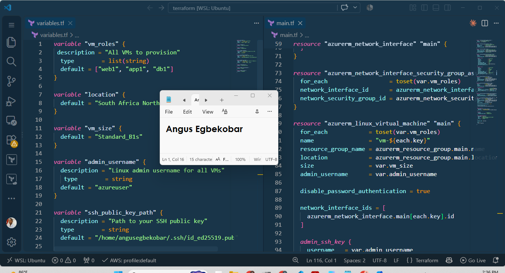
---

#### Screenshot 4 — Terraform configuration showing SSH restricted to the controller IP and HTTP allowed only for web hosts

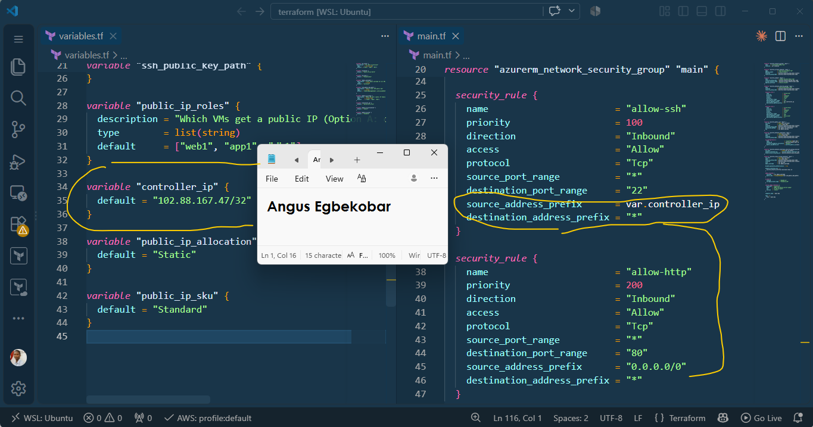
---

#### Screenshot 5 — Terraform output configuration showing how public IP addresses are associated with the server roles

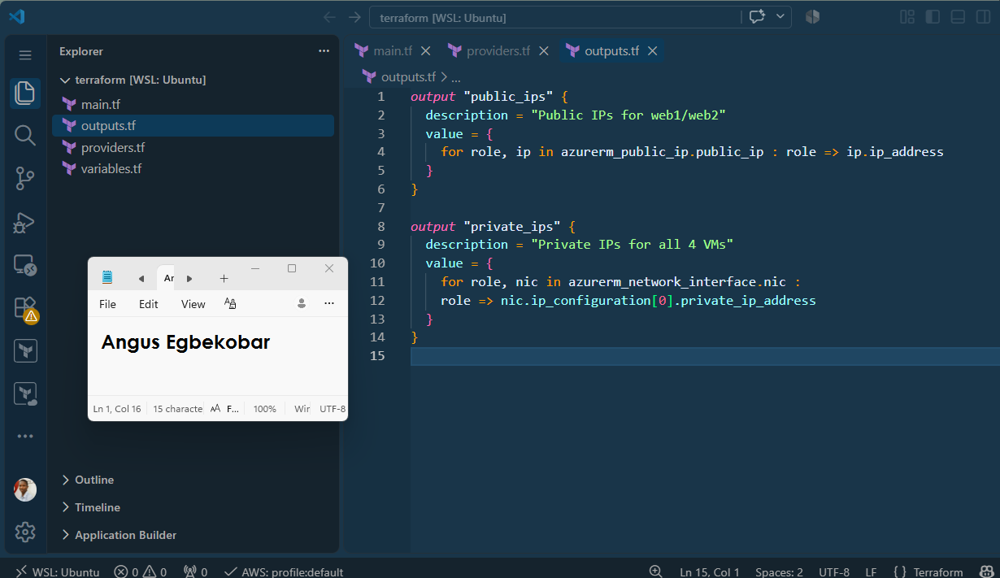
---

### Notes

Created the Terraform configuration for the three-VM Azure environment using reusable infrastructure definitions. The VMs were organized by role as web1, app1, and db1. I used for_each to provision the servers and configured network access so that SSH was restricted to the controller IP while HTTP access was limited to the web host.
---

# Task 3 — Provision the Infrastructure with Terraform

## Goal

Initialize and validate the Terraform configuration, review the execution plan, provision the selected three or four VMs, and retrieve their public IP addresses.

### Evidence

#### Screenshot 6 — Final `terraform apply` output showing `Apply complete`

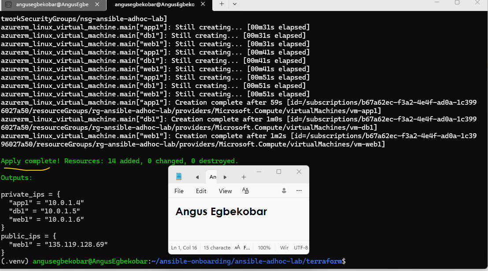
---

#### Screenshot 7 — `terraform output public_ips` showing the role-to-IP mapping for all three or four VMs

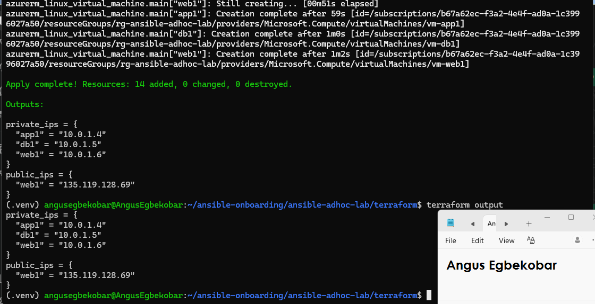
---

#### Screenshot 8 — Azure Portal or AWS Management Console showing all three or four VMs in the `Running` state, with their role-based names visible

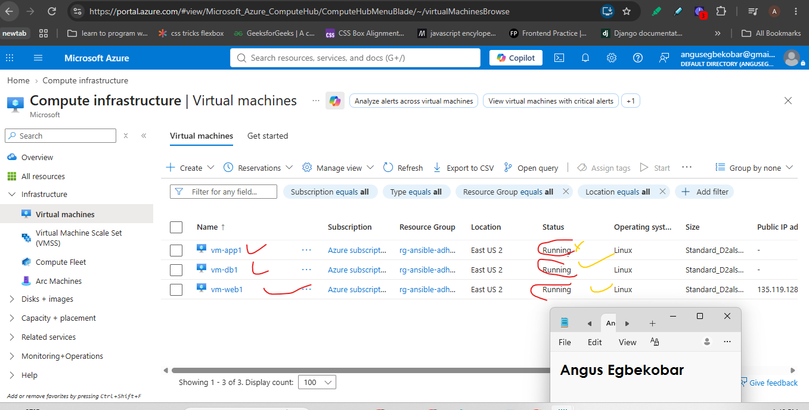
---

### Notes

Initialized, validated, planned, and applied the Terraform configuration successfully. Terraform provisioned the three Ubuntu Linux VMs on Azure and the terraform output public_ips command was used to retrieve the role-to-IP mapping. The infrastructure was also verified in the Azure Portal.
---

# Task 4 — Verify SSH Key-Based Access

## Goal

Verify that each managed VM can be accessed from the Ansible controller using SSH key-based authentication.

### Evidence

#### Screenshot 9 — Terminal showing successful SSH hostname output from all VMs

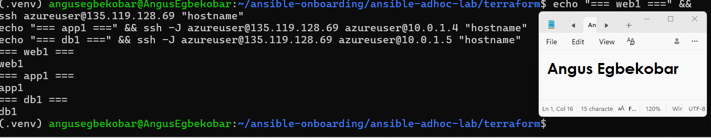
---

### Notes

Verified SSH key-based connectivity from the Ansible controller to all three managed VMs. Because app1 and db1 use private IP addresses, web1 was configured as a jump host so the controller could securely reach the private servers through the web server.
---

# Task 5 — Create the Custom Ansible Inventory

## Goal

Create an Ansible inventory file that groups the managed VMs by role.

The inventory allows Ansible to run commands against all servers, or only specific groups such as `web`, `app`, or `db`.

### Evidence

#### Screenshot 10 — `inventory.ini` showing the `web`, `app`, and `db` groups

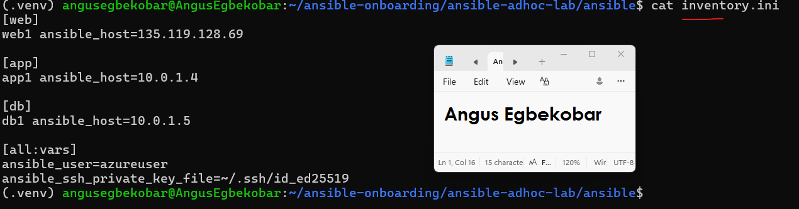
---

#### Screenshot 11 — Output of `ansible-inventory -i inventory.ini --graph`

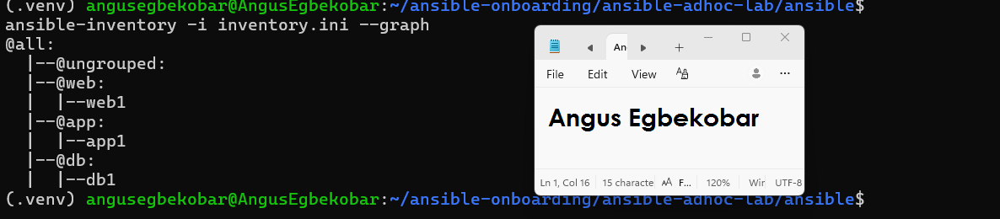
---

### Notes

Created a custom Ansible inventory containing separate web, app, and db groups. The inventory maps each server to its appropriate role and contains the SSH connection configuration required for Ansible to manage the VMs. I also verified the inventory structure using ansible-inventory --graph.
---

# Task 6 — Run Ansible Ad-Hoc Commands

## Goal

Run Ansible ad-hoc commands from the controller to verify connectivity, check server information, and manage packages and services across inventory groups.

This task proves that the inventory is working and that Ansible can control multiple managed VMs without writing a playbook.

### Evidence

#### Screenshot 12 — Output of `ansible all -i inventory.ini -m ping`

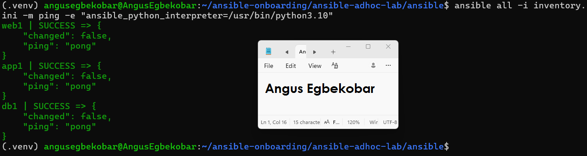
---

#### Screenshot 13 — Output of `ansible all -i inventory.ini -m command -a "uptime"`

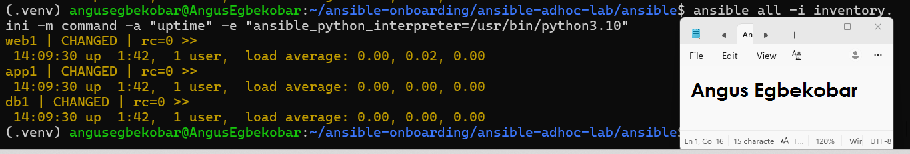
---

#### Screenshot 14 — Output of `ansible web -i inventory.ini -m apt -a "name=nginx state=present update_cache=yes" --become`

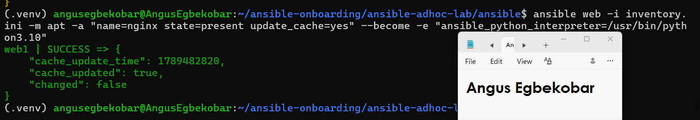
---

#### Screenshot 15 — Output of `ansible web -i inventory.ini -m service -a "name=nginx state=started enabled=yes" --become`

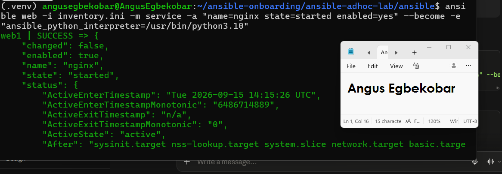
---

#### Screenshot 16 — Output of `ansible all -i inventory.ini -m apt -a "name=htop state=present update_cache=yes" --become`

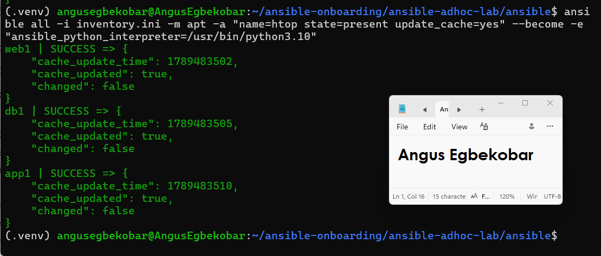
---

#### Screenshot 17 — Output of `ansible web -i inventory.ini -m command -a "systemctl is-active nginx"`

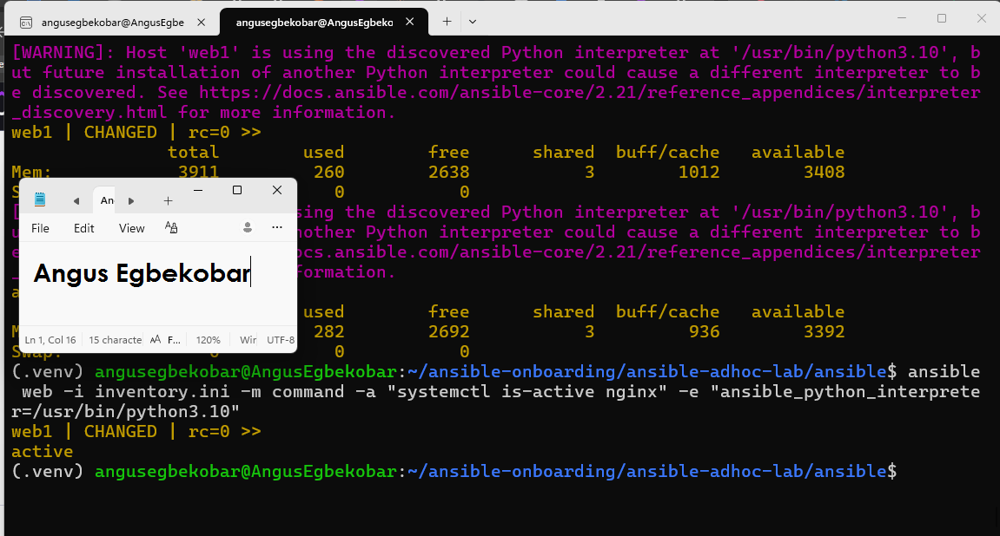
---

### Notes

Successfully used Ansible ad-hoc commands to manage and verify the three VMs without creating a playbook. I used the ping module to verify connectivity, command to check system information, and apt and service modules to install and manage Nginx and htop. The --become option was required for tasks that needed elevated privileges. Nginx was successfully installed, started, enabled, and verified as active on the web server.
---

# LinkedIn Post Required

## Evidence

#### LinkedIn Post URL

Paste your LinkedIn post URL here:

https://lnkd.in/p/ev2JJy8c

---

#### Screenshot — Published LinkedIn post

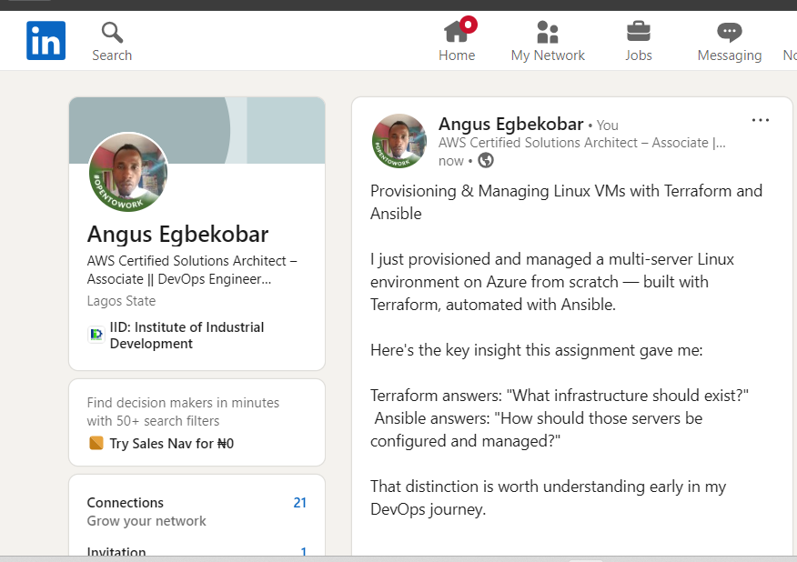
---

# Assignment Questions

Answer the following in your own words:

**1. What is the purpose of an Ansible inventory file?**

The inventory file tells Ansible which servers it is managing and how to reach them. It contains the IP addresses or hostnames of all your managed nodes, organizes them into groups, and stores connection details like the SSH user and private key file. Without the inventory file, Ansible would not know which machines to connect to or how to authenticate.
---

**2. What is the difference between the `web`, `app`, and `db` groups in your inventory?**

The groups separate the VMs by their role in the infrastructure. The web group contains web1 which is the only VM with a public IP address and acts as the entry point and jump host. The app group contains app1 which handles application logic and sits on a private IP. The db group contains db1 which handles the database layer and also sits on a private IP. Grouping them this way means you can target a specific tier with a command — for example running ansible web only affects web1, not app1 or db1.
---

**3. What does the Ansible `ping` module verify?**

The ping module verifies three things at once — that Ansible can reach the managed node over SSH, that it can authenticate using the provided credentials, and that Python is available on the remote machine for Ansible to run its modules. It is not a network ping like the Linux ping command. A successful pong response confirms the full Ansible connection stack is working end to end.
---

**4. Why do package installation commands require `--become`?**

Installing packages requires root/sudo privileges on the remote machine. By default Ansible connects as a regular user — in this lab that is azureuser. The --become flag tells Ansible to escalate privileges to root on the managed node before running the command, the same way you would prefix a command with sudo if you were logged in manually. Without --become the apt module would be denied permission to install anything.
---

**5. When would you use an ad-hoc command instead of a playbook?**

You use an ad-hoc command for quick, one-time tasks where writing a full playbook would be overkill. For example checking the uptime of all your VMs, restarting a service on a single host, copying a file to a server, or verifying connectivity with ping. A playbook is better when the task is complex, needs to run in a specific order, will be repeated regularly, or needs to be version controlled and shared with a team.
---

**6. What is one challenge you faced while setting up SSH or inventory, and how did you fix it?**

One challenge was that app1 and db1 only have private IP addresses, which meant Ansible could not reach them directly from the control node. The fix was to configure web1 as a jump host in the inventory file using ansible_ssh_common_args='-J azureuser@135.119.128.69' on the app1 and db1 entries. This tells Ansible to first SSH into web1 and then hop through it to reach the private VMs, the same way the -J flag works in a regular SSH command.
---

# Required Files

Confirm that the following files are included in your assignment workspace:

- [ ] `ansible-adhoc-lab/README.md`
- [ ] `ansible-adhoc-lab/terraform/providers.tf`
- [ ] `ansible-adhoc-lab/terraform/main.tf`
- [ ] `ansible-adhoc-lab/terraform/variables.tf`
- [ ] `ansible-adhoc-lab/terraform/outputs.tf`
- [ ] `ansible-adhoc-lab/ansible/inventory.ini`
- [ ] Updated `.gitignore`

---

# Submission Instructions

- Add all required screenshots from the tasks.
- Full Name must be visible in required screenshots.
- Mention whether you used Azure or AWS.
- Mention whether you used the three-VM option or four-VM option.
- Add the public IP addresses of the VMs, redacted if preferred.
- Add your `inventory.ini` proof.
- Add a short explanation of what you learned.
- Answer all assignment questions clearly in your own words.
- Add your LinkedIn post URL.
- Do not expose SSH private keys, Terraform state files, cloud credentials, passwords, access keys, secret keys, account IDs, or subscription IDs.

---

# Completion Checklist

- [ ] Task 1: `ansible-adhoc-lab` project structure created
- [ ] Task 1: `.gitignore` updated for Terraform files
- [ ] Task 2: Terraform configuration created
- [ ] Task 2: Server roles defined for either three or four VMs
- [ ] Task 2: `count` or `for_each` used
- [ ] Task 2: SSH restricted to the controller public IP
- [ ] Task 2: HTTP allowed only for web hosts
- [ ] Task 2: Terraform output maps roles to public IPs
- [ ] Task 3: Terraform initialized successfully
- [ ] Task 3: Terraform configuration validated
- [ ] Task 3: Terraform apply completed successfully
- [ ] Task 3: All selected VMs are running
- [ ] Task 4: SSH key-based access works for every VM
- [ ] Task 5: `inventory.ini` contains `web`, `app`, and `db` groups
- [ ] Task 5: `ansible-inventory -i inventory.ini --graph` shows the correct groups
- [ ] Task 6: `ansible all -i inventory.ini -m ping` returns `SUCCESS`
- [ ] Task 6: Ad-hoc commands run successfully
- [ ] Task 6: `--become` was used for package and service tasks
- [ ] Task 6: Nginx is active on the `web` group
- [ ] Screenshots 1–17 are included
- [ ] Assignment questions are answered
- [ ] LinkedIn post published
- [ ] LinkedIn post URL added
- [ ] No sensitive information is exposed

---

## About DMI & CloudAdvisory

DevOps Micro Internship (DMI) is a project-based DevOps program run by Pravin Mishra and The CloudAdvisory, focused on real-world execution, systems thinking, and career readiness.

It helps learners build strong DevOps foundations with hands-on experience.

---

## Resources

- DMI Official Website: [https://dmi.pravinmishra.com?utm_source=github&utm_medium=readme](https://dmi.pravinmishra.com?utm_source=github&utm_medium=readme)
- University: [https://university.pravinmishra.com?utm_source=github&utm_medium=readme](https://university.pravinmishra.com?utm_source=github&utm_medium=readme)
- Discord Community: [https://discord.pravinmishra.com?utm_source=github&utm_medium=readme](https://discord.pravinmishra.com?utm_source=github&utm_medium=readme)
- Blog: [https://dmi.pravinmishra.com/blog?utm_source=github&utm_medium=readme](https://dmi.pravinmishra.com/blog?utm_source=github&utm_medium=readme)
- YouTube Playlist: [https://www.youtube.com/playlist?list=PLFeSNDtI4Cho](https://www.youtube.com/playlist?list=PLFeSNDtI4Cho)
- Pravin Mishra LinkedIn: [https://www.linkedin.com/in/pravin-mishra-aws-trainer/](https://www.linkedin.com/in/pravin-mishra-aws-trainer/)
- CloudAdvisory LinkedIn: [https://www.linkedin.com/company/thecloudadvisory/](https://www.linkedin.com/company/thecloudadvisory/)

---

*This submission is part of DevOps Micro Internship (DMI) — Agentic AI Track.*