# Assignment 03 — Deploy a Static Website to Multiple Servers Using a Multi-Play Ansible Playbook

Part of the DevOps Micro Internship (DMI) with Agentic AI

---

## Student Details

**Full Name:** Angus Egbekobar 
**Cloud Platform Used:**  Azure  
**Server 1 URL:** `http://52.251.54.57`  
**Server 2 URL:** `http://20.242.97.240`

---

## Purpose

In this assignment, you will create a multi-play Ansible playbook to install Nginx, deploy a static website to two Ubuntu servers, and verify that the website is accessible from both servers.

You may use either AWS EC2 instances or Azure Virtual Machines as your managed servers.

---

# Task 1 — Create the Project Structure

## Goal

Create the required folders and files for the Ansible project.

## Evidence

### Screenshot 1 — Terminal or VS Code showing the complete `static-web` project structure


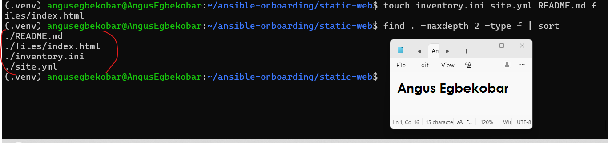
---

# Task 2 — Configure the Ansible Inventory

## Goal

Add both Ubuntu servers to the Ansible inventory.

## Evidence

### Screenshot 2 — Output of `ansible-inventory -i inventory.ini --graph` showing `web1` and `web2`


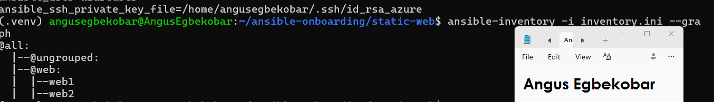
---

## Configuration File

Copy and paste the complete contents of your `inventory.ini` file below:

```ini
[web]
web1 ansible_host=52.251.54.57
web2 ansible_host=20.242.97.240

[web:vars]
ansible_user=azureuser
ansible_ssh_private_key_file=/home/angusegbekobar/.ssh/id_rsa_azure
```

---

# Task 3 — Verify Ansible Connectivity

## Goal

Confirm that the Ansible controller can connect to both servers.

## Evidence

### Screenshot 3 — Ansible ping output showing `SUCCESS` and `pong` for both servers


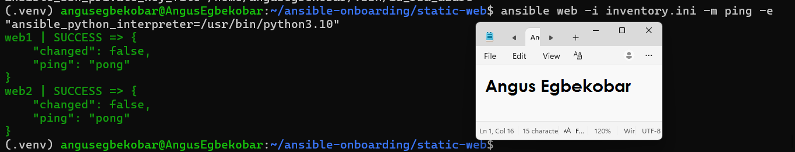
---

# Task 4 — Download and Personalize the Static Website

## Goal

Download `index.html` to the Ansible controller and personalize the website with your full name.

## Evidence

### Screenshot 4 — Edited `files/index.html` showing the footer line with your full name


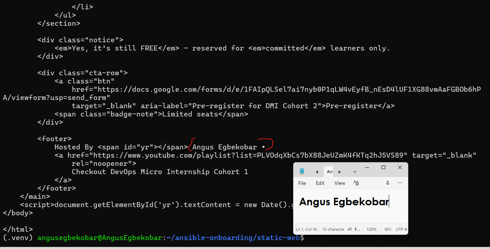
---

# Task 5 — Create the Multi-Play Ansible Playbook

## Goal

Create a single Ansible playbook containing separate plays for installation, deployment, and verification.

## Configuration File

Copy and paste the complete contents of your `site.yml` file below:

```yaml
---
- name: Install and configure Nginx
  hosts: web
  become: true
  tasks:
    - name: Update the APT package cache
      ansible.builtin.apt:
        update_cache: true

    - name: Install Nginx
      ansible.builtin.apt:
        name: nginx
        state: present

    - name: Start and enable Nginx
      ansible.builtin.service:
        name: nginx
        state: started
        enabled: true

- name: Deploy the static website
  hosts: web
  become: true
  tasks:
    - name: Copy index.html to the web root
      ansible.builtin.copy:
        src: files/index.html
        dest: /var/www/html/index.html
        owner: www-data
        group: www-data
        mode: "0644"
      notify: Reload nginx

  handlers:
    - name: Reload nginx
      ansible.builtin.service:
        name: nginx
        state: reloaded

- name: Verify both websites from the controller
  hosts: localhost
  connection: local
  gather_facts: false
  become: false
  tasks:
    - name: Send an HTTP GET request to each web server
      ansible.builtin.uri:
        url: "http://{{ hostvars[item].ansible_host }}"
        status_code: 200
      loop: "{{ groups['web'] }}"
      register: website_checks

    - name: Confirm each server returned HTTP 200
      ansible.builtin.assert:
        that:
          - item.status == 200
        success_msg: "{{ item.item }} returned HTTP {{ item.status }}"
      loop: "{{ website_checks.results }}"
```

---

# Task 6 — Validate the Playbook Syntax

## Goal

Check the playbook for YAML or Ansible syntax errors before running it.

## Evidence

### Screenshot 5 — Successful syntax-check output showing `playbook: site.yml`


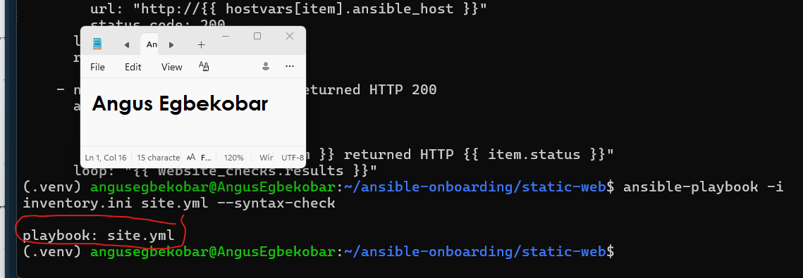
---

# Task 7 — Run the Multi-Play Playbook

## Goal

Install Nginx, deploy the website, and verify both servers in one playbook run.

## Evidence

### Screenshot 6 — Play 3 verification showing HTTP `200` for both servers


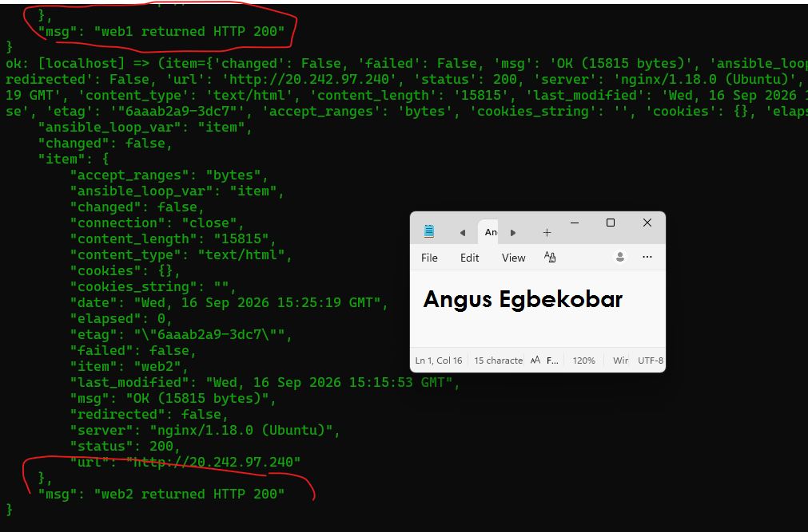
---

### Screenshot 7 — Final play recap showing `unreachable=0` and `failed=0` for `web1`, `web2`, and `localhost`


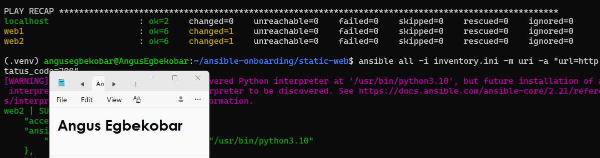
---

# Task 8 — Verify Idempotency

## Goal

Run the playbook again and confirm that it does not make unnecessary changes.

## Evidence

### Screenshot 8 — Second playbook run showing the play recap with `changed=0`, `unreachable=0`, and `failed=0` for both web servers


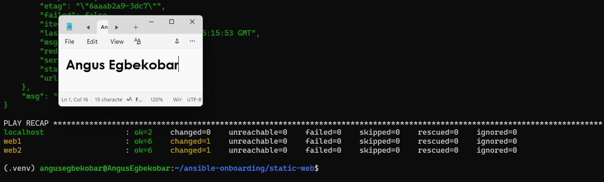
---

# Task 9 — Test Both Websites Manually

## Goal

Confirm that the static website is accessible from both public IP addresses.

## Evidence

### Screenshot 9 — `curl -I` output showing HTTP `200 OK` from both servers


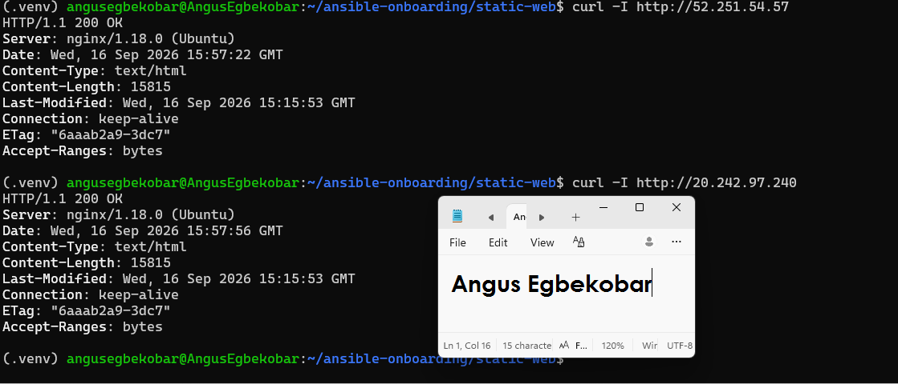
---

### Screenshot 10 — Browser showing the website from Server 1 with the public IP and your full name visible


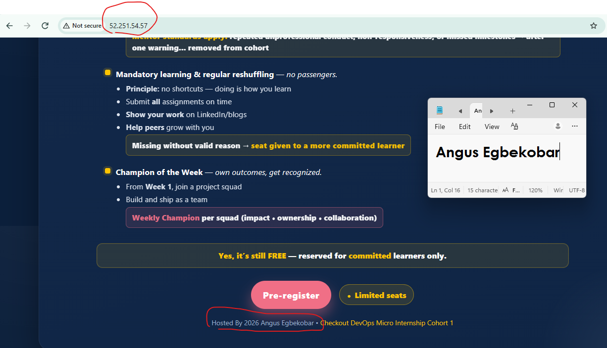
---

### Screenshot 11 — Browser showing the website from Server 2 with the public IP and your full name visible


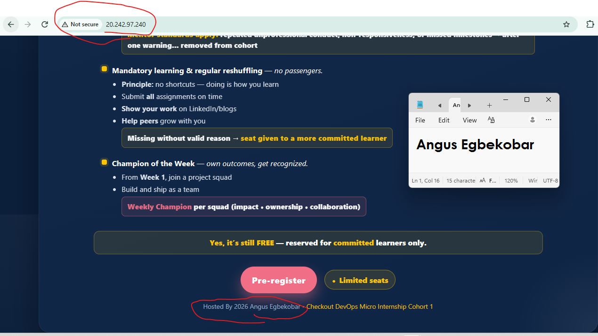
---

## Website URLs

Add both deployed website URLs below:

```text
Server 1: http://52.251.54.57
Server 2: http://20.242.97.240
```

---

# Task 10 — Complete the Project README

## Goal

Document how the project works and record what you learned.

## README Content

Copy and paste the complete contents of your `README.md` file below:

```markdown
# Multi-Play Ansible Static Website Deployment

## Project Overview

This project demonstrates how to use Ansible to deploy a static website to two Ubuntu virtual machines hosted on Microsoft Azure.

I created a multi-play Ansible playbook that performs three main activities:

1. Installs and configures Nginx on both servers.
2. Deploys a static website from the Ansible controller to both servers.
3. Verifies that both websites return HTTP status code 200.

The deployment uses Ansible automation to ensure that both servers have a consistent configuration.

## Environment

- Cloud platform: Microsoft Azure
- Operating system: Ubuntu 22.04 LTS
- Number of managed servers: 2
- Web server: Nginx
- Automation tool: Ansible
- Ansible controller: Ubuntu running inside WSL
- Connection method: SSH

## Project Structure

```text
static-web/
├── inventory.ini
├── site.yml
├── README.md
└── files/
    └── index.html
```

---

# LinkedIn Post Required

## Evidence

### LinkedIn Post URL

Paste your LinkedIn post URL here:

https://lnkd.in/p/eyzWfDYW

---

### Screenshot — Published LinkedIn post


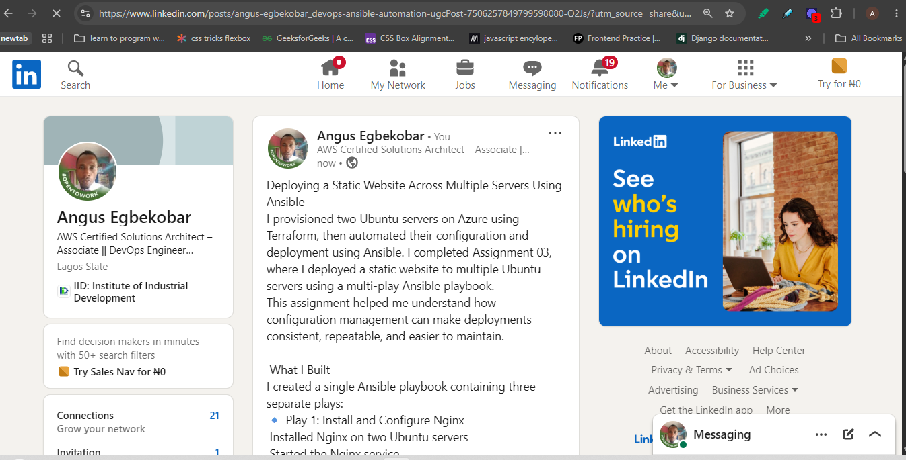
---

# Assignment Questions

Answer the following in your own words:

**1. What issue did you face while completing this assignment, and how did you fix it?**


Issue Faced and Solution

One issue I faced during the assignment was ensuring that the servers were accessible through SSH and HTTP.

I resolved the issue by checking the Azure network security rules and ensuring that SSH port 22 was allowed from my public IP address. I also ensured that HTTP port 80 was open so that the website could be accessed through a browser and verified using Ansible.

I learned that network access is important because Ansible needs SSH connectivity to manage the servers, while users need HTTP access to view the deployed website.
---

**2. What did you learn from this assignment?**

What I Learned

I learned how to structure an Ansible playbook using multiple plays with different responsibilities.

I learned how to:

Install packages using the apt module.
Manage services using the service module.
Copy files using the copy module.
Use handlers to reload Nginx when a file changes.
Use the uri module to perform HTTP checks.
Use the assert module to validate results.
Manage multiple servers through an Ansible inventory.
Test playbook idempotency by running the playbook more than once.

I also learned that automation makes it easier to configure multiple servers consistently and reduces the need to perform repetitive tasks manually.

---

**3. Why is it useful to split installation, deployment, and verification into separate plays?**

Why Installation and Deployment Are Separate

Installation and deployment are separated into different plays because each play has a specific responsibility.

The installation play prepares the servers by installing and configuring Nginx. The deployment play is responsible for transferring the website files.

Separating these responsibilities makes the playbook easier to understand, troubleshoot, maintain, and reuse. Website content can be updated without changing the Nginx installation tasks.

The verification play provides an independent way to confirm that the deployment was successful.

---

**4. What is one benefit of using the Ansible `copy` module instead of cloning the website directly from Git on every managed server?**

Benefit of the Ansible Copy Module

One benefit of using the Ansible copy module is that it allows me to maintain one approved website file on the Ansible controller and deploy the same file to multiple servers.

Ansible compares the source file with the destination file and only copies it when a change is detected. This supports consistent deployments and reduces unnecessary changes.

It also avoids the need to clone the website repository separately on every managed server.

---

**5. What does idempotency mean in this assignment?**

Idempotency

Idempotency means that running the same Ansible playbook multiple times produces the same desired system state without making unnecessary changes.

For example, if Nginx is already installed and running, Ansible should not reinstall it or restart it unnecessarily. If the website file has not changed, the copy task should remain unchanged and the Nginx reload handler should not run again.

---

**6. What does the Ansible `uri` module verify in Play 3?**


HTTP Verification

The Ansible uri module sends HTTP requests to both web servers and checks their responses.

The playbook expects each server to return HTTP status code 200, which indicates that the website request was successful.

The assert module validates the returned status and confirms that both websites are accessible.
---

# Required Files

Confirm that the following files are included in your assignment folder:

- [ ] `inventory.ini`
- [ ] `site.yml`
- [ ] `files/index.html`
- [ ] `README.md`

---

# Submission Instructions

- Add all required screenshots in the correct order.
- Full Name must be visible in required screenshots.
- Include both deployed website URLs.
- Paste `inventory.ini`, `site.yml`, and `README.md` as editable text.
- Answer all assignment questions clearly in your own words.
- Add your LinkedIn post URL.
- Do not expose SSH private keys, passwords, cloud account IDs, or other sensitive information.

---

# Completion Checklist

- [ ] Task 1: `static-web` folder structure is complete
- [ ] Task 2: Both servers are listed under the `[web]` group in `inventory.ini`
- [ ] Task 2: Inventory graph shows `web1` and `web2`
- [ ] Task 3: Ansible ping returns `SUCCESS` and `pong` for both servers
- [ ] Task 4: `files/index.html` contains your full name
- [ ] Task 5: `site.yml` contains three separate plays
- [ ] Task 5: Play 1 installs, starts, and enables Nginx
- [ ] Task 5: Play 2 deploys `index.html` using the `copy` module
- [ ] Task 5: Nginx reload handler is included
- [ ] Task 5: Play 3 verifies both web servers from the controller
- [ ] Task 6: Playbook syntax check passes
- [ ] Task 7: First playbook run completes with `unreachable=0` and `failed=0`
- [ ] Task 7: URI verification returns HTTP `200` for both servers
- [ ] Task 8: Second playbook run demonstrates idempotency
- [ ] Task 8: Second run shows `changed=0` for both web servers
- [ ] Task 9: Both `curl -I` commands return HTTP `200 OK`
- [ ] Task 9: Website loads from Server 1
- [ ] Task 9: Website loads from Server 2
- [ ] Task 9: Full name is visible on both deployed websites
- [ ] Task 10: `README.md` contains all required explanations
- [ ] Screenshots 1–11 are included
- [ ] `inventory.ini`, `site.yml`, and `README.md` are pasted as editable text
- [ ] Both website URLs are included
- [ ] Assignment questions are answered
- [ ] LinkedIn post published
- [ ] LinkedIn post URL added
- [ ] No sensitive information is exposed

---

## About DMI & CloudAdvisory

DevOps Micro Internship (DMI) is a project-based DevOps program run by Pravin Mishra and The CloudAdvisory, focused on real-world execution, systems thinking, and career readiness.

It helps learners build strong DevOps foundations with hands-on experience.

---

## Resources

- DMI Official Website: [https://dmi.pravinmishra.com?utm_source=github&utm_medium=readme](https://dmi.pravinmishra.com?utm_source=github&utm_medium=readme)
- University: [https://university.pravinmishra.com?utm_source=github&utm_medium=readme](https://university.pravinmishra.com?utm_source=github&utm_medium=readme)
- Discord Community: [https://discord.pravinmishra.com?utm_source=github&utm_medium=readme](https://discord.pravinmishra.com?utm_source=github&utm_medium=readme)
- Blog: [https://dmi.pravinmishra.com/blog?utm_source=github&utm_medium=readme](https://dmi.pravinmishra.com/blog?utm_source=github&utm_medium=readme)
- YouTube Playlist: [https://www.youtube.com/playlist?list=PLFeSNDtI4Cho](https://www.youtube.com/playlist?list=PLFeSNDtI4Cho)
- Pravin Mishra LinkedIn: [https://www.linkedin.com/in/pravin-mishra-aws-trainer/](https://www.linkedin.com/in/pravin-mishra-aws-trainer/)
- CloudAdvisory LinkedIn: [https://www.linkedin.com/company/thecloudadvisory/](https://www.linkedin.com/company/thecloudadvisory/)

---

*This submission is part of DevOps Micro Internship (DMI) — Agentic AI Track.*