# Assignment 04 — Deploy Mini Finance on Azure Using Terraform and Ansible

Part of the DevOps Micro Internship (DMI) with Agentic AI

---

## Purpose

In this assignment, you will provision Azure infrastructure using Terraform and deploy the Mini Finance website using an Ansible multi-play playbook.

Terraform will create the Azure Virtual Machine and networking resources. Ansible will install Nginx, clone the Mini Finance repository, deploy the website, and verify the deployment.

---

# Task 1 — Create the Project Structure

## Goal

Create separate directories and files for the Terraform infrastructure and Ansible configuration.

### Evidence

#### Screenshot 1 — Terminal or VS Code showing the complete `mini-finance` project structure


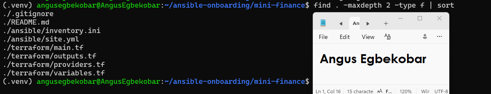
---

### Notes

Task 1 — Project Structure

Created mini-finance directory with terraform and ansible subfolders.

Added .gitignore to exclude Terraform state files and private keys.

Verified structure matches assignment requirements.

---

# Task 2 — Create the Azure Infrastructure Using Terraform

## Goal

Use Terraform to provision an Ubuntu Virtual Machine with the required Azure networking and security resources.

### Evidence

#### Screenshot 2 — Terraform code showing the `Allow-SSH` rule for port `22` and the `Allow-HTTP` rule for port `80`


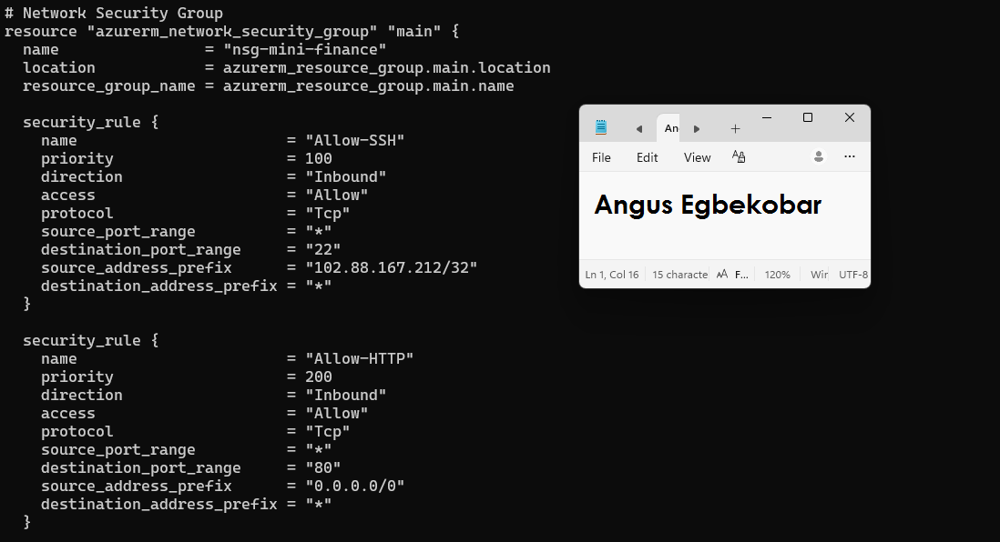
---

#### Screenshot 3 — Terraform code showing the association between `nsg-mini-finance` and `nic-mini-finance`


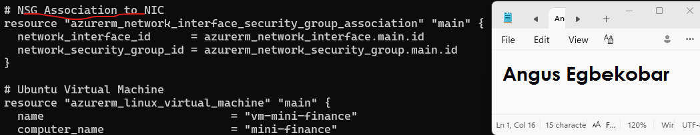
---

### Notes


Task 2 — Azure Infrastructure with Terraform

✓Provisioned Resource Group, VNet, Subnet, NSG, Public IP, NIC, and Ubuntu VM.

✓Configured NSG rules: SSH restricted to my public IP, HTTP open to all.

✓Associated NSG with NIC.

   Added Terraform output for public IP.
---

# Task 3 — Initialize and Apply the Terraform Configuration

## Goal

Format and validate the Terraform configuration, review the execution plan, and provision the Azure infrastructure.

### Evidence

#### Screenshot 4 — End of the `terraform apply` output showing `Apply complete!` with no errors


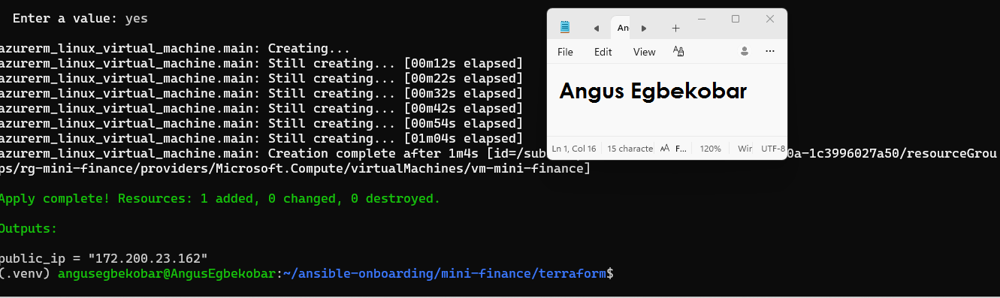
---

#### Screenshot 5 — Output of `terraform output public_ip` showing the VM’s public IP address


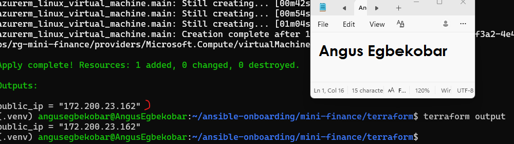
---

### Notes

Task 3 — Initialize and Apply Terraform

‣Ran terraform fmt, terraform init, terraform validate.

‣Applied configuration successfully.

‣Retrieved VM public IP using terraform output public_ip.

---

# Task 4 — Verify Passwordless SSH Access

## Goal

Confirm that the Ansible controller can connect to the Terraform-provisioned Azure VM using SSH key authentication.

### Evidence

#### Screenshot 6 — Passwordless SSH command and the returned `mini-finance` hostname


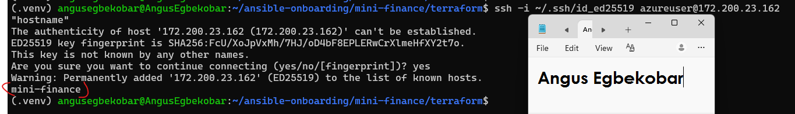
---

### Notes

Task 4 — Verify Passwordless SSH

‣Connected to VM using SSH key authentication.

‣Verified hostname returned as mini-finance.

‣No password prompt required.

---

# Task 5 — Create the Ansible Inventory and Verify Connectivity

## Goal

Add the Terraform-provisioned Azure VM to the Ansible inventory and confirm that Ansible can connect to it.

### Evidence

#### Screenshot 7 — Ansible ping output showing `SUCCESS` and `pong` from the Azure VM


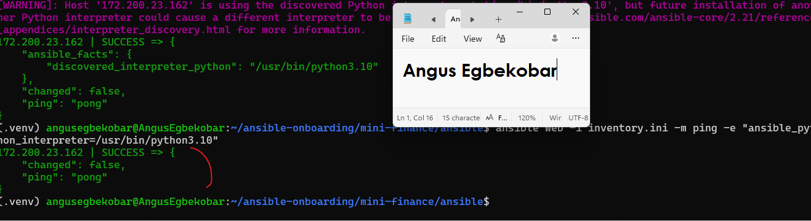
---

### Configuration File

Copy and paste the complete contents of your `ansible/inventory.ini` file below:

```ini
[web]
172.200.23.162

[web:vars]
ansible_user=azureuser
ansible_ssh_private_key_file=~/.ssh/id_ed25519
```

---

# Task 6 — Create the Multi-Play Ansible Playbook

## Goal

Create one Ansible playbook containing separate plays to install Nginx, deploy the Mini Finance website, and verify the deployment.

### Evidence

#### Screenshot 8 — `site.yml` showing Play 1 and the beginning of Play 2

Screenshot must show:

- Play 1 targeting the `web` group
- Installation of `nginx`, `git`, and `rsync`
- Nginx service configured as started and enabled
- Beginning of Play 2 with the Git repository URL and synchronization task


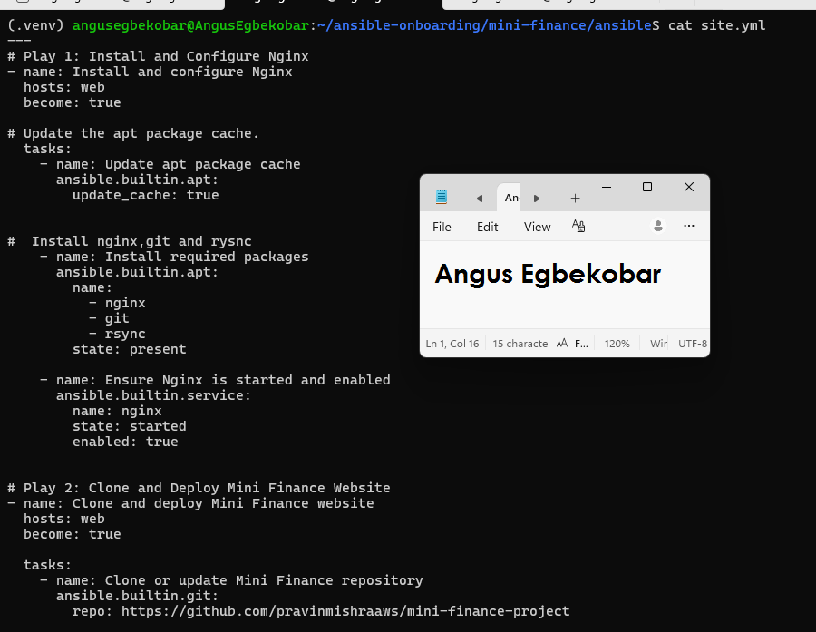
---

#### Screenshot 9 — `site.yml` showing the deployment destination, handler, and Play 3 verification

Screenshot must show:

- Website destination `/var/www/html/`
- Ownership set to `www-data:www-data`
- Nginx reload handler
- Play 3 targeting `localhost`
- The `uri` verification and `assert` condition


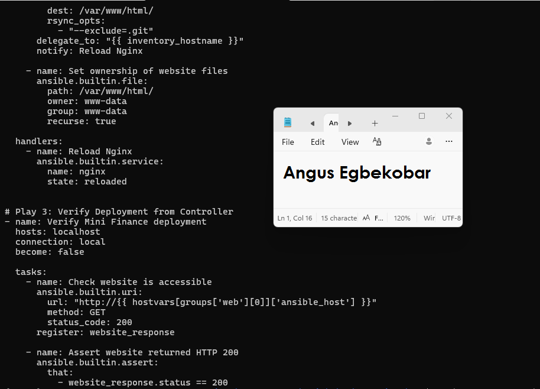
---

### Configuration File

Copy and paste the complete contents of your `ansible/site.yml` file below:

```yaml
---
# Play 1: Install and Configure Nginx
- name: Install and configure Nginx
  hosts: web
  become: true

# Update the apt package cache.
  tasks:
    - name: Update apt package cache
      ansible.builtin.apt:
        update_cache: true


#  Install nginx,git and rysnc
    - name: Install required packages
      ansible.builtin.apt:
        name:
          - nginx
          - git
          - rsync
        state: present

    - name: Ensure Nginx is started and enabled
      ansible.builtin.service:
        name: nginx
        state: started
        enabled: true


# Play 2: Clone and Deploy Mini Finance Website
- name: Clone and deploy Mini Finance website
  hosts: web
  become: true

  tasks:
    - name: Clone or update Mini Finance repository
      ansible.builtin.git:
        repo: https://github.com/pravinmishraaws/mini-finance-project
        dest: /opt/mini-finance
        version: main

    - name: Synchronize website files to Nginx web root
      ansible.posix.synchronize:
        src: /opt/mini-finance/
        dest: /var/www/html/
        rsync_opts:
          - "--exclude=.git"
      delegate_to: "{{ inventory_hostname }}"
      notify: Reload Nginx

    - name: Set ownership of website files
      ansible.builtin.file:
        path: /var/www/html/
        owner: www-data
        group: www-data
        recurse: true

  handlers:
    - name: Reload Nginx
      ansible.builtin.service:
        name: nginx
        state: reloaded


# Play 3: Verify Deployment from Controller
- name: Verify Mini Finance deployment
  hosts: localhost
  connection: local
  become: false

  tasks:
    - name: Check website is accessible
      ansible.builtin.uri:
        url: "http://{{ hostvars[groups['web'][0]]['ansible_host'] }}"
        method: GET
        status_code: 200
      register: website_response

    - name: Assert website returned HTTP 200
      ansible.builtin.assert:
        that:
          - website_response.status == 200
```

---

# Task 7 — Validate and Run the Ansible Playbook

## Goal

Validate the syntax of the multi-play Ansible playbook and run it to install Nginx, deploy the Mini Finance website, and verify the deployment.

### Evidence

#### Screenshot 10 — Successful playbook syntax check showing `playbook: site.yml`


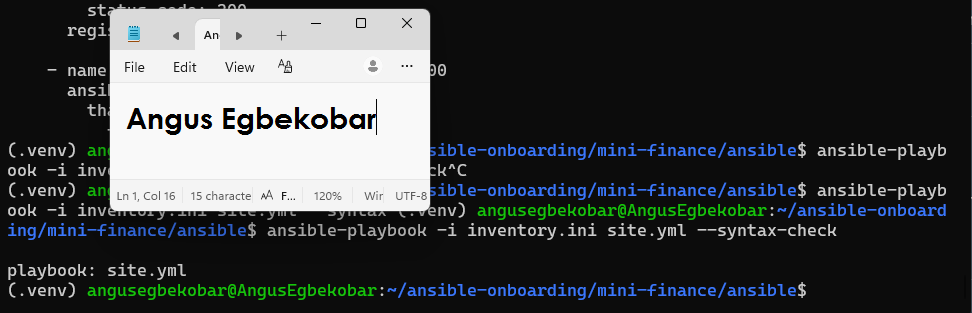
---

#### Screenshot 11 — Play 3 output showing the successful HTTP verification and assertion


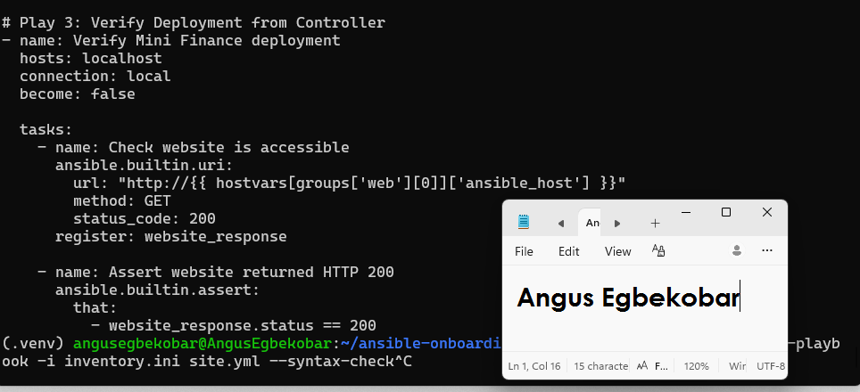
---

#### Screenshot 12 — Final `PLAY RECAP` showing `failed=0` and `unreachable=0`


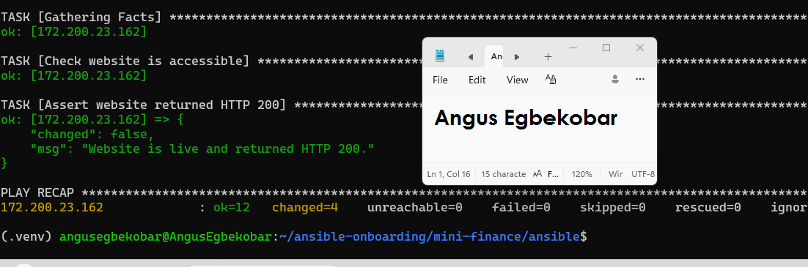
---

### Notes

Task 7 — Validate and Run Playbook

‣Syntax check passed.

‣Playbook executed successfully: Nginx installed, site deployed, HTTP 200 verified.

‣Final recap showed failed=0 and unreachable=0.

---

# Task 8 — Test the Mini Finance Website in a Browser

## Goal

Confirm that the Mini Finance website is publicly accessible through the Azure VM’s public IP address.

### Evidence

#### Screenshot 13 — Mini Finance website successfully loading in the browser, with the Azure VM’s public IP address visible in the address bar


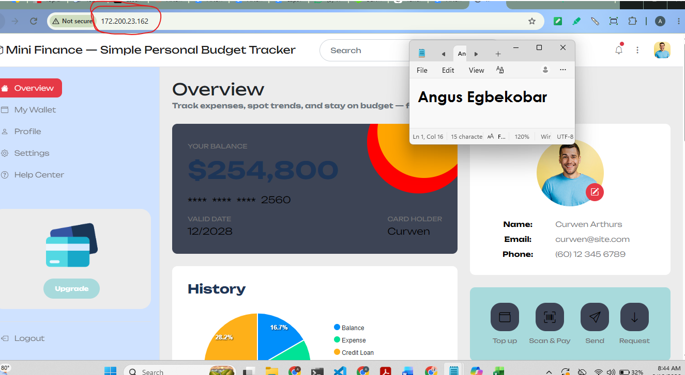
---

### Website URL


```text
http://172.200.23.162/
```

---

# Task 9 — Create the Project README

## Goal

Create a `README.md` file to document the Mini Finance infrastructure and deployment project.

### Evidence

#### Screenshot 14 — Completed `README.md` displayed in the VS Code Markdown preview or terminal


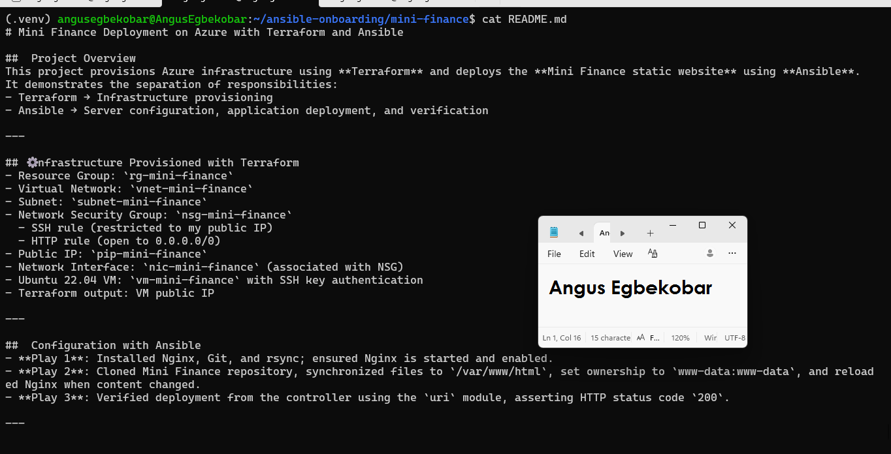
---

### README Content

Copy and paste the complete contents of your `README.md` file below:

```markdown
# Mini Finance Deployment on Azure with Terraform and Ansible

##  Project Overview
This project provisions Azure infrastructure using **Terraform** and deploys the **Mini Finance static website** using **Ansible**.
It demonstrates the separation of responsibilities:
- Terraform → Infrastructure provisioning
- Ansible → Server configuration, application deployment, and verification

---

## ⚙️nfrastructure Provisioned with Terraform
- Resource Group: `rg-mini-finance`
- Virtual Network: `vnet-mini-finance`
- Subnet: `subnet-mini-finance`
- Network Security Group: `nsg-mini-finance`
  - SSH rule (restricted to my public IP)
  - HTTP rule (open to 0.0.0.0/0)
- Public IP: `pip-mini-finance`
- Network Interface: `nic-mini-finance` (associated with NSG)
- Ubuntu 22.04 VM: `vm-mini-finance` with SSH key authentication
- Terraform output: VM public IP

---

##  Configuration with Ansible
- **Play 1**: Installed Nginx, Git, and rsync; ensured Nginx is started and enabled.
- **Play 2**: Cloned Mini Finance repository, synchronized files to `/var/www/html`, set ownership to `www-data:www-data`, and reloaded Nginx when content changed.
- **Play 3**: Verified deployment from the controller using the `uri` module, asserting HTTP status code `200`.

---

##  Verification
- Passwordless SSH access confirmed with hostname `mini-finance`.
- Ansible ping returned `SUCCESS` and `pong`.
- Playbook executed successfully with `failed=0` and `unreachable=0`.
- Mini Finance website loaded in browser via VM public IP.

---

##  Project Structure
mini-finance/
├── .gitignore
├── README.md
├── terraform/
│   ├── providers.tf
│   ├── main.tf
│   ├── variables.tf
│   └── outputs.tf
└── ansible/
├── inventory.ini
└── site.yml


---

##  Deployed Website
Accessible at:
`http://172.200.23.162/

---

##  Learning Outcomes
- Learned how to provision Azure infrastructure with Terraform.
- Understood how Ansible configures servers and deploys applications.
- Practiced idempotency with both Terraform and Ansible.
- Experienced real-world DevOps workflow: infrastructure as code + configuration management.

---

##  Real-World Use Case
This workflow can be reused to quickly deploy demo websites, proof-of-concept applications, or training environments in a repeatable and secure way.

---

##  Author
Angus — DevOps Micro Internship (DMI) Cohort 3
```

---

# LinkedIn Post Required

## Evidence

#### Screenshot 15 — Published LinkedIn post showing the text and at least one deployment screenshot


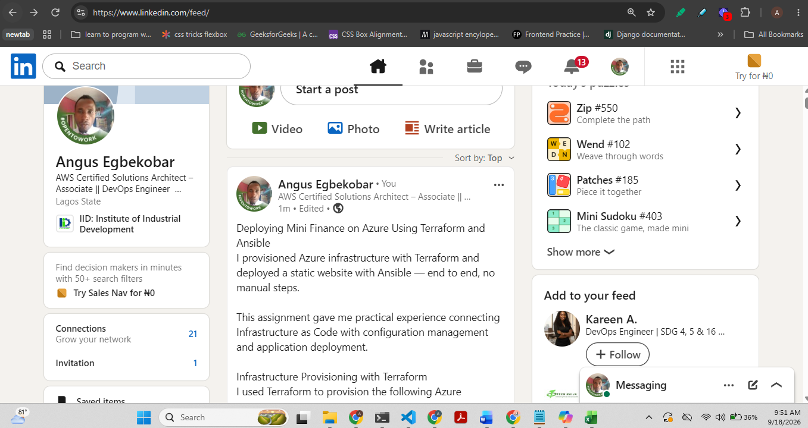
---

#### LinkedIn Post URL

Paste your LinkedIn post URL here:

https://lnkd.in/p/echW92cv

---

### LinkedIn Submission Notes

**One challenge you faced and how you fixed it:**


 I initially had SSH connectivity issues because the NSG rule allowed 0.0.0.0/0. I fixed it by restricting SSH to my public IP with /32.
---

**One real-world example where you can use this learning:**

Here's a well-written answer:

---

A real-world example is a software company that needs to spin up a staging environment every time a new feature branch is ready for testing.

Instead of a developer manually creating cloud resources and configuring servers, a DevOps engineer can use Terraform to provision the infrastructure — virtual machines, networking, and security rules — and Ansible to install the web server, deploy the application code, and verify the deployment automatically.

When testing is complete, `terraform destroy` tears down the entire environment, stopping costs immediately. The next time a staging environment is needed, the same workflow provisions an identical environment in minutes with no manual steps.

This is exactly the workflow practised in this assignment — Terraform handles the infrastructure, Ansible handles the configuration and deployment, and the two tools work together without overlapping responsibilities. The result is a deployment process that is consistent, repeatable, and easy to hand off to any team member.

---

# Assignment Questions

Answer the following in your own words:

**1. What did you provision using Terraform in this assignment?**


I provisioned the Azure infrastructure: Resource Group, Virtual Network, Subnet, Network Security Group with rules, Public IP, Network Interface, and an Ubuntu VM.
---

**2. What did Ansible configure and deploy in this assignment?**


Ansible installed Nginx, Git, and rsync, cloned the Mini Finance repository, deployed the website to /var/www/html, and verified it returned HTTP 200.
---

**3. Why is SSH access on port `22` restricted to your public IP address?**


To secure the VM by limiting SSH access only to my controller machine, preventing unauthorized access from the internet.
---

**4. Why is HTTP port `80` open to the internet?**


So the Mini Finance website is publicly accessible to anyone via the VM’s public IP.
---

**5. What is the purpose of the Ansible inventory file?**


It defines the target servers, their IPs, and connection details so Ansible knows where and how to run tasks.
---

**6. Why does the playbook use separate plays for install, deploy, and verify?**

To maintain clear separation of responsibilities: one play for server setup, one for application deployment, and one for validation. This improves readability and troubleshooting.

---

**7. Why is `rsync` useful when deploying website files?**


It efficiently synchronizes files, copying only changes instead of everything, which saves time and bandwidth.
---

**8. What does the Ansible `uri` module verify in this assignment?**


It checks that the deployed website is accessible and returns HTTP status code 200, confirming successful deployment.
---

**9. What issue did you face during this assignment, and how did you fix it?**


The first was an Azure VM capacity restriction. When I ran terraform apply, Azure returned a SkuNotAvailable error, meaning the requested VM size had no available capacity in my chosen region. I resolved this by testing different VM sizes and regions through the Azure portal to find one that was actually available, then updating the vm_size variable in my variables.tf accordingly.


A smaller but important issue was that the Mini Finance GitHub repository URL provided in the assignment instructions returned a 404. I resolved this by browsing the instructor's GitHub profile directly and finding the correct repository name, which used an underscore (mini_finance) rather than a hyphen and did not include -project at the end
---

**10. What did you learn from using Terraform and Ansible together?**


I learned how Terraform and Ansible complement each other: Terraform provisions infrastructure, while Ansible configures and deploys applications, ensuring a repeatable and automated workflow.
---

# Required Files

Confirm that the following files are included in your assignment folder:

- [ ] `.gitignore`
- [ ] `README.md`
- [ ] `terraform/providers.tf`
- [ ] `terraform/main.tf`
- [ ] `terraform/variables.tf`
- [ ] `terraform/outputs.tf`
- [ ] `ansible/inventory.ini`
- [ ] `ansible/site.yml`

---

# Submission Instructions

- Add all required screenshots in the correct order.
- Full Name must be visible in required screenshots.
- Add the Azure VM public IP address.
- Add the final Mini Finance website URL.
- Paste `inventory.ini`, `site.yml`, and `README.md` as editable text.
- Answer all assignment questions clearly in your own words.
- Add your LinkedIn post URL.
- Do not expose SSH private keys, passwords, Azure credentials, subscription IDs, Terraform state contents, or other sensitive information.

---

# Completion Checklist

- [ ] Task 1: `mini-finance` project structure created
- [ ] Task 1: `.gitignore` created
- [ ] Task 2: Terraform Azure infrastructure code created
- [ ] Task 2: `Allow-SSH` rule configured for port `22`
- [ ] Task 2: `Allow-HTTP` rule configured for port `80`
- [ ] Task 2: NSG associated with the Network Interface
- [ ] Task 3: `terraform fmt` completed
- [ ] Task 3: `terraform init` completed
- [ ] Task 3: `terraform validate` completed successfully
- [ ] Task 3: `terraform apply` completed successfully
- [ ] Task 3: `terraform output public_ip` displayed the VM public IP
- [ ] Task 4: Passwordless SSH works from the Ansible controller
- [ ] Task 5: `inventory.ini` created
- [ ] Task 5: Ansible ping returns `SUCCESS` and `pong`
- [ ] Task 6: `site.yml` contains three separate plays
- [ ] Task 6: Play 1 installs Nginx, Git, and rsync
- [ ] Task 6: Play 2 clones and deploys the Mini Finance website
- [ ] Task 6: Play 3 verifies HTTP status code `200`
- [ ] Task 7: Playbook syntax check passes
- [ ] Task 7: Ansible playbook completes successfully
- [ ] Task 7: Final recap shows `failed=0` and `unreachable=0`
- [ ] Task 8: Mini Finance website loads in the browser
- [ ] Task 8: Azure VM public IP is visible in the browser screenshot
- [ ] Task 9: `README.md` completed
- [ ] Screenshots 1–15 are included
- [ ] `inventory.ini`, `site.yml`, and `README.md` are pasted as editable text
- [ ] Assignment questions are answered
- [ ] LinkedIn post published with Anyone visibility
- [ ] LinkedIn post URL added
- [ ] No sensitive information is exposed

---

## About DMI & CloudAdvisory

DevOps Micro Internship (DMI) is a project-based DevOps program run by Pravin Mishra and The CloudAdvisory, focused on real-world execution, systems thinking, and career readiness.

It helps learners build strong DevOps foundations with hands-on experience.

---

## Resources

- DMI Official Website: [https://dmi.pravinmishra.com?utm_source=github&utm_medium=readme](https://dmi.pravinmishra.com?utm_source=github&utm_medium=readme)
- University: [https://university.pravinmishra.com?utm_source=github&utm_medium=readme](https://university.pravinmishra.com?utm_source=github&utm_medium=readme)
- Discord Community: [https://discord.pravinmishra.com?utm_source=github&utm_medium=readme](https://discord.pravinmishra.com?utm_source=github&utm_medium=readme)
- Blog: [https://dmi.pravinmishra.com/blog?utm_source=github&utm_medium=readme](https://dmi.pravinmishra.com/blog?utm_source=github&utm_medium=readme)
- YouTube Playlist: [https://www.youtube.com/playlist?list=PLFeSNDtI4Cho](https://www.youtube.com/playlist?list=PLFeSNDtI4Cho)
- Pravin Mishra LinkedIn: [https://www.linkedin.com/in/pravin-mishra-aws-trainer/](https://www.linkedin.com/in/pravin-mishra-aws-trainer/)
- CloudAdvisory LinkedIn: [https://www.linkedin.com/company/thecloudadvisory/](https://www.linkedin.com/company/thecloudadvisory/)

---

*This submission is part of DevOps Micro Internship (DMI) — Agentic AI Track.*