# Assignment — Deploy EpicBook with Terraform and Ansible Roles

Part of the DevOps Micro Internship (DMI) Cohort 3 with Agentic AI

---

## Purpose

In this assignment, you will deploy the EpicBook web application using Terraform and Ansible roles.

Terraform provisions the cloud infrastructure, including one Ubuntu VM and one managed MySQL database. Ansible roles configure the VM, install required software, deploy the EpicBook application, configure Nginx, connect the app to the managed MySQL database, and verify the deployment.

---

# Task 1 — Set Up the Project Folder Layout

## Goal

Create the project folder structure for Terraform and Ansible roles.

Terraform will be used to provision the cloud infrastructure. Ansible roles will be used to configure the VM and deploy the EpicBook application.

### Evidence

#### Screenshot 1 — Terminal showing the completed `epicbook-prod` project structure

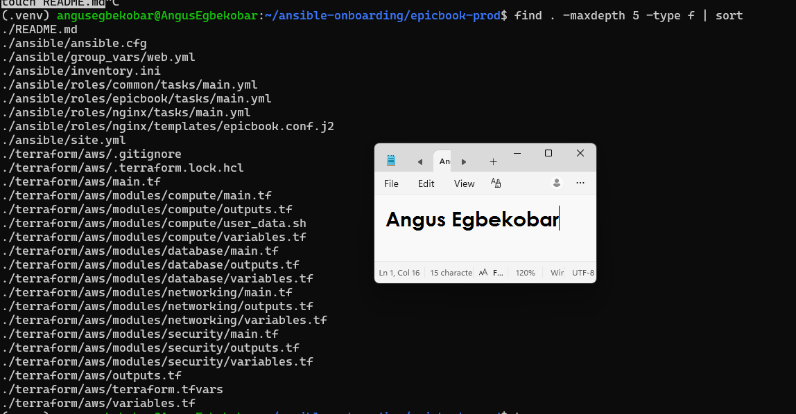
---

### Notes

Answer the following in your own words:

**1. Which cloud provider did you choose for this assignment?**

Amazon Web Service
---

**2. Why is it useful to keep Terraform files and Ansible files in separate folders?**

Keeping Terraform and Ansible in separate folders provides clear separation of responsibilities: Terraform manages and creates the infrastructure, while Ansible configures the servers and deploys applications. This makes the project organized, easier to understand, maintain, and run.
---

**3. What is the purpose of the `roles` directory in Ansible?**

The roles directory organizes Ansible tasks into reusable and maintainable components.
---

# Task 2 — Provision the Infrastructure with Terraform

## Goal

Run Terraform to provision the cloud infrastructure for the EpicBook deployment.

Terraform will create the VM, managed MySQL database, networking, security rules, and required outputs.

### Evidence

#### Screenshot 2 — `terraform apply` completed successfully

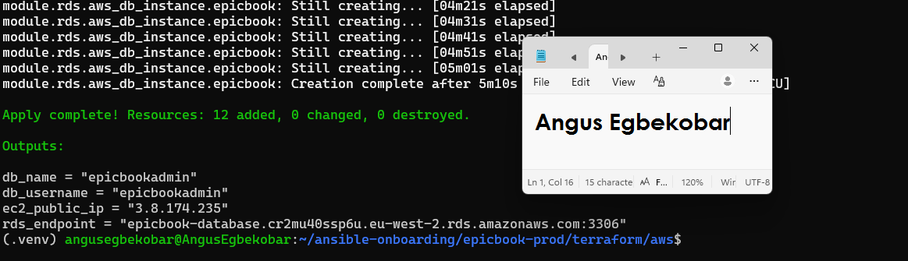
---

#### Screenshot 3 — Output of `terraform output`

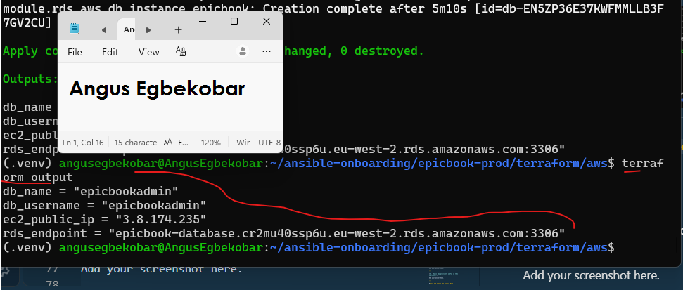
---

#### Screenshot 4 — Azure Portal or AWS Console showing the VM running

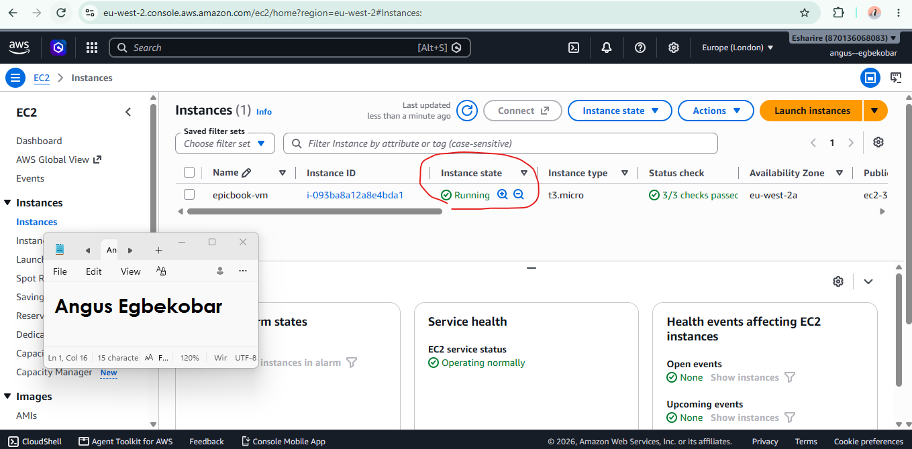
---

#### Screenshot 5 — Azure Portal or AWS Console showing the managed MySQL database created

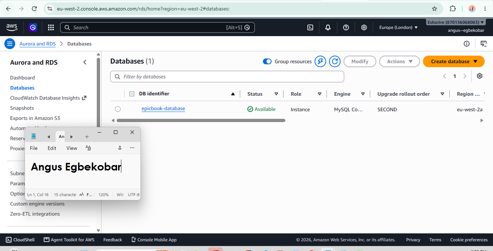
---

### Notes

Answer the following in your own words:

**1. What resources did Terraform create for this assignment?**

virtual machines, security groups,VPC, subnets,subnet groups, RDS instance
---

**2. Why should you review `terraform plan` before running `terraform apply`?**

terraform plan shows you exactly what Terraform intends to do before any changes are made to real infrastructure. It lists every resource that will be created, modified, or destroyed, along with the specific properties that will change.

Reviewing the plan before applying protects you in several ways.

First, it catches mistakes before they cause damage. If you accidentally changed the wrong variable or introduced a typo in a resource name, the plan will show an unexpected destruction or replacement of a resource. Catching this before apply prevents accidental data loss or downtime.

Second, it prevents surprise resource replacements. Some property changes in Terraform, such as changing a VM's OS disk type or an SSH key, force Terraform to destroy and recreate the resource rather than update it in place. The plan flags these with # forces replacement so you are not caught off guard by a server being deleted when you only intended to update a tag.

Third, it gives you a cost awareness check. If the plan shows ten new VMs being created when you only expected three, you know something is wrong before Azure or AWS starts billing you.

Fourth, in a team environment, the plan output can be reviewed and approved by a second person before apply runs, which is a standard practice in production environments where changes carry real risk.

In short, terraform plan is the difference between knowing what will happen and finding out after the fact.
---

**3. Why should database passwords not be shown in Terraform output?**

Because Terraform outputs are visible in logs and state files, showing database passwords there would expose sensitive credentials to anyone with access.
---

# Task 3 — Verify SSH Key-Based Access

## Goal

Verify that the cloud VM can be accessed from the Ansible controller using SSH key-based authentication.

### Evidence

#### Screenshot 6 — Successful SSH hostname check from the Ansible controller

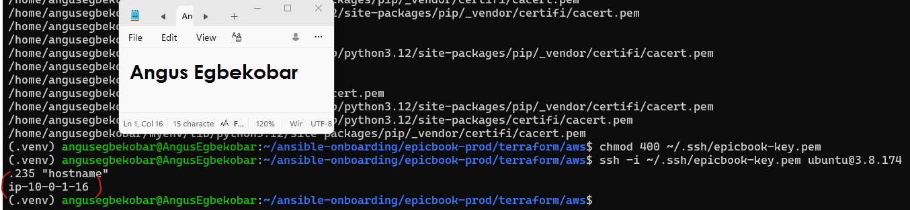
---

### Notes

Answer the following in your own words:

**1. What command did you use to verify SSH access?**

ssh -i ~/.ssh/epicbook-key.pem ubuntu@3.8.174.235 "hostname"
---

**2. What proves that SSH key-based access worked successfully?**

it returned the VM's private IP
---

**3. What would you check if SSH returned `Permission denied (publickey)`?**

    Check the correct key is being used
    Confirm the private key you are specifying matches the public key that was injected into the server during provisioning.
    Check the key file permissions
    Check the correct username
---

# Task 4 — Create the Ansible Inventory and Configuration

## Goal

Create the Ansible inventory file and local Ansible configuration for the EpicBook VM.

The inventory tells Ansible which VM to manage and which SSH user to use.

### Evidence

#### Screenshot 7 — `inventory.ini` showing the VM under the `web` group

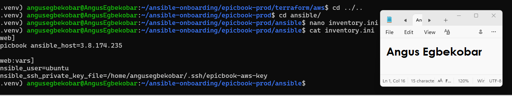
---

#### Screenshot 8 — Output of `ansible-inventory -i inventory.ini --graph`

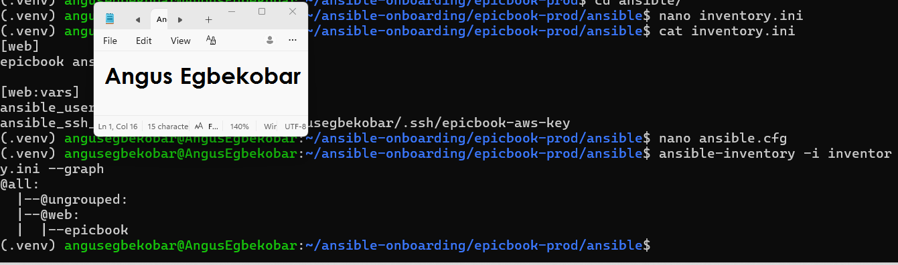
---

#### Screenshot 9 — Output of `ansible web -i inventory.ini -m ping`

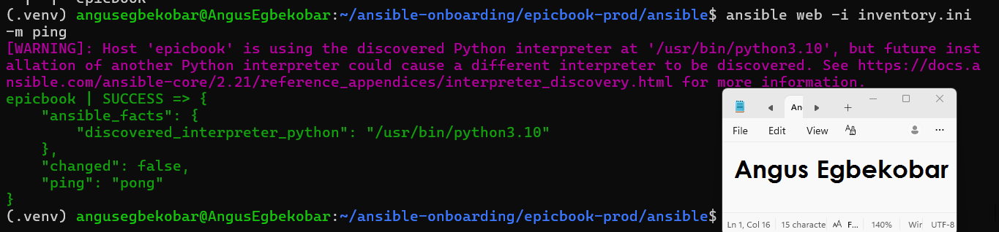
---

### Notes

Answer the following in your own words:

**1. What is the purpose of `inventory.ini`?**

The inventory.ini file tells Ansible which servers it is managing and how to connect to them. It lists all the managed nodes, organises them into groups, and stores connection details such as the IP address, SSH user, and private key file. Without it Ansible would not know which machines to target or how to authenticate against them
---

**2. What does `ansible_host` store?**

ansible_host stores the IP address or hostname that Ansible uses to actually reach the managed node. It is the address Ansible connects to over SSH. For example if a server has a public IP of 3.8.174.235 you set ansible_host=3.8.174.235 so Ansible knows exactly where to send the connection.
---

**3. What does `ansible_ssh_private_key_file` tell Ansible?**

It tells Ansible which private key file to use when authenticating to the managed node over SSH. Ansible uses this key the same way you would use the -i flag in a manual SSH command. The private key must match the public key that was injected into the server during provisioning, otherwise the connection will be denied.
---

**4. Why is `host_key_checking = False` used only for this temporary lab?**

host_key_checking = False tells Ansible to skip verifying the server's host key fingerprint when connecting for the first time. In a lab environment this is convenient because you are frequently destroying and recreating VMs which generates new host keys each time, and the old entries in known_hosts would cause connection failures. However in a real production environment you should never disable this because host key checking is a security mechanism that protects against man-in-the-middle attacks where an attacker intercepts your connection by pretending to be your server. In production every server's fingerprint should be verified and trusted explicitly.
---

# Task 5 — Create the Main Ansible Playbook

## Goal

Create the main Ansible playbook that runs the required roles in the correct order.

The `site.yml` file will call the `common`, `nginx`, and `epicbook` roles.

### Evidence

#### Screenshot 10 — `site.yml` showing the roles in the correct order

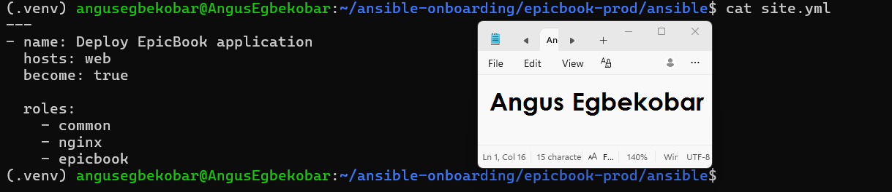
---

#### Screenshot 11 — Output of `ansible-playbook -i inventory.ini site.yml --syntax-check`

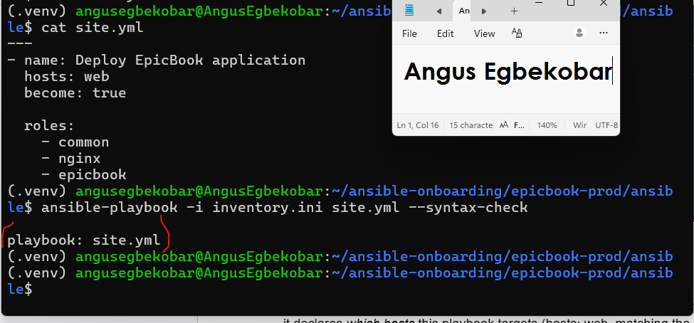
---

### Notes

Answer the following in your own words:

**1. What is the purpose of `site.yml`?**

site.yml is the main entry point for the entire Ansible playbook. It is the file you run with ansible-playbook and it brings everything together by defining which hosts to target, what variables to use, and which roles to apply. Think of it as the master instruction file that orchestrates the full deployment — it does not contain the detailed tasks itself but instead calls the roles that do. In a real project site.yml is what a team member or a CI/CD pipeline would run to deploy the entire application from scratch.
---

**2. Why should the roles run in the order `common`, `nginx`, and `epicbook`?**

The order matters because each role depends on the one before it being completed first. common runs first because it handles the base system setup — updating packages and installing foundational dependencies that everything else needs. nginx runs second because the web server must be installed and configured before there is anywhere to serve the application from. epicbook runs last because it deploys the actual application files, and it needs both the base system and the web server to already be in place before it can copy files, set permissions, and make the site live. Running them out of order would cause failures because you would be trying to deploy an application onto a server that has no web server, or install a web server onto a system that has not been updated.
---

**3. What does `become: true` allow Ansible to do?**

become: true tells Ansible to escalate its privileges to root on the managed node before running tasks, the same way sudo works when you are logged into a server manually. By default Ansible connects as a regular user — in most cases ubuntu on AWS or azureuser on Azure — and that user does not have permission to install packages, modify system files, manage services, or write to protected directories like /var/www/html/. Adding become: true gives Ansible the elevated access it needs to perform those system-level tasks. Without it any task that requires root would fail with a permission denied error.
---

# Task 6 — Create the `common` Role

## Goal

Create the `common` role to prepare the Ubuntu VM with the basic packages required for the EpicBook deployment.

This role handles the common server setup before Nginx and the application are configured.

### Evidence

#### Screenshot 12 — `roles/common/tasks/main.yml` showing the common setup tasks

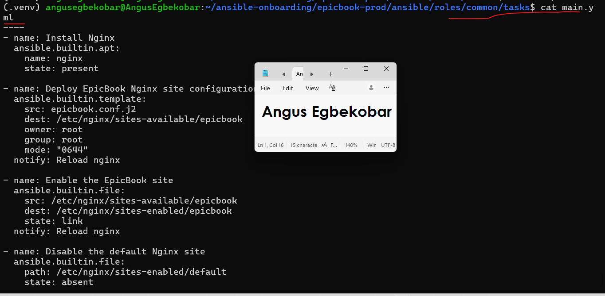
---

### Notes

Answer the following in your own words:

**1. What is the responsibility of the `common` role?**

The common role is responsible for preparing the server's base environment before any application-specific configuration happens. It runs first across all managed nodes and handles the foundational setup that every other role depends on.

In practice the common role typically does the following:

System updates
It updates the package cache and upgrades existing packages to make sure the server is running the latest stable software before anything else is installed. This is the equivalent of running apt update && apt upgrade manually.

Installing base dependencies
It installs packages that are not specific to any one role but are needed across the system — things like curl, git, rsync, unzip, or python3. These are tools that the nginx and application roles may rely on being already present.

Setting system-level configuration
It may configure things like the system timezone, hostname, or basic security settings that should be consistent across every server regardless of its role.

Why it matters

Without the common role running first, the roles that come after it could fail because they assume certain packages or system states are already in place. For example the epicbook role may need git to clone a repository and rsync to copy files — if common did not install those tools first, those tasks would fail.

Think of common as laying the foundation before the walls go up. It does not deploy your application or configure your web server — it simply makes sure the server is in a clean, updated, and consistent state so that everything else can be built on top of it reliably.
---

**2. Why should Nginx installation not be placed inside the `common` role?**

Nginx installation should not be placed inside the common role because the common role is meant to handle base system setup that applies to every server equally, regardless of what that server is supposed to do. Nginx is a web server and is only relevant to servers that need to serve web traffic — not every server in your infrastructure needs it.
---

**3. Why is `mysql-client` useful in this deployment?**

It is used by the epicbook role to connect to the managed MySQL database and import SQL files
---

# Task 7 — Create the `nginx` Role

## Goal

Create the `nginx` role to install Nginx and configure it as a reverse proxy for the EpicBook application.

Nginx will receive browser traffic on port `80` and forward it to the EpicBook Node.js application running on the VM.

### Evidence

#### Screenshot 13 — `roles/nginx/tasks/main.yml` showing Nginx installation and site configuration tasks

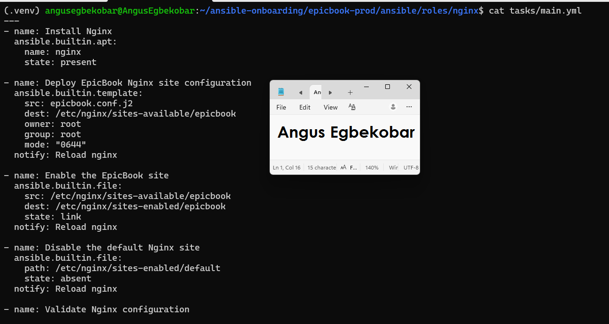
---

#### Screenshot 14 — `roles/nginx/templates/epicbook.conf.j2` showing the reverse proxy configuration

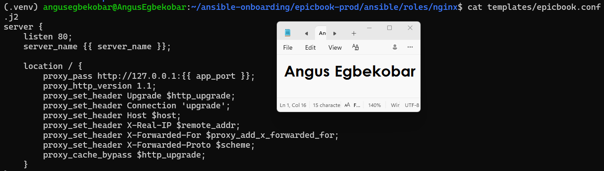
---

### Notes

Answer the following in your own words:

**1. What is the responsibility of the `nginx` role?**

The nginx role is responsible for installing the Nginx web server, configuring it to serve the application correctly, and ensuring the service is running and will start automatically on reboot. It sits between the common role which prepares the base system and the epicbook role which deploys the actual application files.

In practice the nginx role handles:

Installing the Nginx package using the apt module
Deploying the site configuration file from a Jinja2 template to /etc/nginx/sites-available/
Creating a symbolic link in /etc/nginx/sites-enabled/ to activate the site
Removing the default Nginx site so it does not conflict with the application
Validating the Nginx configuration using nginx -t to catch any errors before reloading
Ensuring the Nginx service is started and enabled so it survives a server reboot

The nginx role does not touch the application code or files — that is the responsibility of the epicbook role. It only sets up and manages the web server itself.
---

**2. Why is Nginx configured as a reverse proxy in this deployment?**

Nginx is configured as a reverse proxy because the EpicBook application runs as a backend process on a specific port — for example port 5000 or 8000 — and is not designed to be exposed directly to the internet. Nginx sits in front of it, accepts incoming HTTP requests on port 80 from the public, and forwards those requests internally to the application process running on its private port.

This setup exists for several reasons. First it means the application itself does not need to handle raw internet traffic, SSL termination, or low level connection management — Nginx handles all of that. Second it keeps the backend port private and not directly accessible from outside the server. Third Nginx is far more efficient at handling concurrent connections and serving static files than most application servers. Fourth it gives you a single entry point where you can add SSL certificates, rate limiting, caching, and logging without touching the application code at all.

In short Nginx acts as the professional front door that manages all incoming traffic and passes it cleanly to the application running behind it
---

**3. Why should the application port come from `group_vars/web.yml` instead of being hard-coded?**

The application port should come from group_vars/web.yml instead of being hard-coded because hard-coding values directly into configuration files and templates creates a maintenance problem. If the port ever needs to change you would have to manually find and update every file that references it, and in a large project that is easy to get wrong and leads to inconsistencies.

By storing the port in group_vars/web.yml as a variable there is a single source of truth. You change it in one place and Ansible automatically applies the updated value everywhere it is referenced — in the Nginx template, in the application configuration, and anywhere else that variable is used.

It also makes the roles reusable across different environments. In your development environment the application might run on port 3000, in staging on port 5000, and in production on port 8000. By using a variable you can deploy the exact same role and template to all three environments and simply change the value in the relevant group_vars file for each one without touching any role code.

Hard-coding is always a short term convenience that creates a long term problem. Variables make infrastructure easier to read, easier to change, and easier to reuse.
---

# Task 8 — Create the `epicbook` Role

## Goal

Create the `epicbook` role to deploy the EpicBook application, connect it to the managed MySQL database, and run the application on port `8080` using PM2.

### Evidence

#### Screenshot 15 — `roles/epicbook/tasks/main.yml` showing application deployment tasks

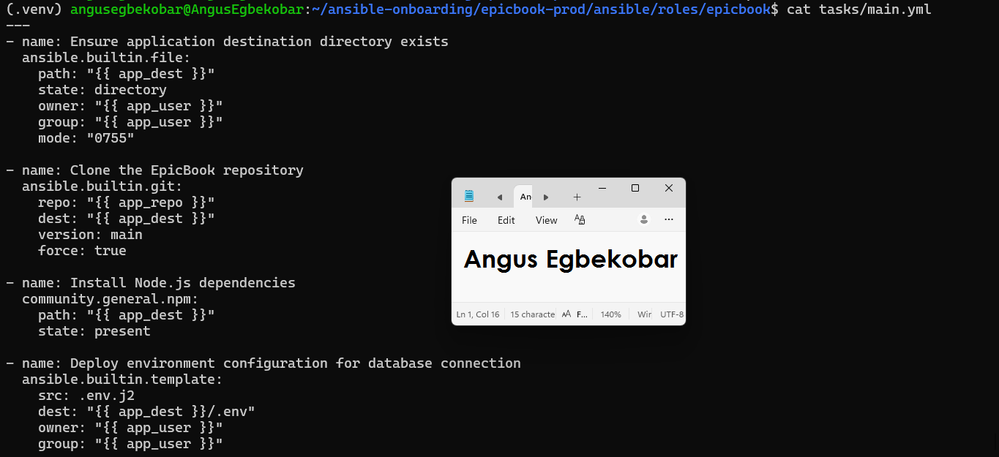
---

#### Screenshot 16 — Task or file showing how the database connection is configured, with secrets hidden

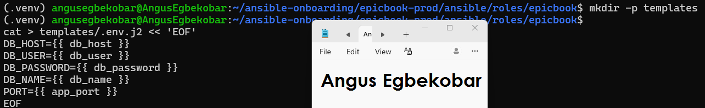
---

#### Screenshot 17 — Task or output showing the EpicBook application managed by PM2

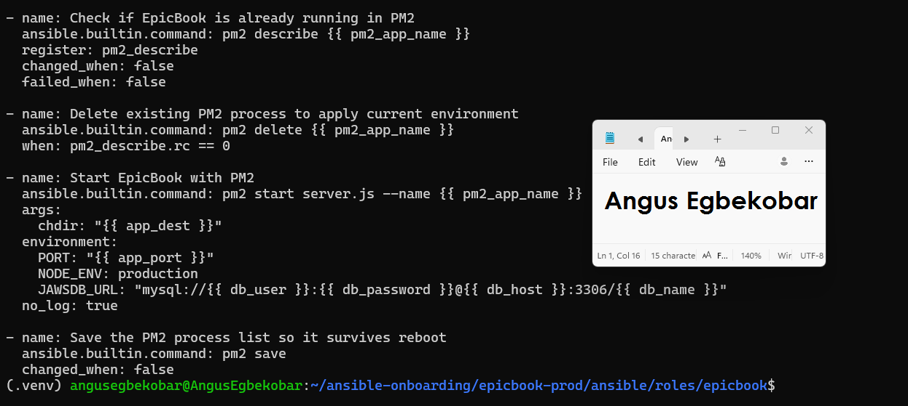
---

### Notes

Answer the following in your own words:

**1. What is the responsibility of the `epicbook` role?**

The epicbook role is responsible for taking the server that has already been prepared by common and nginx and turning it into a fully running EpicBook application. It is the final role in the sequence and handles everything from getting the application code onto the server to making it live and running.

Specifically the epicbook role is responsible for these five areas in order:

Cloning the repository — it pulls the EpicBook source code from GitHub onto the server so there is something to deploy.

Installing application dependencies — it runs npm install inside the cloned repository directory to install all the Node.js packages the application needs to function.

Configuring the database connection — it creates the environment configuration file on the server that tells the application how to connect to the managed MySQL database, including the host, database name, username, and password.

Importing the database scripts — it runs the SQL files found in the repository's db/ directory against the managed MySQL database to create the required schema and populate the seed data the application depends on.
---

**2. Why is PM2 used for the EpicBook Node.js application?**

PM2 is used because of the specific requirement in Task 8 to keep the EpicBook application running persistently on port 8080 without manual intervention.

If you started the application by simply running node server.js it would stop the moment you closed the SSH session or the server rebooted. The website would go down and there would be no automatic recovery. For a deployed application that is completely unacceptable.

PM2 solves this by running server.js as a managed background process with the name epicbook. It monitors the process and restarts it automatically if it crashes. It also hooks into the system startup sequence so the application comes back up on its own after a reboot without anyone having to SSH in and manually restart it.

This is why Task 8 specifically requires PM2 rather than just running the application directly — the goal is a self-managing, always-on deployment that does not depend on anyone being logged in to keep it alive.
---

**3. Why should database passwords not be hard-coded in public files?**

Task 8 requires configuring the database connection using the host, database name, username, and password from Ansible variables rather than writing them directly into the task file. This requirement exists because hard-coding passwords in files that live inside a project directory creates serious security problems.

Project files get committed to Git repositories. Once a password is committed it becomes part of the permanent history of that repository. Even if you remove it in a later commit the password is still visible in the history and anyone with access to the repository can retrieve it. If the repository is ever made public or cloned by someone who should not have database access, the credentials are exposed.

Hard-coding also means the same password ends up copied across environments because people duplicate configuration files, and changing the password requires editing code rather than simply updating a secret. The correct approach as required by this task is to store the password in a variable managed securely through Ansible Vault or another secret management method so it never appears in plain text in any file that gets committed to version control.
---

**4. What does it mean for the application to run on port `8080` while Nginx listens on port `80`?**

It means there are two separate processes running on the same server handling two different stages of the same incoming request.

When someone opens a browser and visits the server's public IP address the browser automatically connects to port 80 because that is the standard HTTP port. Nginx is listening on port 80 and receives that connection. Nginx does not serve the EpicBook application directly — it takes the request and passes it internally to port 8080 where PM2 is running the EpicBook Node.js application via server.js. The application processes the request and sends the response back to Nginx which then delivers it to the browser.

From the visitor's perspective they simply loaded a website. They never know port 8080 exists and they never connect to it directly. Port 8080 is kept private and is not open in the cloud security rules to the outside world — only port 80 is publicly accessible.
---

# Task 9 — Create Group Variables

## Goal

Create reusable variables for the EpicBook deployment.

The `group_vars/web.yml` file stores values that can be reused across the Ansible roles.

### Evidence

#### Screenshot 18 — `group_vars/web.yml` showing the application, PM2, and database variables, with passwords hidden or masked

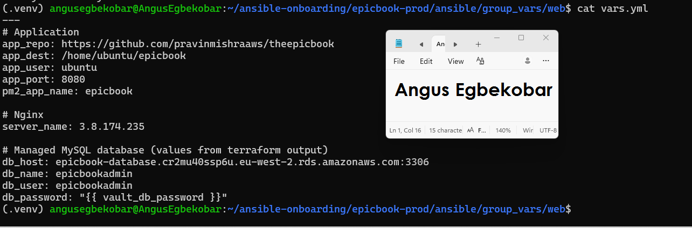
---

### Notes

Answer the following in your own words:

**1. What is the purpose of `group_vars/web.yml`?**

group_vars/web.yml is a file that stores reusable variables that apply to all hosts in the web group. Its purpose is to act as a single source of truth for all the values that the roles need to do their work — things like the application port, the repository URL, the database host, and the PM2 process name.

Without group_vars/web.yml you would have to hard-code these values directly inside each role's task files and templates. That creates a maintenance problem because the same value might appear in multiple places and if it ever needs to change you have to hunt through every file to find and update it. With group_vars/web.yml you change it in one place and it automatically applies everywhere it is referenced across the common, nginx, and epicbook roles.

It also makes the roles themselves cleaner and more reusable. A role that uses {{ app_port }} instead of the hard-coded value 8080 can be reused in a different project simply by changing the variable in group_vars without touching any role code.
---

**2. Which values did you store in `group_vars/web.yml`?**

The following variables were stored in group_vars/web.yml:

app_repo — the URL of the EpicBook GitHub repository that Ansible uses to clone the application onto the server.

app_dest — the path on the server where the application should be deployed to, for example /opt/epicbook.

app_user — the user that owns the application files on the server.

app_port — the port the Node.js application listens on, set to 8080.

pm2_app_name — the name PM2 uses to identify and manage the EpicBook process, set to epicbook.

server_name — the public IP address of the VM, used by the Nginx configuration template to set the server name directive.

db_host — the hostname of the managed MySQL database taken from the Terraform output.

db_name — the name of the database that was created by Terraform and that the application connects to.

db_user — the username used to authenticate against the managed MySQL database.

db_password — handled securely and not stored in plain text, covered in the answer below.
---

**3. How did you handle the database password securely?**

The database password was handled using Ansible Vault so it was never stored in plain text in any file that could be committed to GitHub.

Ansible Vault encrypts the sensitive value so that even if someone gains access to the file they cannot read the password without the vault key. The encrypted value is stored in group_vars/web.yml in place of the plain text password and looks like a block of cipher text beginning with !vault | rather than the actual password.

To run the playbook with a vaulted password you use the --ask-vault-pass flag which prompts you to enter the vault password at runtime:

bash
ansible-playbook -i inventory.ini site.yml --ask-vault-pass

Ansible decrypts the value in memory during the playbook run and injects it into the environment configuration file on the server. The plain text password never touches disk on the controller and never appears in any file that gets committed to version control.

This approach means the repository can be made public or shared with a team without ever exposing the database credentials, and the only person who can decrypt the vault is someone who has the vault password separately.
---

# Task 10 — Run the Ansible Playbook

## Goal

Run the Ansible playbook to configure the VM and deploy the EpicBook application.

The playbook should run the roles in this order:

1. `common`
2. `nginx`
3. `epicbook`

### Evidence

#### Screenshot 19 — Ansible playbook output showing the roles running

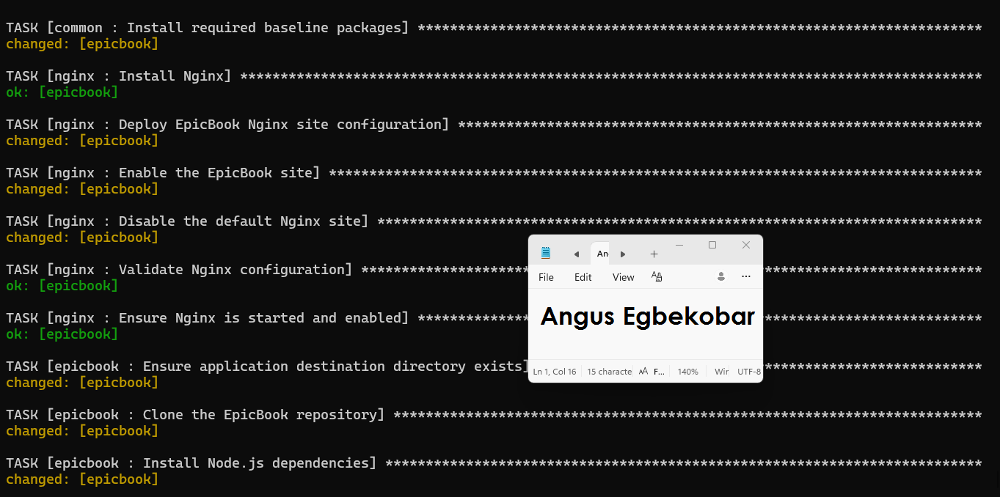
---

#### Screenshot 20 — Final Ansible recap showing `failed=0`

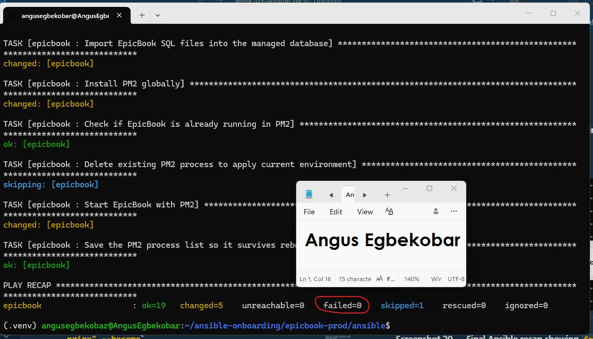
---

#### Screenshot 21 — Output of `ansible web -i inventory.ini -m command -a "systemctl is-active nginx" --become`

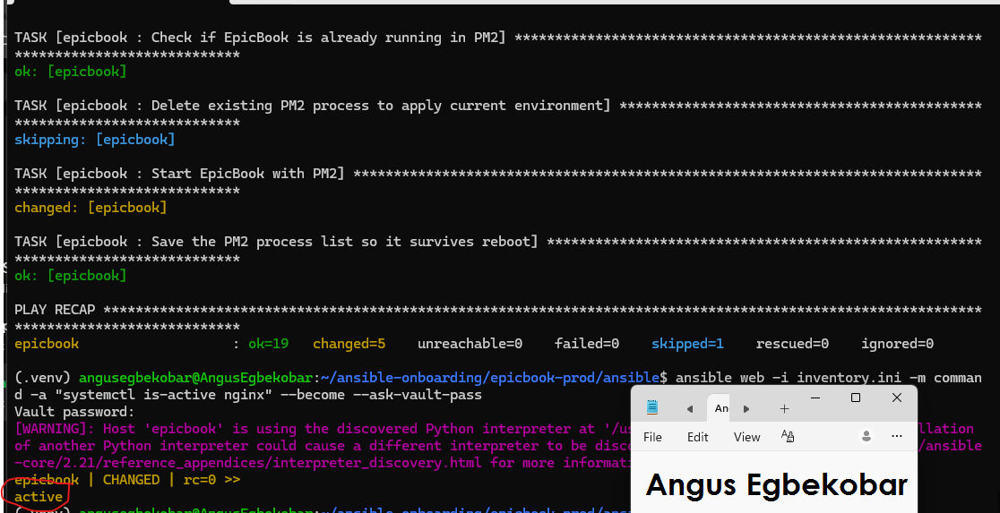
---

#### Screenshot 22 — Output of `ansible web -i inventory.ini -m command -a "pm2 status"`

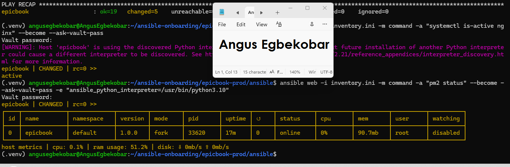
---

#### Screenshot 23 — Output of `ansible web -i inventory.ini -m command -a "curl -I http://localhost:8080"`

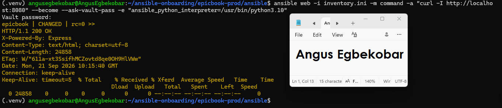
---

### Notes

Answer the following in your own words:

**1. What command did you run to execute the Ansible playbook?**

ansible-playbook -i inventory.ini site.yml --ask-vault-pass
---

**2. How do you know all roles completed successfully?**

The final play recap showed failed=0 and unreachable=0, meaning every task across the common, nginx, and epicbook roles completed without errors.
---

**3. What proves that Nginx is active?**

ansible web -i inventory.ini -m command -a "systemctl is-active nginx" --become
---

**4. What proves that PM2 is managing the EpicBook application?**

ansible web -i inventory.ini -m command -a "pm2 status"
---

**5. What proves that the EpicBook application responds on port `8080`?**

Running the following command returned an HTTP 200 response confirming the Node.js application was running and responding on port 8080:

ansible web -i inventory.ini -m command -a "curl -I http://localhost:8080"
---

# Task 11 — Verify the EpicBook Deployment

## Goal

Verify that the EpicBook application is running, accessible in the browser, and connected to the managed MySQL database.

### Evidence

#### Screenshot 24 — Output of `curl -I http://<public_ip>`

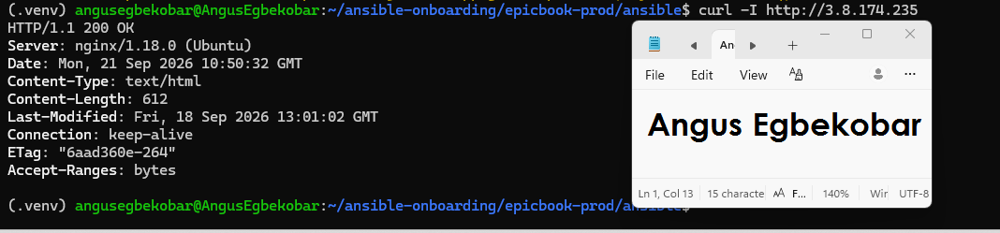
---

#### Screenshot 25 — Output of the cart API test command

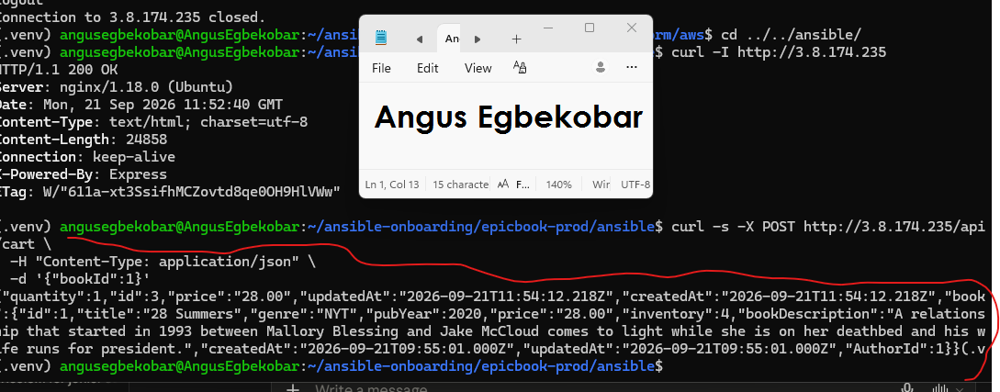
---

#### Screenshot 26 — Output of the `/cart` HTTP status check

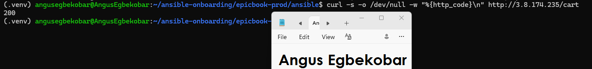
---

#### Screenshot 27 — Browser showing the EpicBook application loaded from `http://<public_ip>`

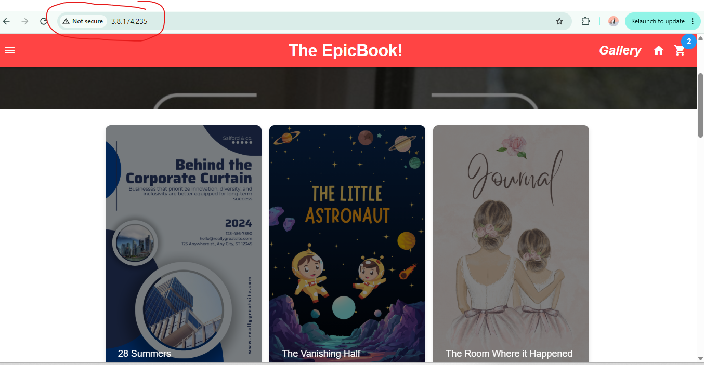
---

### Notes

Answer the following in your own words:

**1. What HTTP response did you receive from the public application URL?**

Running curl -I http://3.8.174.235 returned HTTP 200 OK with Nginx 1.18.0 as the server, confirming the EpicBook application is publicly accessible and being served correctly through the Nginx reverse proxy.
---

**2. What did the cart API test prove?**

The cart API test proved the entire application stack is working end to end — from the public HTTP request through Nginx on port 80, to the Node.js application on port 8080, all the way through to the managed MySQL RDS database on AWS. A successful JSON response confirmed the database was seeded correctly and the application can read and write data.
---

**3. What did the `/cart` status check return?**

The /cart status check returned 200, confirming the cart page route is accessible and the application is handling requests correctly through the Nginx reverse proxy.
---

**4. What issue did you face during verification, and how did you fix it?**

After the playbook completed the browser was showing the default Nginx welcome page because PM2 was not configured to restore the saved process list on startup. I fixed this by adding two tasks to the epicbook role — one to register PM2 as a systemd service using pm2 startup systemd and another to ensure the pm2-ubuntu service is enabled and started. This ensures the EpicBook application is managed by the system and starts automatically without any manual intervention.
---

# LinkedIn Post Required

## Evidence

#### LinkedIn Post URL

Paste your LinkedIn post URL here:

https://www.linkedin.com/posts/angus-egbekobar_devops-terraform-ansible-activity-7507783483465957377-HSIW?utm_source=share&utm_medium=member_desktop&rcm=ACoAACpBxXUBgkRH28KX9wNr0QE4jJlRTmgHtCg
---

#### Screenshot — Published LinkedIn post

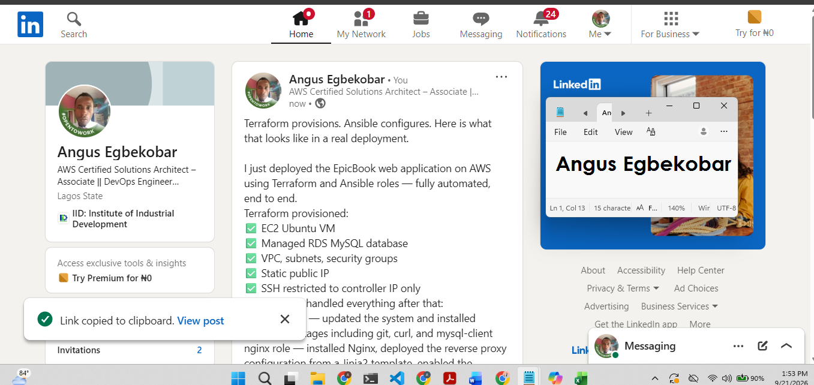
---

# Assignment Questions

Answer the following in your own words:

**1. Why is Terraform used for infrastructure provisioning?**

Terraform is used for infrastructure provisioning because it allows you to define your entire cloud environment as code and create it consistently and repeatably. Instead of manually clicking through the AWS console to create a VM, a database, networking rules, and a public IP, you write it once in Terraform and it provisions everything automatically. It also tracks the state of your infrastructure so it knows what already exists and what needs to be created, changed, or destroyed. This makes it easy to reproduce the same environment, share infrastructure definitions with a team, and tear everything down cleanly when finished.
---

**2. Why are Ansible roles useful for production-style deployments?**

Ansible roles are useful because they break a large deployment into smaller, focused, and reusable pieces. Instead of writing one giant playbook that does everything, you split the work into separate roles where each one has a single clear responsibility. In this deployment the common role prepares the base system, the nginx role configures the web server, and the epicbook role deploys the application. This separation makes the code easier to read, easier to debug when something fails, and easier to reuse in future projects. Each role can be updated or replaced independently without breaking the others.
---

**3. What is the purpose of `group_vars/web.yml`?**

group_vars/web.yml stores reusable variables that apply to all hosts in the web group. Instead of hard-coding values like the application port, repository URL, PM2 process name, and database host directly inside each role, you define them once in this file and reference them everywhere as variables. If a value needs to change you update it in one place and it automatically applies across all roles. It keeps the roles clean, flexible, and easy to reuse across different environments.
---

**4. Why should database passwords not be committed to GitHub?**

Once a password is committed to a repository it becomes part of the permanent commit history. Even if you delete it in a later commit the password is still visible in the history and anyone with access to the repository can retrieve it. If the repository is ever made public the credentials are exposed to the entire internet. The correct approach is to use a secret management tool like Ansible Vault so the password is encrypted and never stored in plain text in any file that gets committed.
---

**5. What is the purpose of Nginx in this deployment?**

Nginx acts as a reverse proxy. The EpicBook Node.js application runs internally on port 8080 and is not directly exposed to the internet. Nginx listens on port 80, the standard HTTP port that browsers connect to, receives all incoming public traffic, and forwards each request internally to the application on port 8080. The response comes back through Nginx to the browser. This keeps the application protected, allows Nginx to handle all public traffic concerns, and means port 8080 never needs to be open in the security group.
---

**6. Why should the managed MySQL database not be publicly accessible?**

Exposing port 3306 to the internet creates a serious security risk. Anyone who can reach that port could attempt to brute force the credentials or exploit known MySQL vulnerabilities. In this deployment only the EC2 instance needs to talk to the database and it does so over the private network inside the VPC. Port 3306 should be restricted to the VM's private IP only, keeping the database completely invisible to the public internet.
---

**7. Why is PM2 used for the EpicBook Node.js application?**

If you started the application by simply running node server.js it would stop as soon as you closed the terminal or the server rebooted. PM2 is a process manager that runs the Node.js application as a persistent background process, monitors it continuously, and automatically restarts it if it crashes or if the server reboots. This makes the deployment reliable and self-healing without any manual intervention needed.
---

**8. What does idempotency mean in Ansible?**

Idempotency means that running the same Ansible playbook multiple times produces the same result every time without causing unintended changes. If Nginx is already installed and the configuration file is already in place, running the playbook again will not reinstall Nginx or overwrite the file unnecessarily — it will simply check the desired state is already met and report changed: false. This means you can safely re-run a playbook to fix configuration drift or verify a deployment without worrying it will break something that is already working.
---

**9. What issue did you face during the deployment, and how did you fix it?**

The most significant challenge was a chain of database connection failures. First the MySQL command was failing because the RDS endpoint included the port number as part of the host value — I fixed this by separating db_host and db_port into two variables. Then the password was being rejected with Access denied — I discovered the RDS instance had been created with a different password than what was in terraform.tfvars. I reset the RDS master password using the AWS CLI with aws rds modify-db-instance --master-user-password and updated the Ansible Vault to match. Then the SQL files failed because they referenced a database called bookstore but my database was named epicbookadmin — I created the bookstore database inside RDS and updated db_name in group_vars. Each error was a different layer of the same connection chain and fixing them in sequence got the deployment working.
---

**10. What security improvement would you make before using this setup in production?**

There are several improvements I would make. First I would replace host_key_checking = False in ansible.cfg with proper known hosts management to protect against man-in-the-middle attacks. Second I would add HTTPS by provisioning an SSL certificate through Let's Encrypt and configuring Nginx to redirect all HTTP traffic to HTTPS so data in transit is encrypted. Third I would restrict SSH access further by using a dedicated bastion host rather than exposing port 22 directly on the application VM. Fourth I would store the Terraform state file in a remote encrypted backend such as an S3 bucket with state locking enabled rather than keeping it locally. Fifth I would rotate the database password immediately after the RDS instance is created and manage it exclusively through AWS Secrets Manager going forward.
---

# Required Files

Confirm that the following files are included in your GitHub repository or assignment folder:

- [ ] `README.md`
- [ ] Terraform files under either `terraform/azure/` or `terraform/aws/`
- [ ] `ansible/ansible.cfg`
- [ ] `ansible/inventory.ini`
- [ ] `ansible/site.yml`
- [ ] `ansible/group_vars/web.yml`
- [ ] `ansible/roles/common/tasks/main.yml`
- [ ] `ansible/roles/nginx/tasks/main.yml`
- [ ] `ansible/roles/nginx/templates/epicbook.conf.j2`
- [ ] `ansible/roles/epicbook/tasks/main.yml`

---

# Submission Instructions

- Add all required screenshots in your submission.
- Full Name must be visible in required screenshots.
- Mention the cloud provider used: Azure or AWS.
- Add the VM public IP address.
- Add the final application URL.
- Add Terraform output proof.
- Add Ansible role tree proof.
- Add all required notes and assignment question answers.
- Add your LinkedIn post URL.
- Do not expose SSH private keys, passwords, cloud credentials, database credentials, Terraform state files, subscription IDs, or account IDs.
- Submit only your Google Doc link.

---

# Completion Checklist

- [ ] Task 1: Project folder layout created
- [ ] Task 2: Terraform infrastructure provisioned
- [ ] Task 3: SSH key-based access verified
- [ ] Task 4: Ansible inventory and configuration created
- [ ] Task 5: Main Ansible playbook created
- [ ] Task 6: `common` role created
- [ ] Task 7: `nginx` role created
- [ ] Task 8: `epicbook` role created
- [ ] Task 9: Group variables created
- [ ] Task 10: Ansible playbook run completed
- [ ] Task 11: EpicBook deployment verified
- [ ] Terraform files created under only one cloud provider folder
- [ ] One Ubuntu VM was created
- [ ] One managed MySQL database was created
- [ ] SSH port `22` is restricted to the controller public IP
- [ ] HTTP port `80` is accessible
- [ ] MySQL port `3306` is not publicly open
- [ ] `ansible web -i inventory.ini -m ping` returns `SUCCESS`
- [ ] `site.yml` calls the roles in the correct order
- [ ] Database secrets are hidden or handled securely
- [ ] Nginx is active
- [ ] PM2 shows the EpicBook application running
- [ ] EpicBook responds on port `8080`
- [ ] Public URL loads in the browser
- [ ] Cart API verification works
- [ ] Playbook completes with `failed=0`
- [ ] Screenshots 1–27 are included
- [ ] Assignment questions are answered
- [ ] LinkedIn post published
- [ ] LinkedIn post URL added
- [ ] No sensitive information is exposed
- [ ] Google Doc is accessible

---

## About DMI & CloudAdvisory

DevOps Micro Internship (DMI) is a project-based DevOps program run by Pravin Mishra and The CloudAdvisory, focused on real-world execution, systems thinking, and career readiness.

It helps learners build strong DevOps foundations with hands-on experience.

---

## Resources

- DMI Official Website: [https://dmi.pravinmishra.com?utm_source=github&utm_medium=readme](https://dmi.pravinmishra.com?utm_source=github&utm_medium=readme)
- University: [https://university.pravinmishra.com?utm_source=github&utm_medium=readme](https://university.pravinmishra.com?utm_source=github&utm_medium=readme)
- Discord Community: [https://discord.pravinmishra.com?utm_source=github&utm_medium=readme](https://discord.pravinmishra.com?utm_source=github&utm_medium=readme)
- Blog: [https://dmi.pravinmishra.com/blog?utm_source=github&utm_medium=readme](https://dmi.pravinmishra.com/blog?utm_source=github&utm_medium=readme)
- YouTube Playlist: [https://www.youtube.com/playlist?list=PLFeSNDtI4Cho](https://www.youtube.com/playlist?list=PLFeSNDtI4Cho)
- Pravin Mishra LinkedIn: [https://www.linkedin.com/in/pravin-mishra-aws-trainer/](https://www.linkedin.com/in/pravin-mishra-aws-trainer/)
- CloudAdvisory LinkedIn: [https://www.linkedin.com/company/thecloudadvisory/](https://www.linkedin.com/company/thecloudadvisory/)

---

*This submission is part of DevOps Micro Internship (DMI) Cohort 3 — Agentic AI Track.*